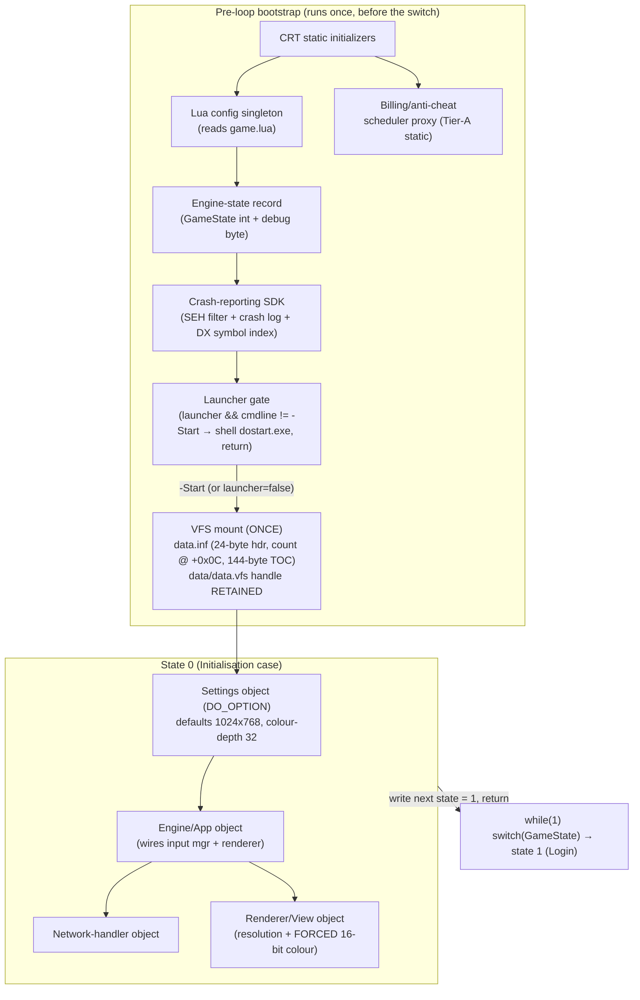

# Init Scene Dossier — Engine State 0

> **Clean-room neutral dossier.** Synthesised from the committed `Docs/RE` specs only (no IDA, no
> `_dirty/`). No decompiler pseudo-code, no virtual addresses-as-truth, no decompiler identifiers
> (`sub_`, `loc_`, `__thiscall`, `_DWORD`, mangled names). Engine-struct field offsets and
> `GameState` case numbers are interoperability facts and are stated where load-bearing. This is the
> per-scene companion to `specs/client_runtime.md §0` (boot) and `§7` (lifecycle); when a number is
> load-bearing the satellite spec is the authority and is cross-linked.

---

## 1. Overview

**Init** is **engine state 0**, the first case of the master scene state machine. In the legacy
client the application entry point (`WinMain`) **is** the scene machine: after a one-time bootstrap
(CRT statics → `game.lua` booleans → launcher gate → VFS mount) it runs an infinite
`while(1) switch(GameState)` over **exactly eight cases (states 0..7)** plus a `default`. The ladder
**starts at state 0** and state 0 transitions **immediately** to **state 1 (Login)** — the first real
interactive screen. (CODE-CONFIRMED — `specs/client_runtime.md §0.1`, `§7`;
`specs/client_workflow.md §3`.)

State 0 is **not** a rendered scene. No window, no Direct3D device, and no widget tree exist yet when
state 0 begins; state 0 (and the first half of state 1) is exactly where they are brought up. State 0
itself does a small, ordered set of engine bring-up steps and then writes the next state and returns
into the loop, which re-dispatches into state 1. Conceptually:

- **Boot (pre-loop, runs once before the switch):** CRT static initializers, the `SetThreadExecutionState`
  display-keep-awake call and the C++ terminate-handler install, the `game.lua` boolean read, the
  crash-reporting SDK init, the launcher gate, and the **one-time VFS mount** of `data.inf` +
  `data/data.vfs`.
- **State 0 (Initialisation case):** write next state → 1; construct the Engine/App and network-handler
  singletons; read the display-mode setting and copy resolution into the renderer (with the
  per-renderer caps); force the active colour depth to 16-bit. Then return → the loop enters state 1.
- **State 1 (Login, the immediate successor):** parse `DoOption.ini` into the settings object, do the
  display-mode 1→2 promotion, **create the OS window**, **create the D3D9 device**, **register the 15
  Korean font slots**, **reset the effect subsystem**, then enter the per-frame loop.

> **Scope boundary.** This dossier covers state 0 and the boot steps that precede it, plus the
> state-0→state-1 device/window bring-up that state 0 sets in motion (because that bring-up is what
> "init" means for this client). The Login scene's interactive behaviour, its widget tree, its
> credential/PIN handshake, and the lobby fetch are owned by `specs/frontend_scenes.md` /
> `specs/login_flow.md` and are out of scope here.

This campaign's **corrections** (all re-confirmed on build 263bd994) live in §2/§4 and are flagged
inline; they have **no C# surface** (see §7).

---

## 2. Object & ownership inventory

State 0 touches two construction tiers: **Tier A** C++ static objects that run before the entry point,
and **Tier B** lazy singletons constructed on first use. The objects relevant to Init:

| Object | Tier | First touched | Role at Init |
|---|---|---|---|
| **Lua config singleton** | B | entry-point top (pre-loop) | reads `game.lua` (`vfsmode`, `launcher`, `debugmode`) |
| **Engine-state record** | B | entry-point top (pre-loop) | holds the `GameState` int + the debug-mode byte |
| **Crash-reporting SDK** | B | entry-point (pre-loop) | installs an unhandled-exception (SEH) filter, opens a crash log, loads a DirectX symbol-index file |
| **VFS mount** | — | just before the loop (pre-loop) | opens `data.inf` (24-byte header, entry count at +0x0C, 144-byte TOC), loads the TOC, opens `data/data.vfs` and **retains its handle** for the process lifetime |
| **Settings object (DO_OPTION)** | B | **state 0** | constructed (defaults 1024×768, colour-depth field 32-bpp); parsed from `DoOption.ini` during the state-0→1 bring-up |
| **Engine/App object** | B | **state 0** | wires the input manager and the renderer |
| **Network-handler object** | B | **state 0** | the network handler object (not yet a live socket) |
| **Renderer/View object** | B | state 0 / 1 | the large D3D renderer; receives the resolution and colour-depth from state 0 |
| **Texture manager** | B | every state | texture cache; flushed before each per-frame loop entry |
| **Billing/anti-cheat scheduler proxy** | A | pre-loop static init | the load-bearing static object the state-1 entry must pass (`exit(1)` on failure) |

Ownership / lifetime notes (CODE-CONFIRMED — `specs/client_runtime.md §0.5`, `§0.7`,
`specs/resource_pipeline.md §1.5`):

- The **VFS data-archive handle is held open for the entire process**; it is the handle every later
  asset read seeks within. The index file (`data.inf`) handle is **closed** right after the TOC is read.
- The settings object's **colour-depth field default (32-bpp) is overridden** to 16-bit during state 0
  (§2.4 of `client_runtime.md §0.8`); the active colour depth is **forced 16-bit**.
- The crash-reporting SDK's hard-coded application-identity string, version, support contact, and
  crash-submission host/port are **deliberately not reproduced** here or in code (non-distribution).



---

## 3. State machine

State 0 is the entry of the eight-case ladder. Internally it performs an ordered, non-rendered
bring-up and then advances to state 1. The "next state" write happens **first** (intent-then-act, the
per-case contract); the device/window/font/effect bring-up is set in motion across the state-0→1
boundary. (CODE-CONFIRMED — `specs/client_runtime.md §0.8`, `§7`.)

```mermaid
stateDiagram-v2
    [*] --> State0_Init : entry point reaches the switch (after bootstrap + VFS mount)

    state State0_Init {
        [*] --> WriteNext
        WriteNext : Write GameState = 1 (intent first)
        WriteNext --> ConstructSingletons
        ConstructSingletons : Construct Engine/App + network-handler singletons
        ConstructSingletons --> ReadDisplayMode
        ReadDisplayMode : Read display-mode setting (settings index [30], byte +120)
        ReadDisplayMode --> CopyResolution
        CopyResolution : Copy OPTION_WIDTH/HEIGHT into renderer\n(width cap 1920 @ +44465, height cap 1200 @ +44466)\nfull-desktop (mode==2): width from GetSystemMetrics
        CopyResolution --> ForceColour
        ForceColour : Force active colour depth to 16-bit\n(overrides the 32-bpp settings default)
        ForceColour --> [*]
    }

    State0_Init --> State1_Login : return into the loop; switch re-dispatches

    state State1_Login {
        [*] --> ParseIni
        ParseIni : Parse DoOption.ini into settings object
        ParseIni --> Promote
        Promote : Display-mode 1 -> 2 promotion (fed to window + device)
        Promote --> StartSched
        StartSched : Start the task scheduler (fail -> error state 7)
        StartSched --> MakeWindow
        MakeWindow : Create OS window (class "diamond engine application")
        MakeWindow --> MakeDevice
        MakeDevice : Create Direct3D 9 device (16-bit path)
        MakeDevice --> MakeFonts
        MakeFonts : Register 15 Korean font slots
        MakeFonts --> ResetFx
        ResetFx : Reset the effect subsystem
        ResetFx --> EnterLoop
        EnterLoop : Enter Engine_MainLoop (per-frame pump)
    }

    State1_Login --> ErrorState7 : scheduler/device init failure (code 1 or 3 — see §9)
    ErrorState7 : State 7 (Error) — modal dialog from the reason field
```

> **Note.** The value `8` seen elsewhere is a terminal exit **sub-state**, not a ninth case; it is
> irrelevant to Init and is owned by `specs/client_runtime.md §7`. State 0 never writes it.

---

## 4. Execution flow

The bring-up order below is **load-bearing and CODE-CONFIRMED** (`specs/client_runtime.md §0.8.2`).
The five numbered steps inside state 1's engine bring-up are: start scheduler → create window →
create device → register fonts → reset effects. The state-0 colour/resolution work and the
display-mode promotion bracket that sequence.

```mermaid
sequenceDiagram
    participant CRT as CRT / static init
    participant Main as Entry point (WinMain)
    participant Lua as Lua config
    participant CR as Crash-reporting SDK
    participant VFS as VFS mount
    participant S0 as State 0
    participant Set as Settings (DO_OPTION)
    participant Rend as Renderer
    participant OS as OS window
    participant D3D as Direct3D 9
    participant Fx as Effect subsystem

    CRT->>Main: run C++ static ctors (incl. scheduler proxy), enter WinMain
    Main->>Main: 1. SetThreadExecutionState(ES_DISPLAY_REQUIRED | ES_CONTINUOUS)
    Main->>Main: 2. install C++ terminate-handler
    Main->>Lua: read game.lua (vfsmode / launcher / debugmode; default true)
    Main->>CR: init crash-reporting SDK (SEH filter + crash log + DX symbol index)
    Main->>Main: launcher gate — if launcher && cmdline != "-Start": shell dostart.exe, return
    Main->>VFS: mount ONCE — open data.inf (24-byte hdr, count @ +0x0C), read 144-byte TOC,\nclose index, open data/data.vfs, RETAIN handle
    Main->>S0: enter while(1) switch → case 0

    S0->>S0: write GameState = 1 (intent first)
    S0->>Rend: construct Engine/App + network-handler singletons
    S0->>Set: read display-mode (index [30], byte +120)
    alt display-mode == 2 (full desktop)
        S0->>Rend: width from GetSystemMetrics (height auto)
    else otherwise
        S0->>Rend: copy OPTION_WIDTH/HEIGHT (caps 1920 @ +44465 / 1200 @ +44466)
    end
    S0->>Rend: force active colour depth = 16-bit (override 32-bpp default)
    S0-->>Main: return → switch re-dispatches to case 1 (Login)

    Main->>Set: parse DoOption.ini into settings object
    Main->>Set: re-read display-mode; promote 1 -> 2 (feed to window + device)
    Main->>Rend: 1. start task scheduler (fail → error state 7)
    Main->>OS: 2. create OS window (class "diamond engine application", title "Do")
    Main->>D3D: 3. create Direct3D 9 device (HAL, HW vertex + multithreaded, 16-bit)
    Main->>D3D: 4. register 15 Korean font slots (DotumChe / Dotum / BatangChe, Hangul)
    Main->>Fx: 5. reset the effect subsystem
    Main->>Main: enter Engine_MainLoop (per-frame pump for the Login scene)
```

**Corrections re-confirmed this campaign (CODE-CONFIRMED — `specs/client_runtime.md §0.8.2`,
`§0.2`, `§0.10`):**

- **Resolution setters.** The **width** setter writes the renderer width field (object offset +44465)
  and caps at **1920**; the **height** setter writes the renderer height field (offset +44466) and caps
  at **1200**. The separate full-desktop width global is used **only** in the display-mode == 2 branch
  and is **not** a height-setter cap — the two must not be conflated. (Earlier note read the height
  setter as "caps width at 1920 via the separate global"; that was wrong.)
- **Active colour depth is forced 16-bit.** The 32-bpp value is only the settings-object constructor
  default; state 0 overrides the active depth to 16-bit and the device path runs 16-bit.
- **Crash component is a crash-reporting SDK** (SEH filter + crash log + DX symbol-index load), **not**
  a frame profiler. Its identity/endpoint literals are omitted by policy.
- **DoOption map (Init-relevant keys):** display-mode = settings index **[30]** at **byte offset +120**;
  the runtime-built `option.ini` path lives in a buffer at **settings-object offset +1165** (read later
  by the state-2 opening decision, not by Init).

---

## 5. UI architecture

**N/A for state 0.** No OS window, no Direct3D device, no `ID3DXSprite`, and no widget tree exist
during the Init case. The window (class `"diamond engine application"`, title `"Do"`), the D3D9 device,
the 15 Korean font slots, the `ID3DXSprite` used for 2D HUD/UI, and the first retained-mode "Diamond"
widget tree (the LoginWindow, ~340 widgets) are all created in the **state-0→state-1 bring-up that
state 0 hands off to** — they belong to the **Login** scene dossier and to `specs/ui_system.md` /
`specs/frontend_scenes.md`, not here.

The only Init-time fact with any UI bearing is the **15 Korean font slot registration** (it is part of
the state-1 bring-up that state 0 sets in motion). It is a **system-font / GDI-backed D3DX path**, not
a VFS atlas: each of the 15 slots (ids 0..14) is created from a system Hangul typeface
(`DotumChe` / `Dotum` / `BatangChe`) at a fixed height/weight, with the Hangul charset. The per-slot
table is owned by `specs/client_runtime.md §0.6` / `specs/ui_system.md §6.2`. There is **no glyph
atlas in the VFS** for body text. (CODE-CONFIRMED — `resource_pipeline.md §3A.5`.)

---

## 6. Asset manifest

State 0's asset footprint is intentionally tiny: it mounts the VFS, it leans on the boot-time INI
parse (`DoOption.ini`), and the bring-up it hands off registers the 15 fonts. No game-data tables and
no textures are loaded by Init — that is state 2's job (`resource_pipeline.md §2`).

| Asset / resource | When | Mechanism | Owned by |
|---|---|---|---|
| `data.inf` (VFS index) | pre-loop (once) | open `FILE_FLAG_RANDOM_ACCESS`; read 24-byte header; **entry count = 4th dword (byte +0x0C)**; allocate `144 × count`; read TOC; **close** index handle | `formats/pak.md`, `client_runtime.md §0.5`, `resource_pipeline.md §1.5` |
| `data/data.vfs` (VFS archive) | pre-loop (once) | open `FILE_FLAG_RANDOM_ACCESS`; **retain handle** for the process lifetime (every later read seeks within it) | `formats/pak.md`, `resource_pipeline.md §1.5` |
| `game.lua` | pre-loop | Lua config singleton; reads `vfsmode` / `launcher` / `debugmode` (each defaults `true`) | `client_runtime.md §0.1`, `specs/lua-config.md` |
| `DoOption.ini` (`[DO_OPTION]`) | state 0 / state-0→1 | private-profile reads, clamped per key; display-mode = index [30] @ byte +120; resolution → renderer; `OPTION_ID` is the only string key | `client_runtime.md §0.2` |
| `option.ini` (path only) | state 0 builds the path | runtime-built path stored at settings-object offset +1165; **read later** by the state-2 opening decision, **not** by Init | `client_runtime.md §0.2`, `resource_pipeline.md §2.5` |
| `panel.ini` / `combo.ini` / `TSIDX.ini` | startup (paths located + hidden) | the other four INI paths are located and `SetFileAttributesA`-hidden at startup; not consumed by Init | `client_runtime.md §0.2` |
| Crash-reporter DirectX symbol-index file | pre-loop | loaded by the crash-reporting SDK to resolve symbols (on-disk `symindex_dx9`-style index); identity/endpoint omitted by policy | `client_runtime.md §0.10` |
| 15 Korean font slots | state-1 bring-up (handed off by state 0) | `D3DXCreateFontA`-equivalent on system Hangul typefaces (DotumChe / Dotum / BatangChe); **not** a VFS asset | `client_runtime.md §0.6`, `ui_system.md §6.2`, `resource_pipeline.md §3A.5` |

> **VFS header authority.** The on-disk byte map (the +0x0C entry-count field and the 144-byte TOC
> stride) is owned by `formats/pak.md`; the mount-routine control flow corroborates it, with the
> raw-byte witness of the header offset pending in that spec (capture/debugger-pending).

---

## 7. C# + Godot fidelity summary

**Init has essentially no C# surface, and the campaign corrections are original-only / not-ported-by-design.**
Godot owns the window and the rendering device, so the legacy state-0 device/window/colour-depth work
does not exist in the port; what remains of "state 0" is a near no-op that mounts services and advances
to Login.

**Mapped code (cite these):**

- `05.Presentation/MartialHeroes.Client.Godot/Scene/Controllers/InitScene.cs` — the state-0 controller.
  Its `OnEnter` is a near no-op: state-0 init is already complete (the VFS + service graph were mounted
  by the `ClientContext` autoload before this scene is shown), so it logs completion, writes the next
  state, and **advances to Login** (`host.CallDeferred(Advance)`). This mirrors the legacy contract:
  *init precedes the loop; the loop begins at Login.* (`client_runtime.md §7.1/§7.3`.)
- `05.Presentation/MartialHeroes.Client.Godot/Autoload/ClientContext.cs` — the layer-05 composition
  root and the **functional analogue of the legacy one-time bootstrap**. It mounts the VFS and builds
  the entire `Client.Application` service graph (event bus, the faithful 8-state `SceneStateMachine`
  booted at state 0, the state-2 `LoadOrchestrator`, input bus, catalogues, audio, HUD hub) before any
  scene is shown — i.e. it carries the "before the `while(1)` switch" work.

**Not ported, faithful by design (the corrections have no C# surface):**

| Original Init fact | Port disposition |
|---|---|
| OS window creation (class `"diamond engine application"`, title `"Do"`) | **Not ported.** Godot owns the OS window (D3D12 on Windows, a **1024×768 design canvas**). |
| Direct3D 9 device creation (HAL, 16-bit) | **Not ported.** Godot's renderer (Forward Plus / D3D12) replaces it entirely. |
| Resolution caps (width 1920 @ +44465 / height 1200 @ +44466) and the full-desktop width global | **Not ported.** Window sizing is Godot's; the caps are an original-only device concern. |
| **Forced 16-bit active colour depth** | **Not ported.** The port renders at modern depth; 16-bit was an era/device constraint. |
| Crash-reporting SDK (SEH filter + crash log + DX symbol index) | **Not ported.** A platform-specific crash facility with no fidelity value; its identity/endpoint must never be reproduced. |
| Display-mode 1→2 promotion; `OPTION_SCREENMODE` window-style words | **Not ported.** Display-mode is a Win32 windowing concern Godot subsumes. |
| 15 GDI/D3DX Hangul font slots | **Substituted, not at Init.** A 1:1 port must ship/substitute equivalent CP949 Hangul fonts and map the 15 slots; this is a UI-layer concern, not state-0. |

**Ported (or port-choice) Init-adjacent behaviour:**

- **VFS mount** is ported in spirit — `ClientContext` resolves the client dir via `ClientPathResolver`
  (env `MH_CLIENT_DIR` → `client_dir.cfg` → auto-detect → empty-offline) and mounts the archive. **Port
  choice / divergence:** the .NET loader uses a **memory-mapped** archive (`MappedVfsArchive`), whereas
  the original is `malloc` + `ReadFile` into a heap buffer (never mmap). This is an accepted performance
  port-choice with no behavioural contract (`resource_pipeline.md §1.3` permits added caching).
- **`game.lua` booleans / `DoOption.ini` keys** are not part of the Godot Init path; the relevant
  toggles (e.g. VFS mount vs offline) are expressed through `ClientPathResolver` and the offline
  fallback, not an INI re-read.
- **Offline safety (port reality — strict-1:1 reconstruction, applied):** the composition root now
  **HARD-FAILS without the VFS** — if no client directory resolves, `ClientContext` throws and the
  client does not start. The former **`EnsureMinimalFallbackState` / empty-world fallback** (which let
  Init → Login advance with no archive) has been **REMOVED**; there is no longer any empty-offline boot
  path. This is **faithful to the binary**, which mounts `data/data.vfs` unconditionally in the
  bootstrap and has **no offline code path** (a missing archive is a fatal install error in the
  original). (Earlier wording asserting "offline still advances Init → Login" overstated this; the
  fallback is now gone, not merely unimplemented.)
- **Front-end audio is per-scene (port reality):** each front-end scene controller (`LoginScene`,
  `OpeningScene`, `SelectScene`) constructs **its own** `FrontEndAudio` node rather than sharing one
  long-lived audio object — so each scene owns its own cue lifecycle (login curtain stinger, Opening
  BGM, lobby BGM). This is a presentation-side wiring detail with no Init-time state-0 surface.

> **Net:** for state 0 the port is a deliberate near-no-op — mount services, advance to Login. Every
> state-0 *correction* this campaign (resolution caps, 16-bit colour, crash SDK, display-mode) is an
> **original-only** device/window concern that Godot owns and the port does not reproduce by design.

---

## 8. Validation checklist

A faithful port / re-derivation of Init should satisfy:

- [ ] The scene machine has **exactly 8 cases (states 0..7)**; state 0 is the entry and is **non-rendered**.
- [ ] **VFS is mounted exactly once, before the loop** (not per-scene); the `data/data.vfs` handle is
      retained for the process lifetime and the `data.inf` index handle is closed after the TOC read.
- [ ] The VFS header is read as **24 bytes** with the **entry count at byte +0x0C**, and the TOC stride
      is **144 bytes/entry** (defer the on-disk byte map to `formats/pak.md`).
- [ ] State 0 **writes the next state (1) before** doing its bring-up work (intent-then-act).
- [ ] State 0 transitions to **state 1 (Login)** unconditionally and immediately (no rendered frame in
      state 0).
- [ ] The engine bring-up order is **start scheduler → create window → create device → register fonts →
      reset effects** (the five-step §4 order).
- [ ] **Active colour depth is 16-bit** (the 32-bpp settings default is overridden) — *for an
      original-faithful re-derivation; the Godot port does not honour this (§7).*
- [ ] Resolution caps are applied as **width ≤ 1920**, **height ≤ 1200**, on the two distinct
      per-renderer setters — *original-only (§7).*
- [ ] Display-mode is read from **settings index [30] (byte +120)** and **1 is promoted to 2** before
      window/device creation — *original-only (§7).*
- [ ] The crash component is treated as a **crash-reporting SDK** (neutral); **no** identity/endpoint
      literal appears anywhere in committed text or code.
- [ ] **C# port:** `InitScene.OnEnter` mounts nothing of its own and **advances to Login**;
      `ClientContext` has already mounted the VFS + service graph and boots `SceneStateMachine` at
      state 0. The port **requires the real VFS** (faithful to the binary, which mounts it
      unconditionally); a missing client dir is a **hard failure** — the `EnsureMinimalFallbackState` /
      empty-offline boot path has been removed (see §7), not merely left unimplemented.

---

## 9. Open items / GAPs

Most are inherited from `specs/client_runtime.md §0.9` / `§0.10.1` and `client_workflow.md §12`.
**Item 1 was RESOLVED statically this pass** (scene reconstruction campaign, direct binary read of the
application entry point); the remainder are **debugger-pending** (no live capture/debugger this campaign):

1. **RESOLVED (static) — which Init failure raises Error reason 1 vs reason 3.** Re-read directly from
   the entry point's Login(1) bring-up: the **OS main-window creation** step failing raises `reason = 1`,
   and the **render-device initialisation** step failing raises `reason = 3` (the device step runs only
   after the window step succeeds; both write engine-state 7 with their reason, which the Error case
   turns into its native modal). Previously listed as debugger-pending, but it is fully determinable
   from static control flow and matches `scenes/scene_state_machine.md §3` (window-config fail → sub 1,
   device init fail → sub 3). (`client_runtime.md §0.10.1`.)
2. **Live display-mode value and the live resolution.** Static analysis gives the *selection logic*; the
   effective display-mode value (settings index [30]) and the resulting width × height depend on the
   user's `option.ini` and are debugger-pending. (`client_runtime.md §0.10.1`.)
3. **`OPTION_SCREENMODE == 0` semantics.** Values 1 (windowed-sized) and 2 (fullscreen/topmost) are
   proven by the window/device branches; what `0` selects (probably default windowed) is not byte-pinned.
   (`client_runtime.md §0.9` item 1.)
4. **VFS header raw-byte witness.** The +0x0C entry-count offset and the 144-byte TOC stride are
   control-flow confirmed; the raw-byte witness of the header offset is pending in `formats/pak.md`.
5. **Full Tier-A static-initializer list.** Only the billing/anti-cheat scheduler gate was traced
   end-to-end; whether other managers are static vs lazy is unconfirmed. (`client_runtime.md §0.9`
   item 2.)
6. **`game.lua` full content** (only the three boot booleans are known) and the **`OPTION_LANG` branch**
   (loaded/clamped 1..3 but its text/asset branch not traced). (`client_runtime.md §0.9` items 3–4.)

---

## 10. Sources

All committed, firewall-clean (no IDA, no `_dirty/`):

- `Docs/RE/specs/client_runtime.md` — **§0** (boot & startup: §0.1 timeline, §0.2 `DoOption.ini`,
  §0.3 window class, §0.4 D3D9 device, §0.5 VFS mount, §0.6 CP949/fonts, §0.7 singleton order,
  §0.8 state-0→1 transition, §0.8.2 resolution setters / promotion, §0.9 open items, §0.10
  crash-reporting SDK) and **§7** (scene lifecycle).
- `Docs/RE/specs/client_workflow.md` — **§2** (boot & init scopes), **§3** (the GameState scene
  machine 0..7), **§12** (verification status / debugger-pending list).
- `Docs/RE/specs/resource_pipeline.md` — **§1** (the single file-open chokepoint, §1.5 mount sequence),
  **§2** (state-2 boot loading — for the Init boundary), **§3A.5** (boot font load), **§5** (thread
  model).
- `Docs/RE/formats/pak.md` — VFS container byte layout (authority for the header / TOC byte map).
- C# (layer 05): `05.Presentation/MartialHeroes.Client.Godot/Scene/Controllers/InitScene.cs`,
  `05.Presentation/MartialHeroes.Client.Godot/Autoload/ClientContext.cs`.
