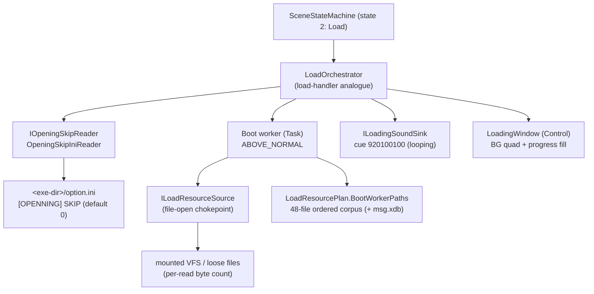
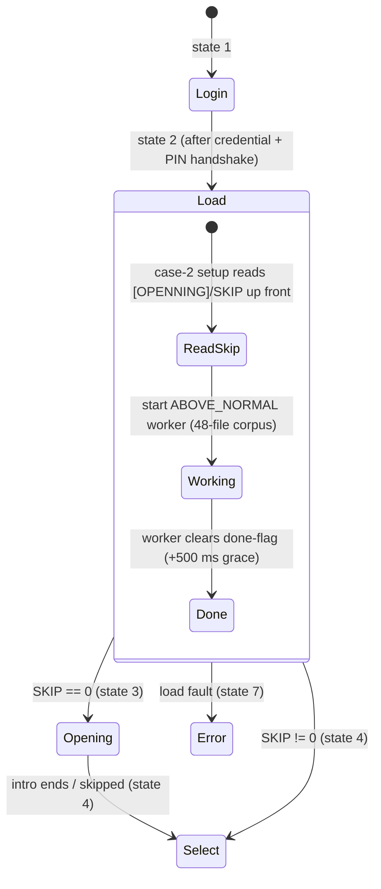
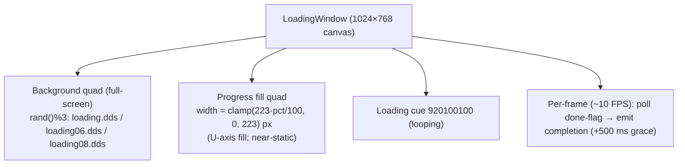

verification: independently re-confirmed 2026-06-18 directly from the doida.exe binary (scene
  reconstruction campaign, static IDA) — the state-2 → 3/4 SKIP gate was re-read from the application
  entry point, and the boot worker (registration-ordered table corpus + subsystem inits, then a 500 ms
  grace, then the worker done-flag clear that drives completion) was re-confirmed from the binary.
  Outcome CONFIRMED, no drift; the second-load-pass replay question remains debugger-pending (§9).
  (Prior basis: build 263bd994 re-confirmation campaign, synthesised from committed specs.)

# Scene Dossier — Load (engine state 2)

> **Clean-room neutral dossier.** Synthesised under EU Software Directive 2009/24/EC Art. 6
> (decompilation permitted solely to achieve interoperability). It contains **no decompiler
> pseudo-code, no binary virtual addresses, no decompiler identifiers**. `GameState` case numbers,
> opcode `(major, minor)` pairs, file paths, and the build-time progress denominator are
> interoperability facts and are stated where load-bearing. Every behaviour below is drawn from the
> committed clean specs cited in §10 — never from `_dirty/` and never from IDA directly.

---

## 1. Overview

**Load** is **engine `GameState` 2**, the single state between Login (1) and the post-login
front-end. Its job is to bring the global game data into memory before play can begin: it loads the
**full ordered 48-file boot data-table corpus** (events / items / skills / npc / mobs / quests / …)
on a **background worker thread** running at **ABOVE_NORMAL** priority, while the main thread renders
a static loading screen at roughly 10 FPS. When the worker finishes, the engine branches to one of
two destinations chosen by an INI flag.

Three facts make this scene behave the way it does:

- **The work is hardcoded, not data-driven.** There is no per-scene resource manifest request; the
  state machine *is* the orchestrator and the 48-file corpus is a compiled-in, fixed-order spine
  (the registration order is load-bearing). See §6 and `resource_pipeline.md §2.1a`.
- **The progress bar barely moves.** Progress is a **truncating integer quotient** of a cumulative
  bytes-loaded counter divided by a **build-time literal denominator of 9,395,240 bytes (≈ 8.96 MiB)**.
  Because the whole boot set is only about one denominator's worth of bytes, the quotient stays near
  0–1 for the entire load — the bar is essentially decorative. **Completion is gated solely by the
  worker's done-flag** (plus a fixed 500 ms grace), never by the bar reaching a value.
- **The destination is decided by an INI gate, up front.** Before the worker even finishes, case 2
  reads a private-profile integer — section **`[OPENNING]`** (double **N**), key **`SKIP`**, default
  `0`, from **`<exe-dir>\option.ini`** (held by the DoOption settings singleton). `SKIP == 0` →
  **state 3 (Opening cinematic)**; `SKIP != 0` → **state 4 (Character Select)**.

The state is entered **twice per session**: once after login (the boot pass documented here) and
once on entering the world. The same handler and worker machinery runs both times; whether the
in-world pass replays the full corpus or short-circuits the already-cached subsystem tables is the
one open item (§9).

**Filename quirks in the corpus** (intentional spellings in the shipped data set — a faithful port
must preserve them verbatim): the OPENNING section spelling has a **double N**; the descript table is
**`discript.sc`** (extension `.sc`, *not* `.scr`); the tutor table is **`Tutor.scr`** (capital
**T**); the stance/"do" table is **`musajung.do`**; and the extra-items table is **`items_extra.do`**.

---

## 2. Object & ownership inventory

The legacy state-2 machinery is a **single allocation** that is both the boot loader and the on-screen
loading window (the load-handler and the loading window are the **same object**). It owns three
load-bearing fields a clean-room layout can mirror: a **thread-running flag** (set when constructed,
cleared by the worker on completion, polled by the render callback), a **loading-background-texture
handle** (the chosen `loading.dds`), and the **worker thread-slot**. The `OPENNING/SKIP` decision is
an INI read performed by the case-2 setup, **not** an object the loader owns.

| Legacy role | Engine-free analogue (this repo) | Owns / responsibility |
|---|---|---|
| Load-handler + loading window (one object) | `LoadOrchestrator` (Application) + `LoadingWindow` (Godot) | the worker, the cumulative-bytes counter, the SKIP decision wiring, the loading screen |
| Boot worker thread (ABOVE_NORMAL) | `Task.Run(RunWorkerAsync)` inside `LoadOrchestrator` | iterate the corpus in order; accumulate bytes; set Completed |
| Fixed compiled corpus | `LoadResourcePlan.BootWorkerPaths` (48 entries) + `MessageCataloguePath` | the ordered file-registration spine |
| File-open chokepoint (VFS-or-loose) | `ILoadResourceSource.LoadAsync(path)` → byte count | one logical-path → bytes seam; mount-flag handled by the adapter |
| `[OPENNING]/SKIP` private-profile read | `IOpeningSkipReader` / `OpeningSkipIniReader` | read `<ini>` section `OPENNING`, key `SKIP`; default false |
| Looping loading SFX `920100100` | `ILoadingSoundSink.PlayLooping` (one path) | start the loading BGM cue once |
| Loading screen (BG + bar) | `LoadingWindow` (`Control`) under `LoadScene` | two textured quads; 500 ms grace; emit completion |



---

## 3. State machine

State 2 has exactly two exits, both decided by the `OPENNING/SKIP` gate that case 2 evaluates **up
front** (before the worker finishes). The worker's done-flag is what *releases* the transition; the
SKIP value is what *chooses* the destination. The error path is the engine's generic state 7.



> The `LoadOrchestrator` applies the SKIP decision synchronously at `Start()` (it writes
> `SceneStateMachine.SkipOpening`), so the destination (`DestinationAfterLoad`) is known immediately;
> the presentation layer only *reports* it. The route fires when the worker completes and the
> loading window's 500 ms grace elapses.

---

## 4. Execution flow

The worker iterates the corpus **in registration order**, accumulating per-read byte counts into the
cumulative counter; the main thread polls progress (cosmetic) and the done-flag. On completion, after
a 500 ms grace, the engine reads the already-decided SKIP destination and transitions.

```mermaid
sequenceDiagram
    participant Case2 as Case-2 setup (main thread)
    participant Skip as OpeningSkipReader
    participant Win as LoadingWindow (main thread)
    participant Wk as Boot worker (ABOVE_NORMAL)
    participant Src as ILoadResourceSource (VFS)

    Case2->>Skip: read [OPENNING]/SKIP (default 0)
    Skip-->>Case2: destination = Opening(3) if 0 else Select(4)
    Case2->>Win: build loading screen (BG rand()%3); start cue 920100100 (loop)
    Case2->>Wk: start worker (raise running flag)

    Note over Wk,Src: msg.xdb is a case-1-only synchronous pre-load (NOT re-loaded on a reload)
    loop for each of the 48 corpus entries (in order)
        Wk->>Src: LoadAsync(path)
        Src-->>Wk: byte count (absent file ⇒ 0, warn-and-continue)
        Wk->>Wk: cumulativeBytes += bytes
    end
    Note over Wk: Sleep 500 ms grace, then clear the done-flag

    loop every frame (~10 FPS)
        Win->>Win: progress = cumulativeBytes / 9,395,240 (integer; bar ~static)
        Win->>Wk: poll done-flag
    end
    Wk-->>Win: done-flag cleared
    Win->>Case2: completion (after 500 ms grace) → advance to destination (3 or 4)
```

Key timing/behaviour facts (all CODE-CONFIRMED in the source specs):

- **Worker priority:** ABOVE_NORMAL; it runs to completion, sleeps 500 ms, clears the running flag,
  exits. Completion is the flag, never the bar.
- **Loading-screen cadence:** the render callback throttles to roughly **10 FPS** during loading (a
  loading-state-specific cadence, distinct from the normal-play ~60 FPS cap).
- **Existence-aware loads:** an absent VFS entry contributes **zero bytes** and is skipped
  (warn-and-continue); a missing optional file **never** throws and never aborts the boot.
- **`msg.xdb`** (the CP949 UI string catalogue, fixed 516-byte records) is loaded **synchronously on
  the main thread during the state-1 → state-2 transition** — a separate load from the worker corpus,
  and **not** re-loaded on a reload (§9).

---

## 5. UI architecture

The loading screen is an **immediate-mode two-quad render** over a fixed **1024×768** reference
canvas. There is no widget tree to speak of — just a background and a progress fill.

- **Background quad — full-screen.** One of three DDS images is chosen at random (`rand() % 3`):
  `data/ui/loading.dds`, `data/ui/loading06.dds`, `data/ui/loading08.dds`. Drawn at
  `(0, 0, screenW, screenH)`.
- **Progress-bar fill — a width fill.** Maximum drawn fill width is **223 px**;
  `fill_px = clamp(223 · pct / 100, 0, 223)`, with UV scaling proportional (max `U = 223/1024 ≈
  0.2178`). The bar height is constant; only the width grows (left → right). Because `pct` is the
  near-static integer quotient of §1, the fill advances by at most a hair and **never fills** — it is
  decorative.
- **Loading SFX.** Sound cue **`920100100`** is played **looping** when the screen starts (category 0,
  a single direct voice, so it cannot double-stack).
- **Completion is flag-driven.** The render callback polls the worker's done-flag; on completion it
  signals the engine to leave the loading loop (after the 500 ms grace). The bar value never gates
  the transition.



---

## 6. Asset manifest

The state-2 load touches two asset classes: the **loading-screen background** (one of three DDS) and
the **boot data-table corpus** (the 48-file spine plus the case-1 `msg.xdb` pre-load). The corpus is
summarised by category below; the **authoritative ordered list of all 48 entries** lives in
`resource_pipeline.md §2.1a` and must be followed in order (registration order is load-bearing).

| Asset | Path / family | Role | Notes |
|---|---|---|---|
| Loading background | `data/ui/loading.dds` \| `loading06.dds` \| `loading08.dds` | full-screen BG | chosen by `rand()%3` |
| UI string catalogue | `data/script/msg.xdb` | CP949 UI strings (516-byte records) | **case-1 synchronous pre-load**, not part of the 48; not reloaded on a reload |
| Core record tables | `data/script/*.scr` (events, system_control, mapsetting, items, skills, users, npc(s), mobs, quests, chivalry, …) | gameplay/data definitions | bulk of the corpus; CP949 |
| `.do` / `.xdb` tables | `musajung.do`, `items_extra.do`, `emoticon.do`, `textcommand.do`; `effectscale.xdb`, `creature_item.xdb`, `vehicle.xdb`, `buff_icon_position.xdb` | stance, extra-items, emoticon, effect/creature/vehicle/buff tables | filename quirks (§1); CP949 |
| Quirk-named tables | `discript.sc` (ext `.sc`), `Tutor.scr` (capital T) | descript / tutor | preserve spellings verbatim |
| UI / icon manifests | `data/ui/UiTex.txt`, `data/item/skinlist.txt`, `data/char/sameemoticon.txt`, `data/ui/guildicon/crestlist.txt` | UI id pool, item-skin, emoticon, guild-crest icon list | `UiTex.txt` seeds the global UI texture id pool |
| Effect manifest chain | `data/effect/bmplist.lst` then `xobj.lst` / `xeffect.lst` (+ effect-cache prime) / `totalmugong.txt` (+ joint/sword-light) | shared effect texture pool + effect manifests | corpus entry #47 + the #48 "chain" |

Interleaved with the 48 explicit file paths are roughly a dozen **subsystem-init / manifest steps**
that resolve their own paths internally (skill-icon manifest, banned-word table, shadow-manager init,
effect-manager init, terrain-manager first-touch, character-visual manifest, generic subsystem
inits). They are **not** numbered file entries; the total worker step count is ≈ 57. The **48 entries
are the file-registration spine** a port must reproduce in order. See `resource_pipeline.md §2.1a` for
the full numbered list and `§2.1` for the per-category breakdown.

---

## 7. C# + Godot fidelity summary

The engine-free state-2 logic lives in the Application layer; Godot is a passive shell that runs it
and renders the loading screen. **Campaign outcome: the core load logic was CONFIRMED to MATCH the
spec** (the 9,395,240 denominator and the `OPENNING/SKIP` gate were both already faithful); the one
divergence — the corpus had only ~10 entries instead of the full 48 — was **FIXED this campaign
(Phase 3)** by restoring `BootWorkerPaths` to the full existence-aware 48-file set.

> **Strict-1:1 reconstruction (applied) — the client now REQUIRES the real VFS.** The defensive
> **catch-to-`Faulted`** wrapper in `LoadOrchestrator` was **removed**: a genuine load fault now
> propagates instead of being swallowed into a benign `Faulted` state (the worker still catches only
> `OperationCanceledException` → `Cancelled`/rethrow). The **transparent-offline fallbacks** in the
> presentation shell (`LoadingWindow` / `LoadScene`) were likewise **removed** — a real fault now
> routes to the engine error path (state 7) and does **not** silently advance as if the load had
> succeeded. (This is distinct from, and does not touch, the faithful **per-file warn-and-continue**
> tolerance below, which an absent *optional* corpus file still relies on — matching the binary.)

| Concern | Implementation (path) | Fidelity note |
|---|---|---|
| 48-file ordered corpus | `04.Client.Core/MartialHeroes.Client.Application/Assets/LoadResourcePlan.cs` | **`BootWorkerPaths` RESTORED 10 → 48 this campaign (Phase 3)**, in registration order, with the §1 filename quirks preserved verbatim; the effect-manifest chain is expanded as the #48 entries. `MessageCataloguePath` carries `msg.xdb`. |
| Worker + denominator + SKIP routing | `…/Assets/LoadOrchestrator.cs` | engine-free LoadHandler analogue: `LegacyProgressDenominatorBytes = 9_395_240` with **integer** `ProgressQuotient`; runs the corpus on `Task.Run`; re-reads `OPENNING/SKIP` **unconditionally** on every state-2 entry (incl. reloads); `DestinationAfterLoad` = Select if SKIP else Opening. **CONFIRMED MATCH.** |
| Existence-aware skip | `…/Assets/LoadOrchestrator.cs` (`LoadAndTrackAsync`) + `ILoadResourceSource` | a load returning `0` bytes contributes nothing and is skipped; **absent VFS files warn-and-continue, never throw** — matches the legacy missing-file tolerance. |
| `OPENNING/SKIP` reader | `…/Assets/IOpeningSkipReader.cs` + `…/Assets/OpeningSkipIniReader.cs` | private-profile-style read of section **`OPENNING`**, key **`SKIP`**, default `0`; CP949-aware; absent file ⇒ `false` (→ Opening). **CONFIRMED MATCH.** |
| `msg.xdb` pre-load | `…/Assets/LoadOrchestrator.cs` (`RunWorkerAsync`, guarded by `_startedAsReload`) | loaded on first entry only; **not** re-loaded on a reload — matches the case-1-only synchronous pre-load rule. |
| Loading cue `920100100` | `…/Assets/ILoadingSoundSink.cs`; Godot `LoadingWindow.StartBgm` / `GodotLoadingSoundSink` | looping cue, category 0; single voice so it cannot double-stack; `PlayOwnCue=false` when the orchestrator routes it to avoid doubling. |
| Loading screen (BG + fill) | `05.Presentation/MartialHeroes.Client.Godot/Ui/Scenes/Load/LoadingWindow.cs` | immediate-mode two-quad render: full-screen BG `rand()%3`; width-fill bar `clamp(223·pct/100,0,223)` (U-axis, max `223/1024`); 500 ms grace before emitting completion. |
| State-2 controller | `05.Presentation/MartialHeroes.Client.Godot/Scene/Controllers/LoadScene.cs` | builds `LoadingWindow`, starts `LoadOrchestrator`, awaits `Completion`, then asks the scene host to advance; the **SceneStateMachine** chooses 2→3 vs 2→4 (Godot does not route). |

---

## 8. Validation checklist

- [ ] `LoadResourcePlan.BootWorkerPaths` lists **48** entries in registration order, with the quirks
      `musajung.do`, `items_extra.do`, `discript.sc` (ext `.sc`), `Tutor.scr` (capital T) preserved.
- [ ] The progress denominator is the literal **9,395,240** and the quotient is **integer** division
      (so the bar is near-static); completion is driven by the worker done-flag, not the bar.
- [ ] `OpeningSkipIniReader` reads section **`OPENNING`** (double N), key **`SKIP`**, default `0`;
      absent file / absent key ⇒ Opening (state 3); non-zero ⇒ Select (state 4).
- [ ] The SKIP gate is **re-read on every state-2 entry**, including reloads (no reload-specific
      "skip the INI read" path).
- [ ] Absent VFS corpus files **warn-and-continue** (contribute 0 bytes), never throw or abort.
- [ ] `msg.xdb` is loaded on first entry only and is **not** re-loaded on a reload.
- [ ] The loading SFX `920100100` plays **looping** and is not doubled (single voice / single owner).
- [ ] The loading screen renders the full-screen BG (`rand()%3` of the three DDS) and a width-fill
      bar (max 223 px), then advances after the 500 ms grace.
- [ ] Godot does not choose the post-load route — the **SceneStateMachine** does (2→3 vs 2→4).

---

## 9. Open items / GAPs

1. **Second load pass — full replay vs. cached short-circuit (capture/debugger-pending).** State 2 is
   entered twice per session: once after login (this dossier) and once on entering the world, reached
   in-world via the char-management reload (opcode **3/100**, codes 202/203/232 → state 2). The
   case-2 body is **byte-for-byte identical** between the two entries, so the SKIP gate is re-read
   either way (in practice SKIP is already 1 after the first opening, so a reload goes straight to
   Select). What is **not** statically determinable is whether the in-world pass **replays the full
   48-file corpus** or whether individual table loaders **early-out** when their registry is already
   populated (which would make the second loading screen near-instant). This determines whether the
   second loading screen is fast or full-length and must be confirmed against a live world-entry /
   reload transition (debugger). The current port re-runs the worker but **omits the `msg.xdb`
   reload** (the one genuine reload difference) — see `resource_pipeline.md §2.5 / §2.6 / §8 item 5`.
2. **Progress denominator origin (minor).** `9,395,240` is a build-time literal; whether it still
   matches the shipped VFS's boot-set byte sum (and is not patched at runtime) is unconfirmed. A
   clean-room port that wants a bar that actually moves should sum the boot set's real TOC entry sizes
   rather than reuse the legacy constant (`resource_pipeline.md §8 item 7`).
3. **Boot-table order dependencies (minor).** No mandatory data dependency between the 48 tables was
   confirmed; before any parallelisation, a per-loader dependency audit is needed to prove the order
   is non-load-bearing (`resource_pipeline.md §7.2 / §8 item 2`).

---

## 10. Sources

- `Docs/RE/specs/resource_pipeline.md` — §2 (boot worker / state 2), §2.1 + **§2.1a** (the 48-file
  corpus and its authoritative registration order), §2.2 (`msg.xdb` synchronous pre-load), §2.3
  (loading-screen sub-init, BG `rand()%3`, cue `920100100`, ~10 FPS), §2.4 (progress meter +
  `9,395,240` denominator), §2.5 (`OPENNING/SKIP` gate + reload re-read), §2.6 + §8 item 5 (state-2
  entered twice; replay vs cache open item), §6.2 / §7.6 (missing-file tolerance).
- `Docs/RE/specs/client_architecture.md` — §3 (the `GameState` 0..7 scene machine; 2 = Load; SKIP
  edge 2→4), §6 (boot corpus + loading screen + near-static bar), §12 (verification status).
- `Docs/RE/specs/frontend_layout_tables.md §5` — loading-screen layout (BG + width-fill bar geometry,
  cue, grace) as wired in the Godot `LoadingWindow`.
- Implementation cited in §7:
  `04.Client.Core/MartialHeroes.Client.Application/Assets/LoadResourcePlan.cs`,
  `…/Assets/LoadOrchestrator.cs`, `…/Assets/IOpeningSkipReader.cs`,
  `…/Assets/OpeningSkipIniReader.cs`, `…/Assets/ILoadResourceSource.cs`,
  `…/Assets/ILoadingSoundSink.cs`,
  `05.Presentation/MartialHeroes.Client.Godot/Scene/Controllers/LoadScene.cs`,
  `05.Presentation/MartialHeroes.Client.Godot/Ui/Scenes/Load/LoadingWindow.cs`.
