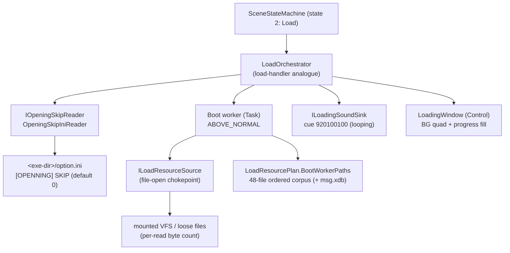
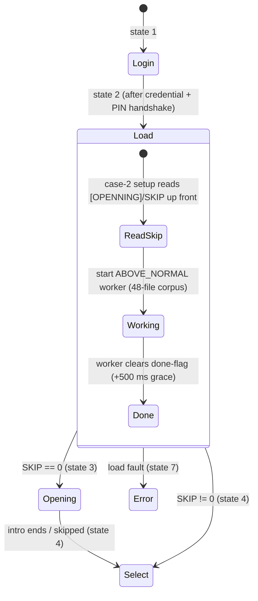
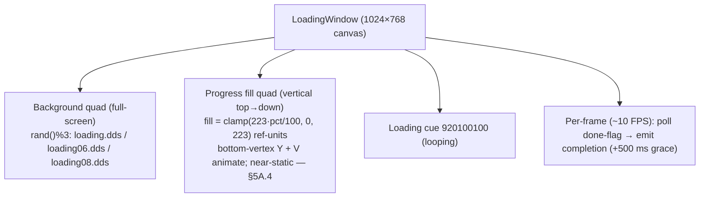

verification: re-confirmed 2026-06-21 directly from the doida.exe binary (IDB SHA 263bd994), static
  IDA — the state-2 → 3/4 SKIP gate, the boot worker (registration-ordered table corpus + subsystem
  inits, then a 500 ms grace, then the worker done-flag clear that drives completion), AND the full
  2D-GUI scene-object internals (the single 0x218 LoadHandler object, its 2-slot vtable, the embedded
  Diamond::GView render-host sub-object, the two immediate-mode quads, asset linkages and per-frame
  render proc) were all re-derived from the binary. NEW THIS PASS (§5A): the "net flag byte" reset in
  the visual-init ctor is identified as the **keepalive-suppress flag (NetClient +82364)** — its only
  other binary reference is the 20 s keepalive timer thread, which transmits only while the flag is 0,
  so entering Load re-enables keepalive sends (§5A.4 networking side-effect); the both-quads-one-texture
  binding, the SetTexture stage-0 bind, and the teardown COM-Release-at-vtbl+8 are independently
  re-confirmed against the actual call shapes. PRIOR PASS (§5A): the progress bar fills VERTICALLY
  (top→down), not horizontally — the earlier §5/§7 "width-fill, left→right" reading is superseded
  (GAP-1). Outcome CONFIRMED, no other drift; the second-load-pass replay question and the byte-exact
  quad vertex stride remain debugger-pending (§9).
  (Prior basis: build 263bd994 re-confirmation campaign, synthesised from committed specs.)
  2026-06-24 audit: added cross-link in §5A.4 noting NetClient +82364 is the same physical byte as
  character_creation.md §5 Latch B (network-client create in-flight marker); one byte, two roles.
  Validation checklist updated correspondingly. IDB SHA 263bd994; no structural drift.

# Scene Dossier — Load (engine state 2)

> **Clean-room neutral dossier.** Synthesised under EU Software Directive 2009/24/EC Art. 6
> (decompilation permitted solely to achieve interoperability). It contains **no decompiler
> pseudo-code, no binary virtual addresses, no decompiler identifiers**. `GameState` case numbers,
> opcode `(major, minor)` pairs, file paths, and the build-time progress denominator are
> interoperability facts and are stated where load-bearing. Every behaviour below is drawn from the
> committed clean specs cited in §10 — never from `_dirty/` and never from IDA directly.

---

## 1. Overview

**Load** is **engine `GameState` 2**, the single state between Login (1) and the post-login
front-end. Its job is to bring the global game data into memory before play can begin: it loads the
**full ordered 48-file boot data-table corpus** (events / items / skills / npc / mobs / quests / …)
on a **background worker thread** running at **ABOVE_NORMAL** priority, while the main thread renders
a static loading screen at roughly 10 FPS. When the worker finishes, the engine branches to one of
two destinations chosen by an INI flag.

Three facts make this scene behave the way it does:

- **The work is hardcoded, not data-driven.** There is no per-scene resource manifest request; the
  state machine *is* the orchestrator and the 48-file corpus is a compiled-in, fixed-order spine
  (the registration order is load-bearing). See §6 and `resource_pipeline.md §2.1a`.
- **The progress bar barely moves.** Progress is a **truncating integer quotient** of a cumulative
  bytes-loaded counter divided by a **build-time literal denominator of 9,395,240 bytes (≈ 8.96 MiB)**.
  Because the whole boot set is only about one denominator's worth of bytes, the quotient stays near
  0–1 for the entire load — the bar is essentially decorative. **Completion is gated solely by the
  worker's done-flag** (plus a fixed 500 ms grace), never by the bar reaching a value.
- **The destination is decided by an INI gate, up front.** Before the worker even finishes, case 2
  reads a private-profile integer — section **`[OPENNING]`** (double **N**), key **`SKIP`**, default
  `0`, from **`<exe-dir>\option.ini`** (held by the DoOption settings singleton). `SKIP == 0` →
  **state 3 (Opening cinematic)**; `SKIP != 0` → **state 4 (Character Select)**.

The state is entered **twice per session**: once after login (the boot pass documented here) and
once on entering the world. The same handler and worker machinery runs both times; whether the
in-world pass replays the full corpus or short-circuits the already-cached subsystem tables is the
one open item (§9).

**Filename quirks in the corpus** (intentional spellings in the shipped data set — a faithful port
must preserve them verbatim): the OPENNING section spelling has a **double N**; the descript table is
**`discript.sc`** (extension `.sc`, *not* `.scr`); the tutor table is **`Tutor.scr`** (capital
**T**); the stance/"do" table is **`musajung.do`**; and the extra-items table is **`items_extra.do`**.

---

## 2. Object & ownership inventory

The legacy state-2 machinery is a **single allocation** that is both the boot loader and the on-screen
loading window (the load-handler and the loading window are the **same object**). It owns three
load-bearing fields a clean-room layout can mirror: a **thread-running flag** (set when constructed,
cleared by the worker on completion, polled by the render callback), a **loading-background-texture
handle** (the chosen `loading.dds`), and the **worker thread-slot**. The `OPENNING/SKIP` decision is
an INI read performed by the case-2 setup, **not** an object the loader owns.

| Legacy role | Engine-free analogue (this repo) | Owns / responsibility |
|---|---|---|
| Load-handler + loading window (one object) | `LoadOrchestrator` (Application) + `LoadingWindow` (Godot) | the worker, the cumulative-bytes counter, the SKIP decision wiring, the loading screen |
| Boot worker thread (ABOVE_NORMAL) | `Task.Run(RunWorkerAsync)` inside `LoadOrchestrator` | iterate the corpus in order; accumulate bytes; set Completed |
| Fixed compiled corpus | `LoadResourcePlan.BootWorkerPaths` (48 entries) + `MessageCataloguePath` | the ordered file-registration spine |
| File-open chokepoint (VFS-or-loose) | `ILoadResourceSource.LoadAsync(path)` → byte count | one logical-path → bytes seam; mount-flag handled by the adapter |
| `[OPENNING]/SKIP` private-profile read | `IOpeningSkipReader` / `OpeningSkipIniReader` | read `<ini>` section `OPENNING`, key `SKIP`; default false |
| Looping loading SFX `920100100` | `ILoadingSoundSink.PlayLooping` (one path) | start the loading BGM cue once |
| Loading screen (BG + bar) | `LoadingWindow` (`Control`) under `LoadScene` | two textured quads; 500 ms grace; emit completion |



---

## 3. State machine

State 2 has exactly two exits, both decided by the `OPENNING/SKIP` gate that case 2 evaluates **up
front** (before the worker finishes). The worker's done-flag is what *releases* the transition; the
SKIP value is what *chooses* the destination. The error path is the engine's generic state 7.



> The `LoadOrchestrator` applies the SKIP decision synchronously at `Start()` (it writes
> `SceneStateMachine.SkipOpening`), so the destination (`DestinationAfterLoad`) is known immediately;
> the presentation layer only *reports* it. The route fires when the worker completes and the
> loading window's 500 ms grace elapses.

---

## 4. Execution flow

The worker iterates the corpus **in registration order**, accumulating per-read byte counts into the
cumulative counter; the main thread polls progress (cosmetic) and the done-flag. On completion, after
a 500 ms grace, the engine reads the already-decided SKIP destination and transitions.

```mermaid
sequenceDiagram
    participant Case2 as Case-2 setup (main thread)
    participant Skip as OpeningSkipReader
    participant Win as LoadingWindow (main thread)
    participant Wk as Boot worker (ABOVE_NORMAL)
    participant Src as ILoadResourceSource (VFS)

    Case2->>Skip: read [OPENNING]/SKIP (default 0)
    Skip-->>Case2: destination = Opening(3) if 0 else Select(4)
    Case2->>Win: build loading screen (BG rand()%3); start cue 920100100 (loop)
    Case2->>Wk: start worker (raise running flag)

    Note over Wk,Src: msg.xdb is a case-1-only synchronous pre-load (NOT re-loaded on a reload)
    loop for each of the 48 corpus entries (in order)
        Wk->>Src: LoadAsync(path)
        Src-->>Wk: byte count (absent file ⇒ 0, warn-and-continue)
        Wk->>Wk: cumulativeBytes += bytes
    end
    Note over Wk: Sleep 500 ms grace, then clear the done-flag

    loop every frame (~10 FPS)
        Win->>Win: progress = cumulativeBytes / 9,395,240 (integer; bar ~static)
        Win->>Wk: poll done-flag
    end
    Wk-->>Win: done-flag cleared
    Win->>Case2: completion (after 500 ms grace) → advance to destination (3 or 4)
```

Key timing/behaviour facts (all CODE-CONFIRMED in the source specs):

- **Worker priority:** ABOVE_NORMAL; it runs to completion, sleeps 500 ms, clears the running flag,
  exits. Completion is the flag, never the bar.
- **Loading-screen cadence:** the render callback throttles to roughly **10 FPS** during loading (a
  loading-state-specific cadence, distinct from the normal-play ~60 FPS cap).
- **Existence-aware loads:** an absent VFS entry contributes **zero bytes** and is skipped
  (warn-and-continue); a missing optional file **never** throws and never aborts the boot.
- **`msg.xdb`** (the CP949 UI string catalogue, fixed 516-byte records) is loaded **synchronously on
  the main thread during the state-1 → state-2 transition** — a separate load from the worker corpus,
  and **not** re-loaded on a reload (§9).

---

## 5. UI architecture

The loading screen is an **immediate-mode two-quad render** over a fixed **1024×768** reference
canvas. There is no widget tree to speak of — just a background and a progress fill.

- **Background quad — full-screen.** One of three DDS images is chosen at random (`rand() % 3`):
  `data/ui/loading.dds`, `data/ui/loading06.dds`, `data/ui/loading08.dds`. Drawn at
  `(0, 0, screenW, screenH)`.
- **Progress-bar fill — a vertical, top→down fill (corrected; see §5A.4).** The gauge rect spans
  design X[−499, −170] (width 329 ref-units), design Y[−363, −140] (height 223 ref-units). Each frame
  the render proc computes `fill_px = clamp(223 · pct / 100, 0, 223)` ref-units and overwrites **only
  the bottom-vertex Y and V-texcoord** (the top edge is fixed). The fill grows **downward from a fixed
  top edge** (top Y = −363 fixed; bottom Y advances toward −140 as the bar fills). The U extents are
  fixed throughout. Because `pct` is the near-static integer quotient of §1, the fill advances by at
  most a hair and **never fills** — it is decorative. The bar is a UV sub-rect of the same background
  DDS (no separate gauge texture).
- **Loading SFX.** Sound cue **`920100100`** is played **looping** when the screen starts (category 0,
  a single direct voice, so it cannot double-stack).
- **Completion is flag-driven.** The render callback polls the worker's done-flag; on completion it
  signals the engine to leave the loading loop (after the 500 ms grace). The bar value never gates
  the transition.



> **Axis correction (GAP-1, this pass).** The legacy fill is **vertical (top→down)**, not the
> horizontal left→right fill described above in prose. Both directions yield the same near-static,
> decorative motion (the §1 integer quotient barely advances), but a 1:1 render must grow the bar
> **downward from a fixed top edge** — see §5A.4 for the exact vertex math. The §7 implementation table
> and §8 checklist below carry the corrected axis; the geometry numbers (max 223, 1024×768 reference)
> are unchanged.

---

## 5A. 2D GUI scene-object internals

This section documents the on-screen Load GUI at the **scene-object** level — the exact widget
inventory, build sequence, asset linkages, dynamic behaviour, and text/font story — as re-derived from
the binary. It refines §2 and §5 with the structural ground truth and supersedes the bar-axis prose.

### 5A.0 Headline — Load is a *direct-draw* screen, NOT a `GUComponent` widget tree

Unlike Login (`LoginWindow`) and Opening (`COpeningWindow`), which build a `Diamond::GUWindow` and
populate it with child `GUButton` / `GULabel` / `GUTextbox` widgets, the Load screen builds **no
GUComponent children at all**. It is **one** heap object — the **`LoadHandler`** (handler/window name
string **`"Loader"`**) — that draws **two immediate-mode textured quads** (a full-screen background +
a progress gauge) through a per-frame render callback hosted on an embedded view sub-object. There is
**no parent `GUWindow`, no child component list, and no per-child `actionId`** in this scene; the
universal `(textureId, x, y, w, h, srcX, srcY, actionId)` child-ctor shape is **never** invoked here.
Consequently the shared button 3-state / hit-test / event-6 click machinery (see
`structs/gucomponent.md`, `specs/ui_system.md §1`) is dormant on this scene.

### 5A.1 Component tree

The `LoadHandler` *is* the container — every visual, the boot thread, and the busy flag are direct
members of the single object. The only "containment" is the engine-driven render-host sub-object.

| name | widget TYPE | role | parent |
|---|---|---|---|
| `LoadHandler` (`"Loader"`) | polymorphic C++ scene object (0x218 / 536 bytes) | the whole scene: owns both quads, the bg texture handle, the busy flag, the boot thread slot; RTTI `LoadHandler : Diamond::EventHandler` (base sub-object's dev alias = "Cmdhandler") | scene FSM (engine state 2) |
| `scene_view` (`Diamond::GView`) | embedded C++ sub-object @ **+0xC8** | render-host the engine ticks; hosts the per-frame loading render callback | `LoadHandler` |
| background image | immediate-mode textured quad (raw 4-vert sprite — **NOT** a `GUStatic`/`GULabel`) | full-screen loading artwork; one of three DDS chosen at random per load | `LoadHandler` (render-host) |
| progress gauge | immediate-mode textured quad (raw 4-vert sprite) | vertical fill bar; **sub-rect of the SAME bg DDS**; drawn only when progress > 0 | `LoadHandler` (render-host) |
| loading SFX | `Sound2D` (looped, category 0) | ambient loading cue, sound id **920100100**, loop = on | `LoadHandler` |
| boot worker | `ThreadSlot` @ **+0x20C** `{proc, handle, id}` | loads the static-data corpus off the VFS; clears the busy flag on completion → scene loop exits | `LoadHandler` |
| busy flag | `bool` @ **+0x200** | = 1 in the ctors; cleared by the boot thread when done → render-cb clears the engine run flag | `LoadHandler` |
| **(spinner / tip-text / buttons / modal / edit-box / panel / toast)** | — | **confirmed ABSENT** — no `GUStatic`/`GUButton`/`GUTextbox`/`GUPanel`, no font draw, no string-table lookup in the ctors or the render proc | — |

> The error **MessageBox** ("modal") is **not** part of Load. It lives in the separate engine failure
> **state 7** (compose localized message → hide main window → shut net client → Win32 `MessageBoxA`
> with `ICONERROR | TASKMODAL | SETFOREGROUND` → exit to state 8), reached from the earlier
> login/init path, **never** from Load itself. Load's own data-load faults produce only empty tables
> (and, in this repo's strict-1:1 reconstruction, route to state 7 — see §7), not an in-scene toast.

#### Object layout — `LoadHandler` (0x218 = 536 bytes; naturally aligned, polymorphic, `this`-in-ECX)

| offset | size | type | field | note |
|---|---|---|---|---|
| 0x000 | 4 | vptr | `__vftable` | → `LoadHandler` 2-slot vtable; base `Diamond::EventHandler` occupies +0x00..~+0x27 |
| 0x004 | ~0x1C | `std::string` | `handler_name` | base field = `"Loader"` (SSO string) |
| 0x020 | 4 | int | `event_param_a` | base field (observed = 1000) |
| 0x024 | 4 | int | `event_param_b` | base field (observed = 28158) |
| ~0x028..0x0C4 | float blocks | `float[]` | `background_quad_verts` + `progress_bar_quad_verts` | two 4-vertex sprites (pos+uv); bg block based ~+0x28 (object word +40), bar block based ~+0x78 (object word +120). Exact byte stride DEBUGGER-PENDING (§9). |
| 0x0C8 | (GView) | `Diamond::GView` | `scene_view` | render-host sub-object with its own vtable; de-registered by name + destroyed in teardown |
| ~0x18C/0x190 | 4+4 | fnptr/ptr | `render_callback {fn, self}` | per-frame draw proc + self context (object words +103/+104) |
| ~0x18C/0x190 (b) | 4+4 | ptr | `second_callback {null, self}` | registered-but-NULL engine callback slot (object words +99/+100); inert on Load (GAP-7) |
| 0x200 | 1 | bool | `busy_flag` | = 1 in ctors; cleared by boot thread on completion → render-cb clears engine run flag → scene exits |
| 0x201 | 3 | pad | — | alignment |
| 0x204 | 4 | handle | `bg_texture_handle` | DXTextureList id of the chosen `loading*.dds`; bound at draw; released in teardown |
| 0x208 | 4 | — | (alignment hole) | unused 4-byte gap (GAP-6: RESOLVED — not a field) |
| 0x20C | 4 | fnptr | `boot_thread_proc` | `ThreadSlot[0]` = boot data-table-corpus loader |
| 0x210 | 4 | HANDLE | `boot_thread_handle` | `ThreadSlot[1]` |
| 0x214 | 4 | uint | `boot_thread_id` | `ThreadSlot[2]` |

#### VTable — `LoadHandler` (exactly 2 slots)

| slot | role | note |
|---|---|---|
| 0 | scalar-deleting destructor | disables VFS progress; joins/closes the boot thread (+0x20C); de-registers + destroys the `GView` (+0xC8); runs the base dtor; conditional free |
| 1 | base virtual query/handler override (stub) | returns 0 (no-op override of the `EventHandler` base slot) |

> A sibling class **`SimpleLoadHandler`** exists (RTTI-confirmed — enables VFS progress but spawns **no**
> boot thread). It is **not** the class used by this scene.

### 5A.2 Creation order (the numbered build sequence)

Two ctors run on the **same** `this` (the handler ctor, then a second-phase visual initializer — the
"LoadingScreen" init is **not** a separate object). Geometry is given in the **1024×768 reference**
space; **there are no per-child `actionId`s** in this scene.

**Pre-build gate (WinMain scene FSM, state 2 — before the allocation):**
0. Read INI `[OPENNING] SKIP` (`GetPrivateProfileIntA`, default 0, from `<exe-dir>` profile) and
   **pre-arm the next state**: `SKIP != 0` → **state 4 (Char-Select / SelectWindow)** (Opening
   skipped); `SKIP == 0` → **state 3 (Opening / COpeningWindow)**. (A distinct buffer also receives a
   `"cTRUE"` section string near the lookup — GAP-3; not part of the SKIP value.)

**Object A — `LoadHandler` ("Loader") ctor (no GUI children):**
1. `operator new(0x218)` allocates the object (536 bytes).
2. Base command/event-handler ctor: name `"Loader"`, trailing scalars 1000 / 28158.
3. Install the `LoadHandler` vtable.
4. Construct the embedded `Diamond::GView` render-host sub-object @ +0xC8.
5. Set `busy_flag` @ +0x200 = 1.
6. Install the boot data-table-corpus loader proc into `ThreadSlot` @ +0x20C.
7. Zero `bg_texture_handle` @ +0x204; zero the progress/phase field consumed by the render proc.
8. Enable VFS load-progress tracking (resets + arms the per-read byte accumulator the bar reads).
9. **`SceneDisposeList_Push(driver, obj)`** — register the object for engine disposal (GAP-2; runs
   **between** the two ctors).

**Object B — second-phase visual init (same object; NO child components, NO action-ids):**
10. **Clear the NetClient keepalive-suppress flag (NetClient +82364 = 0).** This is the scene's sole
    networking side-effect: the only other binary reference to this byte is the 20 s keepalive timer
    thread (which clones the cached `2/10000` keepalive frame and enqueues it), and that thread
    transmits **only while the flag is 0**. Clearing it on entering Load therefore **re-enables
    keepalive transmission** for the load. (GAP-1 of this pass — prior text described this only as
    "net state cleared.")
11. Cache the render-driver singleton, the `Diamond` singleton, and a helper sub-object.
12. Zero a 64-byte filename buffer.
13. **Pick the background** via `rand() % 3`: 0 → `data/ui/loading.dds`, 1 → `data/ui/loading06.dds`,
    2 → `data/ui/loading08.dds` (literal paths formatted into the 64-byte buffer).
14. **Load that texture** at native size via the D3DX-from-VFS-or-disk creator; store the handle at
    `bg_texture_handle` @ +0x204.
15. **Play the looping 2D SFX** id **920100100**, loop = on.
16. Set the background quad **source rect** = `(0, 0, screenW, screenH)` and **color** = packed
    `(0,0,0,0)`; attach/register the bg sprite to the render driver.
17. Install the per-frame **render callback** (fn @ word +103, self @ word +104); set the **second
    callback** slot to `{null fn, self}` (words +99/+100); misc `Diamond` init.
18. Set `busy_flag` @ +0x200 = 1.
19. **BUILD THE BACKGROUND QUAD** (4 verts, full-screen, centered on origin): x extents `±0.5·screenW`,
    y extents `±0.5·screenH`, z/rhw = 1.0; vertex block based at object word **+40**.
20. **Compute scale factors:** `xScale = screenW / 1024`, `yScale = screenH / 768` (layout is against
    the **1024×768** reference and scaled to the live resolution).
21. **BUILD THE PROGRESS-GAUGE QUAD** (4 verts): left = `xScale·−499`, right = `xScale·−170`, top =
    `yScale·−363`, bottom = `yScale·−140`, z/rhw = 1.0; vertex block based at object word **+120**.
22. **Start the boot worker thread**, raise its priority to **ABOVE_NORMAL**.

**Scene-loop & teardown (after the build):**
23. Pre-loop **EffectManager free-list RESET** (frees each node, clears the list — shared across all
    scene cases; GAP-4), then `Engine_RunSceneLoop`.
24. Each frame the render callback runs (§5A.4); the boot thread loads the corpus and on completion
    sleeps 500 ms then clears `busy_flag` → render-cb clears the engine run flag → loop exits.
25. **Teardown order** (GAP-5; the embedded `GView` dispatch + COM-Release call shape independently
    re-confirmed this pass): dispatch/de-register the embedded `GView` command (by name) → unregister
    the loading texture from the shared DXTextureList pool → **COM-Release the bg texture (`IUnknown`
    vtable slot +8 = `Release`)** → join/close the boot `ThreadSlot` (+0x20C) → DisposableList push →
    vtable slot-0 scalar-deleting destructor. No child-widget teardown occurs (none exist). The FSM
    then advances to the pre-armed next state (3 Opening or 4 Char-Select).

> **Geometry summary.** Both quads are 4 vertices, **20-byte stride**, FVF **0x102 =
> `D3DFVF_XYZ | D3DFVF_TEX1`** (position xyz + uv), drawn `DrawPrimitiveUP(triangle-strip, 2 prims)`.
> The background spans the full screen centered on the origin; the gauge is a fixed-width
> (≈329 ref-units wide) rectangle in the lower-left band of the reference canvas. The
> `(x, y, w, h, srcX, srcY, actionId)` convention used by every other scene's child build **does not
> apply** — these are raw vertex blocks, no `actionId`.

### 5A.3 2D asset linkages

The scene binds and draws **exactly ONE** 2D texture: the randomly chosen full-screen `loading*.dds`.
**There is no separate gauge texture and no spinner texture** — the progress gauge is a **UV sub-rect
of the same bg DDS**. The three paths are **hard-coded literals** (one xref each, all inside the
visual-init ctor) — they are **NOT** entries in `UiTex.txt` or any scene manifest, and are loaded
directly by literal path through the D3DX VFS-or-loose creator at **native size**, cached in the shared
DXTextureList.

| component | asset (VFS path) | binding | source sub-rect (UV) |
|---|---|---|---|
| full-screen background | one of `data/ui/loading.dds` / `loading06.dds` / `loading08.dds` (`rand()%3`) | `SetTexture(stage 0, tex @ +0x204)` in the render tick | **U 0..1, V 0..0.75** — a 1024×768 image stored in the **top 75 %** of a 1024×1024 DDS |
| progress-gauge FILL | the **SAME** DDS (sub-rect) | second quad @ word +120, re-sized per frame from VFS progress | **U ≈ 0.7539..0.96875, V ≈ 0.4326..0.96875** (a lower band of the DDS); fill clamped 0..223 ref-units |
| cursor | (no texture) | per-frame cursor-position forwarder (`GetCursorPos`/`ScreenToClient` → child handler) | — — **NO-OP on Load** (no child handler registered); **NOT** a tip-text drawer |
| loading SFX | sound id **920100100** (looping, category 0) | `Sound2D` create + play | — (audio, not 2D) |

VFS paths (CP949-safe ASCII): `data/ui/loading.dds`, `data/ui/loading06.dds`, `data/ui/loading08.dds`.
The boot thread additionally consumes the full data-table corpus (scripts/`.scr`, `.xdb`/`.do` tables,
`UiTex.txt`, `data/item/skinlist.txt`, `data/char/sameemoticon.txt`, the `data/ui/guildicon/` crest
pool, …) — those are general resource loads whose VFS bytes drive the gauge, **not** part of this
scene's 2D draw set (the authoritative ordered corpus is in §6 + `resource_pipeline.md §2.1a`).

> **Sample-unverified (do NOT commit bytes):** the exact pixel dimensions of the three DDS (1024×1024
> inferred from `V = 0.75 = 768/1024`); the exact pixel rect of the gauge fill inside the DDS; whether
> the "empty groove" beneath the gauge is baked into the bg art (the bg quad covers the full screen
> incl. the groove — only the fill quad animates).

### 5A.4 Dynamic / modal / sub-state behaviour

Load is a **passive, dual-thread progress screen** with **no buttons, no in-scene modal, and no
toast**. The route-out is decided **up front** (the §5A.2 step-0 SKIP gate); the worker's done-flag
only *releases* the transition.

- **Two worker mechanisms.** (A) The boot data-loader thread sequentially loads the corpus, accumulates
  VFS bytes, then on completion **sleeps 500 ms** and clears `busy_flag` @ +0x200. (B) The render/tick
  callback (started ABOVE_NORMAL) runs each frame: ortho-2D projection sized to the live backbuffer,
  identity world/view, Z/lighting/cull off, alpha-blend on; bind the bg DDS to stage 0; **draw quad 1
  (background) unconditionally**; read `VFS_GetProgress()`; **if progress > 0, size and draw quad 2
  (the gauge)**; tick cursor/effects/sound; `Sleep(100 ms)` (≈10 FPS); present.
- **Gauge fill is VERTICAL (top→down) — GAP-1, the load-bearing fidelity correction.** With FVF 0x102,
  each vertex is `[x, y, z, u, v]`. The gauge quad's **X extents are FIXED** (left `xScale·−499`, right
  `xScale·−170`) and never animated. Each frame the render proc overwrites **only the Y of the two
  bottom vertices** (object words +164 / +184) and their **V texcoord** (words +176 / +196): the fill
  grows **downward from a fixed top edge**. Math proof: `bottom_y = top_y + width · yScale`; at
  progress 100 (`width = 223`) `bottom = yScale·−140`, exactly the ctor's static bottom edge.
  - **Magnitude:** `width = min(223 · progress / 100, 223)` reference units; `U-extent =
    min(width / 1024, 223/1024 = 0.21777344)`. (The 223 cap and the 1024×768 reference are unchanged
    from §5; only the **axis** is corrected.)
  - Because `progress` is the near-static integer quotient of §1 (a tiny corpus over the 9,395,240
    denominator), the gauge advances by at most a hair and **never fills** — it is decorative.
- **Completion is flag-driven, never bar-driven.** When the render callback observes `busy_flag`
  cleared, it calls the engine "clear run flag" routine; the scene loop (pump → present → tick →
  frame-limit, gated on the engine run flag) breaks, Load tears down, and control falls through to the
  **pre-armed** next state (3 Opening or 4 Char-Select).
- **Input is inert.** The universal per-frame hover hit-test (`GetCursorPos` → `ScreenToClient` →
  bounds-check → registered hover callback via a vtable slot) is present but dormant: **no clickable
  component is registered**, so there is nothing to route a click to (consistent with §5A.0 — no
  `GUComponent` tree, no `actionId`).
- **Networking side-effect — keepalive re-enabled (GAP-1, this pass).** The visual-init ctor's first
  statement clears the **NetClient keepalive-suppress flag (`NetClient +82364 = 0`)** (§5A.2 step 10).
  This byte has exactly two binary references: this write, and a read in the **20 s keepalive timer
  thread**, which clones the cached `2/10000` keepalive frame and enqueues it **only while the flag is
  0**. So entering Load **re-enables keepalive transmission** for the duration of the load — the one and
  only network behaviour this otherwise-passive screen has. (It is a flag write, not a `GUComponent`
  action.)
  > **Cross-link (`specs/character_creation.md §5`, Latch B).** `NetClient +82364` is the **same byte**
  > as the "Latch B — network-client create in-flight marker" documented in `character_creation.md §5`.
  > The char-management/create/enter builders (including the `1/6` create sender) **set** this byte to 1
  > when dispatching a request; the keepalive timer reads it to suppress transmit while a request is
  > outstanding; Load's visual-init **clears** it (= 0) when entering the load phase — re-enabling
  > keepalive. Both specs describe the same physical byte, one byte serving two roles. A faithful port
  > must model a single shared flag, not two independent booleans.
- **No in-scene error modal.** A data-load failure surfaces only as empty tables; the error MessageBox
  belongs to the separate **state 7** (§5A.1), and this repo's strict-1:1 reconstruction routes a real
  fault there rather than swallowing it (§7).

### 5A.5 Text / font / captions

**The Load scene renders NO text** — no string-DB caption, no inline label, no numeric percentage.
Every draw is a textured quad; any "loading" wording the player sees is **baked into the background
art**. No CP949 string is formatted or drawn in either ctor or the render proc, and the per-frame
helper that runs is the cursor hit-test forwarder, **not** a glyph call. The texture-bind helper is a
thin `SetTexture` wrapper (a renderer vtable slot), not a font draw.

The global **15-slot D3DX font table** (charset **129 / `HANGUL_CHARSET`**, common `LOGFONT` params,
typefaces **DotumChe** (default / most slots), **Dotum** (2 slots), **BatangChe** (4 slots), weight
bands 400 / 700 / 800; slot 0 = the unset default) and the **`msg.xdb`** UI string catalogue (516-byte
records: int32 key + 512-byte payload, sorted-map insert) are built **once during the Login boot
(engine state 1)**, before Load runs. Both are **resident and inherited** by Load but are **neither
created nor queried** by it. (`msg.xdb` is the case-1-only synchronous pre-load already noted in §4;
the font system is documented in `specs/ui_system.md §6`.)

### 5A.6 Cross-references — shared GUI framework

- **Why Load is the odd one out.** The shared 2D UI is the in-house `Diamond::GU*` C++ widget toolkit
  rooted at `GUComponent` (`GUWindow : GUPanel, EventHandler`; `GUButton`/`GUCheckBox`/`GULabel*`/
  `GUTextbox`/`GUList`/`GUScroll*`/`GUCanvas3D`). Load uses **none** of it for its visuals — it is a
  `LoadHandler : Diamond::EventHandler` direct-draw screen. For the widget base class, the canonical
  13-slot vtable (setVisible / setPosition / hitTest / onEvent / onDraw / onUpdate / computeTransform /
  getHitActionId / onMouseEnter / onMouseLeave), the `actionId` @ +0x10 / event-type-6 click model,
  and the field layout, see **`Docs/RE/structs/gucomponent.md`**.
- **Top-level window object** (the thing Login/Opening build and Load deliberately does NOT): the
  multiple-inheritance `GUWindow` layout (primary `GUPanel` vtable + `EventHandler` COL, embedded
  `Cmdhandler`/`GView`/`GUTextureList`), with sizes `LoginWindow` 0x558 / `MainWindow` 0x5B8 — see
  **`Docs/RE/structs/guwindow.md`**. Load's embedded `Diamond::GView` @ +0xC8 is the same view
  sub-object class `GUWindow` embeds; its dev-alias base "Cmdhandler" matches the `EventHandler`/
  `Cmdhandler` family documented there.
- **Toolkit + scene machine overview:** the widget roster, the 178-slot panel-slot→class map, the
  D3DX font system, and the `GameState` 0..7 scene FSM (2 = Load) are in
  **`Docs/RE/specs/ui_system.md`** (§1 toolkit, §6 fonts, scene machine). The boot data-corpus that
  drives the gauge is in **`Docs/RE/specs/resource_pipeline.md §2`** (see §6 + §10 here).
- **Sibling scene dossiers:** `Docs/RE/scenes/scene_state_machine.md` (the FSM + SKIP edge),
  `Docs/RE/scenes/login.md` (state 1; builds the font table + `msg.xdb` Load inherits),
  `Docs/RE/scenes/opening.md` (state 3, one of Load's two exits).

---

## 6. Asset manifest

The state-2 load touches two asset classes: the **loading-screen background** (one of three DDS) and
the **boot data-table corpus** (the 48-file spine plus the case-1 `msg.xdb` pre-load). The corpus is
summarised by category below; the **authoritative ordered list of all 48 entries** lives in
`resource_pipeline.md §2.1a` and must be followed in order (registration order is load-bearing).

| Asset | Path / family | Role | Notes |
|---|---|---|---|
| Loading background | `data/ui/loading.dds` \| `loading06.dds` \| `loading08.dds` | full-screen BG | chosen by `rand()%3` |
| UI string catalogue | `data/script/msg.xdb` | CP949 UI strings (516-byte records) | **case-1 synchronous pre-load**, not part of the 48; not reloaded on a reload |
| Core record tables | `data/script/*.scr` (events, system_control, mapsetting, items, skills, users, npc(s), mobs, quests, chivalry, …) | gameplay/data definitions | bulk of the corpus; CP949 |
| `.do` / `.xdb` tables | `musajung.do`, `items_extra.do`, `emoticon.do`, `textcommand.do`; `effectscale.xdb`, `creature_item.xdb`, `vehicle.xdb`, `buff_icon_position.xdb` | stance, extra-items, emoticon, effect/creature/vehicle/buff tables | filename quirks (§1); CP949 |
| Quirk-named tables | `discript.sc` (ext `.sc`), `Tutor.scr` (capital T) | descript / tutor | preserve spellings verbatim |
| UI / icon manifests | `data/ui/UiTex.txt`, `data/item/skinlist.txt`, `data/char/sameemoticon.txt`, `data/ui/guildicon/crestlist.txt` | UI id pool, item-skin, emoticon, guild-crest icon list | `UiTex.txt` seeds the global UI texture id pool |
| Effect manifest chain | `data/effect/bmplist.lst` then `xobj.lst` / `xeffect.lst` (+ effect-cache prime) / `totalmugong.txt` (+ joint/sword-light) | shared effect texture pool + effect manifests | corpus entry #47 + the #48 "chain" |

Interleaved with the 48 explicit file paths are roughly a dozen **subsystem-init / manifest steps**
that resolve their own paths internally (skill-icon manifest, banned-word table, shadow-manager init,
effect-manager init, terrain-manager first-touch, character-visual manifest, generic subsystem
inits). They are **not** numbered file entries; the total worker step count is ≈ 57. The **48 entries
are the file-registration spine** a port must reproduce in order. See `resource_pipeline.md §2.1a` for
the full numbered list and `§2.1` for the per-category breakdown.

---

## 7. C# + Godot fidelity summary

The engine-free state-2 logic lives in the Application layer; Godot is a passive shell that runs it
and renders the loading screen. **Campaign outcome: the core load logic was CONFIRMED to MATCH the
spec** (the 9,395,240 denominator and the `OPENNING/SKIP` gate were both already faithful); the one
divergence — the corpus had only ~10 entries instead of the full 48 — was **FIXED this campaign
(Phase 3)** by restoring `BootWorkerPaths` to the full existence-aware 48-file set.

> **Strict-1:1 reconstruction (applied) — the client now REQUIRES the real VFS.** The defensive
> **catch-to-`Faulted`** wrapper in `LoadOrchestrator` was **removed**: a genuine load fault now
> propagates instead of being swallowed into a benign `Faulted` state (the worker still catches only
> `OperationCanceledException` → `Cancelled`/rethrow). The **transparent-offline fallbacks** in the
> presentation shell (`LoadingWindow` / `LoadScene`) were likewise **removed** — a real fault now
> routes to the engine error path (state 7) and does **not** silently advance as if the load had
> succeeded. (This is distinct from, and does not touch, the faithful **per-file warn-and-continue**
> tolerance below, which an absent *optional* corpus file still relies on — matching the binary.)

| Concern | Implementation (path) | Fidelity note |
|---|---|---|
| 48-file ordered corpus | `04.Client.Core/MartialHeroes.Client.Application/Assets/LoadResourcePlan.cs` | **`BootWorkerPaths` RESTORED 10 → 48 this campaign (Phase 3)**, in registration order, with the §1 filename quirks preserved verbatim; the effect-manifest chain is expanded as the #48 entries. `MessageCataloguePath` carries `msg.xdb`. |
| Worker + denominator + SKIP routing | `…/Assets/LoadOrchestrator.cs` | engine-free LoadHandler analogue: `LegacyProgressDenominatorBytes = 9_395_240` with **integer** `ProgressQuotient`; runs the corpus on `Task.Run`; re-reads `OPENNING/SKIP` **unconditionally** on every state-2 entry (incl. reloads); `DestinationAfterLoad` = Select if SKIP else Opening. **CONFIRMED MATCH.** |
| Existence-aware skip | `…/Assets/LoadOrchestrator.cs` (`LoadAndTrackAsync`) + `ILoadResourceSource` | a load returning `0` bytes contributes nothing and is skipped; **absent VFS files warn-and-continue, never throw** — matches the legacy missing-file tolerance. |
| `OPENNING/SKIP` reader | `…/Assets/IOpeningSkipReader.cs` + `…/Assets/OpeningSkipIniReader.cs` | private-profile-style read of section **`OPENNING`**, key **`SKIP`**, default `0`; CP949-aware; absent file ⇒ `false` (→ Opening). **CONFIRMED MATCH.** |
| `msg.xdb` pre-load | `…/Assets/LoadOrchestrator.cs` (`RunWorkerAsync`, guarded by `_startedAsReload`) | loaded on first entry only; **not** re-loaded on a reload — matches the case-1-only synchronous pre-load rule. |
| Loading cue `920100100` | `…/Assets/ILoadingSoundSink.cs`; Godot `LoadingWindow.StartBgm` / `GodotLoadingSoundSink` | looping cue, category 0; single voice so it cannot double-stack; `PlayOwnCue=false` when the orchestrator routes it to avoid doubling. |
| Loading screen (BG + fill) | `05.Presentation/MartialHeroes.Client.Godot/Ui/Scenes/Load/LoadingWindow.cs` | immediate-mode two-quad render: full-screen BG `rand()%3`; **VERTICAL top→down fill** bar `clamp(223·pct/100,0,223)` ref-units (fixed X extents; only the bottom-vertex Y + V-texcoord animate; V-fill max `223/1024`) — see §5A.4 (GAP-1; supersedes the earlier "width-fill / U-axis" reading); 500 ms grace before emitting completion. |
| State-2 controller | `05.Presentation/MartialHeroes.Client.Godot/Scene/Controllers/LoadScene.cs` | builds `LoadingWindow`, starts `LoadOrchestrator`, awaits `Completion`, then asks the scene host to advance; the **SceneStateMachine** chooses 2→3 vs 2→4 (Godot does not route). |

---

## 8. Validation checklist

- [ ] `LoadResourcePlan.BootWorkerPaths` lists **48** entries in registration order, with the quirks
      `musajung.do`, `items_extra.do`, `discript.sc` (ext `.sc`), `Tutor.scr` (capital T) preserved.
- [ ] The progress denominator is the literal **9,395,240** and the quotient is **integer** division
      (so the bar is near-static); completion is driven by the worker done-flag, not the bar.
- [ ] `OpeningSkipIniReader` reads section **`OPENNING`** (double N), key **`SKIP`**, default `0`;
      absent file / absent key ⇒ Opening (state 3); non-zero ⇒ Select (state 4).
- [ ] The SKIP gate is **re-read on every state-2 entry**, including reloads (no reload-specific
      "skip the INI read" path).
- [ ] Absent VFS corpus files **warn-and-continue** (contribute 0 bytes), never throw or abort.
- [ ] `msg.xdb` is loaded on first entry only and is **not** re-loaded on a reload.
- [ ] The loading SFX `920100100` plays **looping** and is not doubled (single voice / single owner).
- [ ] The loading screen renders the full-screen BG (`rand()%3` of the three DDS) and a **vertical
      top→down fill** bar — fixed X extents, only the bottom-vertex Y + V-texcoord grow, max 223
      ref-units (§5A.4) — then advances after the 500 ms grace.
- [ ] The loading screen is a `LoadHandler` **direct-draw** object (two raw quads), **not** a
      `GUWindow`/`GUComponent` widget tree: no buttons, edit-box, panel, modal, toast, or `actionId`,
      and it renders **no text** (§5A).
- [ ] Entering Load **re-enables keepalive transmission** (clears the NetClient keepalive-suppress flag
      `+82364`); the 20 s keepalive timer sends the `2/10000` frame only while that flag is 0 (§5A.4) —
      a port that models the keepalive timer must honour this gate. This byte is **shared** with the
      char-management in-flight marker (`character_creation.md §5` Latch B) — model one flag, not two.
- [ ] Godot does not choose the post-load route — the **SceneStateMachine** does (2→3 vs 2→4).

---

## 9. Open items / GAPs

1. **Second load pass — full replay vs. cached short-circuit (capture/debugger-pending).** State 2 is
   entered twice per session: once after login (this dossier) and once on entering the world, reached
   in-world via the char-management reload (opcode **3/100**, codes 202/203/232 → state 2). The
   case-2 body is **byte-for-byte identical** between the two entries, so the SKIP gate is re-read
   either way (in practice SKIP is already 1 after the first opening, so a reload goes straight to
   Select). What is **not** statically determinable is whether the in-world pass **replays the full
   48-file corpus** or whether individual table loaders **early-out** when their registry is already
   populated (which would make the second loading screen near-instant). This determines whether the
   second loading screen is fast or full-length and must be confirmed against a live world-entry /
   reload transition (debugger). The current port re-runs the worker but **omits the `msg.xdb`
   reload** (the one genuine reload difference) — see `resource_pipeline.md §2.5 / §2.6 / §8 item 5`.
2. **Progress denominator origin (minor).** `9,395,240` is a build-time literal; whether it still
   matches the shipped VFS's boot-set byte sum (and is not patched at runtime) is unconfirmed. A
   clean-room port that wants a bar that actually moves should sum the boot set's real TOC entry sizes
   rather than reuse the legacy constant (`resource_pipeline.md §8 item 7`).
3. **Boot-table order dependencies (minor).** No mandatory data dependency between the 48 tables was
   confirmed; before any parallelisation, a per-loader dependency audit is needed to prove the order
   is non-load-bearing (`resource_pipeline.md §7.2 / §8 item 2`).

---

## 10. Sources

- `Docs/RE/specs/resource_pipeline.md` — §2 (boot worker / state 2), §2.1 + **§2.1a** (the 48-file
  corpus and its authoritative registration order), §2.2 (`msg.xdb` synchronous pre-load), §2.3
  (loading-screen sub-init, BG `rand()%3`, cue `920100100`, ~10 FPS), §2.4 (progress meter +
  `9,395,240` denominator), §2.5 (`OPENNING/SKIP` gate + reload re-read), §2.6 + §8 item 5 (state-2
  entered twice; replay vs cache open item), §6.2 / §7.6 (missing-file tolerance).
- `Docs/RE/specs/client_architecture.md` — §3 (the `GameState` 0..7 scene machine; 2 = Load; SKIP
  edge 2→4), §6 (boot corpus + loading screen + near-static bar), §12 (verification status).
- `Docs/RE/specs/frontend_layout_tables.md §5` — loading-screen layout (BG + fill-bar geometry, cue,
  grace) as wired in the Godot `LoadingWindow`.
- `Docs/RE/structs/gucomponent.md` — the shared `Diamond::GUComponent` widget base (13-slot vtable,
  `actionId`/event-6 click model, field layout) the Load screen deliberately does NOT use (§5A.0/§5A.6).
- `Docs/RE/structs/guwindow.md` — the `GUWindow` multiple-inheritance window object (embedded
  `Cmdhandler`/`GView`/`GUTextureList`) that Login/Opening build; Load's `GView` @ +0xC8 is the same
  view-host class (§5A.1/§5A.6).
- `Docs/RE/specs/ui_system.md` — widget toolkit roster, the 15-slot HANGUL D3DX font system (§6,
  inherited but unused by Load), and the `GameState` 0..7 scene machine (§5A.5/§5A.6).
- Implementation cited in §7:
  `04.Client.Core/MartialHeroes.Client.Application/Assets/LoadResourcePlan.cs`,
  `…/Assets/LoadOrchestrator.cs`, `…/Assets/IOpeningSkipReader.cs`,
  `…/Assets/OpeningSkipIniReader.cs`, `…/Assets/ILoadResourceSource.cs`,
  `…/Assets/ILoadingSoundSink.cs`,
  `05.Presentation/MartialHeroes.Client.Godot/Scene/Controllers/LoadScene.cs`,
  `05.Presentation/MartialHeroes.Client.Godot/Ui/Scenes/Load/LoadingWindow.cs`.
