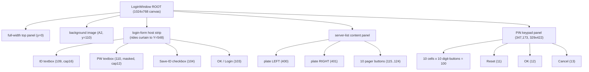

# Login Scene Dossier — Engine State 1 (`CommonLoginWindow` / `LoginWindow`)

> **Firewall-clean synthesis.** This dossier is rewritten in neutral prose from the committed
> `Docs/RE/` specs listed in the front matter. It contains **no addresses-as-truth, no decompiler
> pseudo-C, and no credential / key literals.** Object offsets are interoperability facts (byte
> offsets relative to an object start), never memory addresses. Korean text is **CP949**. Where a
> wire byte VALUE is still unconfirmed, the gap is flagged §10.

---

## 1. Overview

The **Login scene** is the front end the engine constructs and runs at **engine state 1** — the
**state-1 init case** of the top-level `while(1){ switch(GameState) }` engine loop (states 0..7, with
8 the terminal exit sub-state; state 1 = Login, NOT state 4). It is a single in-process top-level window (`CommonLoginWindow`, further
derived as `LoginWindow`) plus a small family of child sub-views, built once on entering state 1 and
running its own per-frame loop until it hands off to the game connection or quits. It is responsible,
end to end, for:

- **credential entry** — an account/ID box and a masked password box, with a curtain-reveal intro;
- **second-password / PIN** — an anti-keylogger scrambled-keypad modal collecting a ≤ 4-digit PIN;
- **server-list discovery** — an out-of-band synchronous lobby fetch (TCP port 10000) returning a
  list of selectable servers;
- **server select** — a two-plate-per-page picker with a commit gate;
- **channel-endpoint discovery** — a second out-of-band lobby fetch (TCP port `10000 + server_id`)
  yielding the actual game server's `"<host> <port>"` endpoint;
- **handoff to the game connection** — building the TAB credential string, the secure context, and
  the login pre-image, then engaging the game socket's `0/0 → 1/4` RSA handshake.

The **bridge out of Login** is the inbound **`3/1 SmsgCharacterList`**: it arrives *during* the live
login loop (after the secure handshake), sets the engine **GameState = 4**, and switches the client
into the character-select scene. (`1/9` enter-game and `3/5` enter-ack fire in the Select scene, not
here.)

Everything below is **CODE-CONFIRMED static** against build `263bd994`, with the secure-handshake
shape additionally **debugger-verified** (structure/lengths only; credential byte values withheld).
The campaign outcome for this scene: control-flow, the `+0x238` sub-state offsets, and the opcode
ladder all **CONFIRMED MATCH** — no corrections.

---

## 2. Object & ownership inventory

The login window is one of exactly **five** `GUWindow`-derived top-level windows. It is
`CommonLoginWindow` (the direct `GUWindow` base-ctor caller, ctor name **"Loginer"**, args
`1000, 28158`), further derived as **`LoginWindow`**. Its object is **CODE-CONFIRMED at `0x558` =
1368 bytes**. The load-bearing fields:

| Field | Offset | Role |
|---|---|---|
| `flowSubState` | **+0x238** (object) | The **single** live login sub-state (init `1`). Spans `1..6` and `29..41` (§3). Also addressed **+0x17C** relative to the embedded command-handler at +0xBC (`0xBC + 0x17C = 0x238`) — the same cell, two object views. |
| page/base counter | +0x554 | Independent ctor-seeded counter (init `5`); the login workflow **never reads** it. Last object slot (`+0x554 + 4 = 0x558`). Do **not** treat as a seed of +0x238. |
| command handler ("Cmdhandler") | +0xBC..+0xE7 | Routes a clicked widget's action id to the window's dispatch (`OnEvent`). Recovers the object base by subtracting 0xBC from its `this`. |
| aux view (`Diamond::GView`) | +0xE8..+0x21F | Embedded 3D/scene view sub-object (hook slot null in the shipped client). |
| texture/skin-atlas list | +0x220.. | Per-window atlas list (login atlases A1..A4 + the PIN art). |

The window drives its sub-views by **visibility toggling**, not by spawning separate scenes — all
children are built once at scene build and shown/hidden by the tick. Three writer classes mutate the
`+0x238` sub-state (per-frame tick = primary 1..41 driver; the input/action router writes `{29, 34,
38}` + the PIN value and *reads* the field as an input gate; the two lobby worker threads deposit
completion sentinels `{35, 39}`).

```mermaid
graph TD
  subgraph Login scene — engine state 1
    LW["LoginWindow / CommonLoginWindow<br/>(GUWindow, 1368B; flowSubState @ +0x238)"]
    CH["command handler @ +0xBC<br/>(OnEvent action router)"]
    GV["aux view @ +0xE8 (GView)"]
    TEX["texture/atlas list @ +0x220"]

    CRED["Credential group<br/>(ID box, PW box, Save-ID, OK)"]
    PIN["PIN keypad sub-view<br/>(2x5, 100 buttons)"]
    SRV["Server-list sub-view<br/>(2 plates/page + 10 pagers)"]
    NOTICE["Notice column<br/>(msg 4001..4022)"]
    MODALS["Exit / Error / Confirm-A/B modals"]

    LW --> CH
    LW --> GV
    LW --> TEX
    LW --> CRED
    LW --> PIN
    LW --> SRV
    LW --> NOTICE
    LW --> MODALS
  end

  subgraph Drivers, stores, lobby (out-of-band)
    TICK["per-frame tick<br/>(switch on flowSubState 1..41)"]
    SLW["server-list worker thread<br/>(blocking TCP :10000)"]
    EPW["channel-endpoint worker thread<br/>(blocking TCP :10000+id)"]
    SAVE["Save-ID store<br/>(DoOption.ini [DO_OPTION] OPTION_ID)"]
    LAST["Lastserver store<br/>(registry HKLM\\...\\crspace\\do : Lastserver)"]
    SEC["secure context + login pre-image<br/>(game socket 0/0 -> 1/4)"]
  end

  TICK -->|writes 1..41| LW
  CH -->|writes 29/34/38 + PIN| LW
  SLW -->|sentinel 35| LW
  EPW -->|sentinel 39| LW
  LW -->|sub-state 33/34| SLW
  LW -->|sub-state 38| EPW
  LW --> SAVE
  LW -->|sub-state 37 commit| LAST
  LW -->|sub-state 40 handoff| SEC
```

---

## 3. State machine (`flowSubState` @ +0x238, init = 1)

One 32-bit field, seeded to `1` at construction, driving the intro → validate → PIN → server-list →
endpoint → join sequence. All edges and numeric boundaries are **CONFIRMED (HIGH, static IDA)**
except the background-worker completion timing (`35 → 36 → 37`, and `38/39 → 40`), which is MEDIUM
(thread completion, debugger-only). There is **no EULA panel**; the 22 stacked labels (`4001..4022`)
are a static notice/agreement text column with no accept gate. Sub-state `30` is **dead/unreachable**
(nothing writes it).

```mermaid
stateDiagram-v2
  [*] --> S1
  S1: 1 — intro start (curtain SFX 861010105; reset offset; show background)
  S2: 2 — curtain opening (offset += 5/tick; top Y = -offset, bottom Y = offset+326)
  S3: 3 — curtain done (settle; show server-list root; credential group still hidden)
  S4: 4 — form idle (Enter advances)
  S5: 5 — advance/commit (reveal ID/PW boxes + buttons; stop intro anim)
  S6: 6 — login form ACTIVE (resting; OK/Enter runs game.ver gate)
  S29: 29 — credential validation (game.ver index-5 gate; ID len>=4; PW len>=1)
  S31: 31 — RAISE PIN modal (scrambled keypad shown; hide credential group)
  S32: 32 — POLL PIN modal (visible && submitted)
  S33: 33 — start server-list fetch (hide credential group + keypad)
  S34: 34 — show server-list content (start worker; show quit/help strip)
  S35: 35 — fetching server list (worker posts result)
  S36: 36 — consume list (0 records -> msg4027; error -> msg4028; else paint)
  S37: 37 — server list shown (pick plate 400/401 or page 115..124)
  S38: 38 — channel-endpoint fetch (TCP :10000 + server_id)
  S39: 39 — wait endpoint (worker copies 30-byte "host port"; posts)
  S40: 40 — JOIN handoff (build TAB string + secure context + 0x2B pre-image; arm 30s timeout)
  S41: 41 — transition complete; login window exits -> loading

  S1 --> S2
  S2 --> S3: offset > 222
  S3 --> S4
  S4 --> S5: Enter
  S5 --> S6
  S6 --> S29: OK (103) / Enter, game.ver match
  S6 --> S6: ID len<4 (msg4025) / PW empty (msg4026)
  S29 --> S31: validated (capture ID; raise keypad)
  S31 --> S32
  S32 --> S33: PIN submitted
  S33 --> S34
  S34 --> S35
  S35 --> S36: worker complete
  S36 --> S37: records painted
  S36 --> S6: empty / fetch error
  S37 --> S38: plate commit (status==0 && load<2400; persist Lastserver)
  S38 --> S39
  S39 --> S40: endpoint received
  S40 --> S41
  S41 --> [*]: -> Loading (engine state 2)
```

**Restart / help.** Action **105** (throttled, ~10 s) and the quit-confirm "yes" paths re-enter
sub-state **34** (a throttled server-list re-fetch; no-op if already at 35 or if a fetch ran within
~10 s). The genuine quit-confirm is the shared `ExitPanel`, whose "Yes" is **inert at Login** (the
GameState-keyed dispatcher has no GameState-1 case).

---

## 4. Execution flow

End-to-end from credential entry through the bridge to the Select scene. The OK/Login button **sends
no game packet**; the only client→server traffic is the two out-of-band lobby fetches and, after the
join, the reactive game-socket handshake.

```mermaid
sequenceDiagram
  autonumber
  actor U as Player
  participant LW as LoginWindow (tick @ +0x238)
  participant L as Lobby (login server, TCP :10000)
  participant G as Game server (DNS host:port)

  U->>LW: type ID + password, click OK (103) / Enter
  Note over LW: game.ver index-5 equality gate (mismatch -> msg2204 + quit)<br/>ID len>=4 (else msg4025); PW len>=1 (else msg4026)
  LW->>U: raise PIN keypad (sub-state 31; scrambled 2x5)
  U->>LW: enter <=4 digits, OK (tag 12) (sub-state 32 -> 33)

  LW->>L: connect :10000, server-list query (8-byte wrapper + LZ4)
  L-->>LW: wrapper.count x 8-byte server records
  LW->>U: paint up to 2 plates/page (sub-state 37)
  U->>LW: pick plate (400/401); commit guard status==0 && load<2400
  Note over LW: persist server_id -> registry Lastserver

  LW->>L: connect :10000 + server_id, channel-endpoint query (8-byte wrapper + LZ4)
  L-->>LW: first 30 bytes = ASCII "<host> <port>" (SPACE-delimited, NUL-padded)

  Note over LW: sub-state 40 — build TAB string<br/>"account\tpassword\tPIN\thost port"<br/>build secure context + 0x2B login pre-image; arm 30s timeout
  LW->>G: gethostbyname(host):port — open overlapped game connection

  G-->>LW: 0/0 SmsgKeyExchange (62B: 54B RSA key blob + 2 scalars)
  Note over LW: import (n,e); PKCS#1 v1.5 type-2 pad staged password M;<br/>c = M^e mod n
  LW->>G: 1/4 CmsgLoginCredential (0x2B pre-image: account + optional PIN;<br/>then [u32 len][BE ciphertext]); per-dword XOR 0x29, then cipher + LZ4
  Note over LW: session marked secure

  G-->>LW: 3/1 SmsgCharacterList (3-byte header + N x 981-byte slot records)
  Note over LW: derive CP949 names; SET GameState = 4
  LW->>U: switch to character-select scene
```

**Key sequencing facts.** The PIN is collected **after** credential validation and **before** the
join (it becomes the optional third field of the login pre-image). The two lobby fetches are
**synchronous blocking** on dedicated worker threads, each opening a throwaway socket. The lobby host
uses `inet_addr` (dotted IPv4 only, no DNS); the **game** host uses `gethostbyname` (DNS — so the
endpoint host may be a name or a dotted quad). The login credential rides the secure **`1/4`** frame
— **`1/6` is character-create only**, never the login send.

---

## 5. UI architecture

The login window is authored on a **1024 × 768** reference canvas (top-left origin, +Y down). UI
geometry is **hard-coded straight-line code with literal widget rects** — `uiconfig.lua` supplies a
single integer (`NEW_SERVER_INDEX`); there is no widget layout file. Visibility is set **imperatively
on transition edges** (§3), not by a declarative per-state table; the bands below are a port-side
reconstruction of those cumulative show/hide calls. Every widget is a **1:1 atlas blit** (destination
and source share the same w/h; no UV scaling) — see `frontend_layout_tables.md §0.10`.

### 5.1 Login window widget / parenting / visibility

**Atlases** (`data/ui/`, loaded in order): **A1** `login_slice1.dds`, **A2** `loginwindow.dds`,
**A3** `InventWindow.dds`, **A4** `loginwindow_02.dds` (plus `password.dds` for the PIN). `tex=0` =
solid panel / text-only label. Default label/textbox font slot = 0.

| Group | Members (role) | Visibility band (reconstructed) |
|---|---|---|
| ROOT | background image (A2), full-width top panel | background **from state 2** onward |
| Curtains | two always-present host panels (animated Y) | not a hideable widget — top Y = −offset, bottom Y = offset+326 |
| Notice column | 22 stacked labels (msg **4001..4022**, X=50, Y=100+18·i, 383×50), scroll up/down/thumb (106/107/108), title plate | always hidden by the flow (no EULA, no accept gate) |
| Credential group | ID textbox (action 109, per-keystroke cap **16** chars, charset mask 6 / alphanumeric, IME 16), PW textbox (action 110, per-keystroke cap **12** chars, charset mask 0x81 / allow-all, IME 12, masked), Save-ID checkbox (104), **OK/Login** (103) | **state 6** only (built hidden; shown entering 6; hidden entering 29/31/33) |
| Login-form host strip | the bottom credential strip (rides the curtain to canvas Y=548) | present from build; Y animates |
| Server-list submit plate | the rest-state plate | states 1..~34 (hidden on 34→35) |
| Server-list content | 2 plates/page + 10 pagers + scroll arrows (§5.3) | **state 35..37** |
| Quit/help strip + help plate | restart/refresh control (action 105) | state 35 onward |
| PIN keypad | the scrambled-keypad child panel (§5.2) | **states 31/32** |
| Modals | quit-confirm `ExitPanel`, `ErrorPanel`, Confirm-A/B (msg 4023/4024, OK 113/114) | hidden; raised only by action ids / message popups |

> **Credential textbox construction (element-level pass, 2026-06-19; field-cap correction 2026-06-22,
> binary-won, IDB SHA 263bd994).** Both boxes are 102 × 13 fields on A1 sampling source origin
> `(615, 404)`, built in the construct routine (not the later secondary init), font slot 0.
> **Per-keystroke length caps (GUTextbox field +0xD0):** ID = **16** chars; PW = **12** chars.
> **Charset mask (GUTextbox field +0xA4):** ID = **6** (alphanumeric-only filter); PW = **129 / 0x81**
> (allow-all — any printable character accepted). **The PW box is masked because its length/flags field
> has the mask (high) bit set — NOT because of its IME mode.** The mask renders the literal glyph `*`
> once per character at 6 px advance; the ID box's mask bit is clear so it shows the typed text. The
> IME-mode values (ID 16, PW 12) only select IME conversion behavior. The construct routine focuses the
> ID box at show time. See `frontend_layout_tables.md §2.7`.

**OnEvent action map (legacy ids = ASCII codes; a fresh impl may use any enum):** `101` app quit ·
`102` open quit-confirm ExitPanel (does **NOT** open server-list) · `103` OK/login (game.ver gate →
29) · `104` Save-ID toggle · `105` throttled server-list re-fetch (→ 34) · `109/110` focus ID/PW ·
`111/112` option/tab buttons (do **NOT** route the PIN panel) · `113/114` hide confirm popup then
re-fetch · `115..124` server-list **pager** (state 37; page = action−115) · `400/401` server **plate
pick** (state 37; LEFT=400, RIGHT=401; record = (action−400)+2·page). Keys: TAB(9) swaps ID/PW focus;
ENTER(10) = Login on the form page. **The server list is reached only through the sub-state machine,
never by a form button.**

### 5.2 PIN keypad (2×5, 100 stacked buttons)

Container panel at screen dst **(347, 173)**, size **329 × 422** — **textureless (`tex = 0`)**; only the
child digit/control button **faces** are textured from `data/ui/password.dds`; child coords panel-relative.
**The ornate visible frame, the title "2차 비밀번호 입력", the red warning line, and the "번호입력" caption
are BAKED INTO `data/ui/password.dds` art — not widgets, not `msg.xdb` text** (the constructor makes zero
message lookups and writes no color constant). A port must **blit the `password.dds` chrome** behind the
keypad children; it must NOT add Korean text labels for the title/warning/caption.

- **10 digit cells** in **5 columns × 2 rows**, each **52 × 52**: column X ∈ {28, 83, 138, 193, 248}
  (= 55·col + 28); row Y ∈ {170, 230}.
- **Each cell is a stack of 10 digit-buttons (0..9) → 100 buttons total.** The face of digit `d`
  samples atlas source **X = `d·52`**; the **button state** selects the source **Y band** (NORMAL,
  PRESSED, HOVER builder order): **Normal (idle) = 560 · Pressed = 664 · Hover = 612** (CONFIRMED,
  element-level pass: the construct call passes the 664 band as the PRESSED frame and 612 as HOVER). The
  scramble shows **exactly one** digit per cell; each digit-button's tag = its digit value.
- **Controls:** **Reset** `(243, 133, 58, 30)` tag **11** · **OK/submit** `(90, 290, 154, 58)` tag
  **12** · **Cancel** `(90, 350, 154, 58)` tag **13**. Masked field label `(81, 138, 150, 22)`,
  rendered as N `*` (no dot-sprite; literal `*` text in font slot 0). **Max length 4.** A separate
  `InventWindow.dds` panel `340 × 190`, source `(318, 647)`, centred, is also built but **kept hidden** —
  it is a **reused quit-confirm ExitPanel** (caption msg 2007), NOT the visible PIN frame (which is the
  baked `password.dds` chrome above). The keypad is routed **only** by its own internal tags {11/12/13}
  (+0-9 append).
- **Scramble (mechanism CODE-CONFIRMED):** on every show/Reset/OK/Cancel, `srand(time())`
  (whole-second CRT wall clock — *not* `GetTickCount`/`QueryPerformanceCounter`), then an
  **ascending** uniform permutation of digits 0..9 (MSVC `random_shuffle`: bound `i` walks 2..10, swap
  with `rand() mod i`), mapped 1:1 onto the 10 cells. A port must **reshuffle on every open** — do not
  hard-code a permutation.



### 5.3 Server-list display model (states 35..37)

**Server name = `msg.xdb` TEXT, not a per-server calligraphy image (DEFINITIVE).** The painter fetches the
name as a string (id **5000 + server_id**, fallback **5901**) and lays it out with a text setter — it never
re-points an atlas rect per server. The calligraphic look = a **fixed** A4 scroll-plate face (identical for
every server) with the CP949 hanja+hangul name rendered on top in the game font. There is **no**
per-server `server_<id>.dds`.

**Outer chrome (element-level pass):** the backdrop is **two layers** — a full-screen A2 image at
`(0, 110) 1024 × 490` src `(0, 0)` drawn first, then the list-box scroll below. **Title "서버선택"** = a baked
A2 image `(207, 44) 70 × 17` src `(0, 980)` (not a msg string). **EVENT badge** = a baked A1 image
`(407, −3) 210 × 70` src `(743, 398)`. **새로고침 (refresh)** = action **105** (A1 `(456, −3) 111 × 38`
N `(792,398)`/H `(602,416)`, 10-s-debounced re-fetch → state 34; back-to-login = action **102**). The ten
`115 + i` "tabs" are a **hidden page-jump strip** (re-parked to a blank UV each repaint) — the visible
하왕관 rows are the two server **plates**, not tabs. **Connecting popup "서버에 접속중입니다…"** = the Confirm-A
modal (A3 `InventWindow.dds`, src `(318,647)`, dst `(342,289) 340×190`, caption msg **4023**), raised at
**state 40** just before the join hand-off.

Outer list panel (page backdrop) at dst `(270, 85)`, `483 × 490`, A2 source `(0, 490)`. Two detail
plates per page (X base 30, step 233, action base 400) — each plate = one server; LEFT plate = record
`2·page`, RIGHT = `2·page + 1`. Each plate = a name label `(X, 390, 174×21)` (**left-aligned** by the
authoritative painter), a plate-face image `(X+47, 97, 100×372)` on A4 source `(448 + 124·i, 6)`, a
selection button `(X−6, 97, 202×372)` on A4 N`(9,6)`/H`(220,6)`, a status label `(X, 410, 174×20)`,
and a population/count label `(X, 430, 174×20)` in font slot 4 (`%4d / %4d`). Ten small page-selector
strips across the top `(13 + 47·i, 66, 47×18)` on A2 (action `115 + i`) page the 2-plate view (page =
action − 115); they are **not** server rows. **On-screen row order is shuffled per repaint** (a
per-render permutation is applied), so the visible row → record mapping is not stable across renders.
Status/load colouring (UI only, ARGB): load > 1200 → red `0xFFFF0000` (msg 6001) · > 800 → orange
`0xFFED6806` (msg 6002) · > 500 → yellow `0xFFFFFF00` (msg 6003) · ≤ 500 → green `0xFFB5FF7A` (no msg,
rendered as numeric `%4d / %4d`). `status_code == 3` = scheduled-open (msg 6004 "preparing" when
load(+4)==24, else msg 6005 HH:MM from +4 hour / +6 minute). `status_code == 100` is a **display-only
special row** (shows the 3 status-color quads, and is **non-selectable** because the commit guard
requires `status == 0`). Selection is a **2D button hit** (action 400/401), not a 3D ray-pick.

---

## 6. Asset manifest

All paths are inside the user-supplied client VFS (never committed). Text is CP949.

| Asset | VFS path / id | Role |
|---|---|---|
| Login atlas A1 | `data/ui/login_slice1.dds` | server-list root, login-form strip, plates |
| Login atlas A2 | `data/ui/loginwindow.dds` | background, notice panel, scroll/title art |
| Login atlas A3 | `data/ui/InventWindow.dds` | shared modal frames (Exit/Error/Confirm) + PIN backdrop frame (src 318,647) |
| Login atlas A4 | `data/ui/loginwindow_02.dds` | server-select plate icons + select buttons |
| PIN keypad art | `data/ui/password.dds` (1024×1024, DXT3) | secondary-password digit faces (3 state bands at srcY 560/612/664) + Reset/OK/Cancel button regions |
| Notice column text | `msg.xdb` ids **4001..4022** (CP949) | 22-line static notice/agreement column (NOT an EULA) |
| Confirm popups text | `msg.xdb` ids **4023 / 4024** | single-OK message popups |
| Validation messages | `msg.xdb` **2204** (version mismatch), **4025** (ID too short), **4026** (empty PW), **4027** (no servers), **4028** (fetch failed) | gate / error captions |
| Server-list captions | `msg.xdb` **6001..6005** (load colors / scheduled-open), column headers **4029..4032** | server-list presentation strings |
| Curtain SFX | sound id **861010105** (2D, category 2 → `data/sound/2d/861010105.ogg`) | login intro curtain cue (sub-state 1) |
| Quit-from-load SFX | sound id **861010106** | played on the version-mismatch quit path |
| Server-name table | `msg.xdb` ids **5001..5040** (CP949), indexed by `5000 + server_id` | server display names — **not on the wire**; resolved via the real `msg.xdb` caption lookup (`HudTextLibrary.GetCaption(5000 + serverId)`), not a synthetic `"Server N"` fabrication |

> The login scene starts **no BGM** (CODE-CONFIRMED absence). Any login music is engine/scene-level,
> not started by login code.

---

## 7. Wire / opcodes

Two distinct wire surfaces: the **out-of-band lobby** (synchronous, plaintext-framed, **no
`(major:minor)` dispatch, no byte cipher**, but the same 8-byte wrapper + inbound LZ4) and the **game
connection** (8-byte header + `(major:minor)` dispatch + send-path cipher + LZ4). Frame header on
both = `[u32 size][u16 major][u16 minor]` (size is u32-LE and includes the 8-byte header). All values
remain **capture-unverified** (no `.pcapng`); the handshake **structure** is debugger-verified.

| Message | Dir | Surface / opcode | Size | Notes |
|---|---|---|---|---|
| Server-list query | C2S→S2C | lobby TCP **:10000** (no opcode) | 8-byte wrapper + LZ4 payload | `wrapper.count (+4 u16)` = number of **8-byte** server records that follow; `+6 u16` unused. Per record (8B LE): `+0 i16 server_id` (1..40), `+2 i16 status_code` (0 = selectable, 3 = scheduled-open, 100 = display-only special), `+4 i16 load`, `+6 i16 open_time`. **Commit guard: `status_code == 0 && load < 2400`.** Name resolved client-side via msg.xdb `5000 + server_id`. |
| Channel-endpoint query | C2S→S2C | lobby TCP **:10000 + server_id** (no opcode) | 8-byte wrapper + LZ4; first 30 bytes used | First **30 (0x1E)** decompressed bytes = ASCII **`"<host> <port>"`**, single SPACE delimiter, NUL-padded (not NUL-terminated). Port parsed via `atol`. Names the **game** server; host may be DNS name or dotted quad. Trailing array UNVERIFIED (only 30 bytes read). |
| `0/0` SmsgKeyExchange | S2C | game `(0,0)` (hardwired branch) | **62 bytes** | 54-byte two-bignum key blob (`header A(2) ‖ header B(2) ‖ [u32 LE L1] ‖ modulus[L1] ‖ [u32 LE L2] ‖ exponent[L2]`, `L1+L2=42`, big-endian digits, opaque 2-byte headers ignorable) + scalar#1 (4B) + scalar#2 (4B). Triggers the reactive `1/4`. Layout owned by `crypto.md §6.2`. |
| `1/4` CmsgLoginCredential | C2S | game `(1,4)` secure auth-reply | variable (crypto-dependent) | **Plaintext pre-image:** `[u8 0x2B][u32 LE account_len (NUL-incl)][account+NUL]([u32 LE pin_len][PIN+NUL] — optional)`. **Then RSA half:** `[u32 LE ciphertext_len][big-endian RSA digits]` = PKCS#1 v1.5 type-2 of the staged password `M` (zero-padded to the password-field cap; runtime cap 17B), `c = M^e mod n`. Whole payload per-dword XOR `0x29` (selector `0x40`, used as-is) **before** the byte-cipher + LZ4 send. Caps: account ≥2 & <20; password ≥2 & <17; PIN <5. The **password is never in the plaintext** — only in the ciphertext. |
| `3/1` SmsgCharacterList | S2C | game `(3,1)` | variable | **The Login→Select bridge.** 3-byte header (`server_id`, `channel_id`, **slot bitmask**) + one **981-byte** record per set bit (loop is **exactly 5 slots**, indices 0..4, LSB-first). Per record: 880-byte SpawnDescriptor + 96-byte stat block + 1-byte slot flag + 4-byte timing. Derives CP949 names (≤16B+NUL) and **sets GameState = 4**. A prior 1965-byte observation = `3 + 2×981`. |

> **Direction asymmetry.** The byte cipher has a single send-side caller — the client never inverts
> it on receive; inbound is **LZ4-decompress and route only**. Inbound `0/0` is plain after
> decompress. (`crypto.md §5`.)
>
> **Not in this scene:** `1/9` enter-game (40B) and `3/5` enter-ack (44B) fire in the **Select**
> scene; the local world spawn is driven by `4/1`. They are out of scope here.

---

## 8. C# + Godot fidelity summary (CONFIRMED MATCH)

Campaign outcome: the control flow, the `+0x238` offsets, and the `0/0 → 1/4 → 3/1` opcode ladder are
all **CONFIRMED to match** the implementation. Each constant in the C# should carry its
`// spec: Docs/RE/...` breadcrumb. Implementation targets (paths verified present in the tree):

> **Strict-1:1 reconstruction (states 0–3 completion pass — applied).** The server-list now resolves
> each plate's display name through the **real `msg.xdb` 5001..5040 lookup** (`5000 + server_id` via
> `HudTextLibrary.GetCaption`); the previous **synthetic `"Server N"` fabrication is removed**. The
> dev-offline apparatus (`DevAccount` / `DevPrefill` / `IsDevOfflineMode`), the `AutoSubmitPin`
> affordance, and the **null-atlas fallbacks** were all **removed** this campaign — the scene now draws
> only from real VFS art. The two parallel **Enter-key submit paths were collapsed** into a single
> path. (These were the residual port divergences this dossier formerly tracked; they are no longer
> present.)

> **Element-level fidelity follow-ups (2026-06-19 construction pass).** Two construction details the
> port should verify against the now-deepened oracle: (a) the PW box must be masked via a **field
> flag** rendering `*` at 6 px/char (not keyed to IME mode); (b) the PIN digit-face state bands are
> idle=560 with two alternate bands 612/664 (hover-vs-pressed assignment is UNVERIFIED — pick either
> band for press feedback). spec: `frontend_layout_tables.md §2.7 / §3`.

> **Known port divergence (action-103 `game.ver` gate — semantics PINNED statically; intentionally not
> enforced).** Re-read directly from the binary this campaign: the login-submit path (action 103, and
> the Enter/event-10 path at sub-state 6) runs a **`game.ver` index-5 equality gate** before advancing
> to sub-state 29. The gate parses **two** version files and compares **field index 5** of each: the
> **"DataVer"** = `data/cursor/game.ver` loaded **from the VFS**, and the **"GameVer"** = a client-root
> **`game.ver` loaded from physical disk** (the copy the launcher/patcher maintains next to the exe).
> Equal → proceed to sub-state 29; **either file unreadable, or the two index-5 values differing →
> show msg 2204 via a native modal and quit**. The C# port currently advances `103 → state 29`
> straight into length validation (`ID ≥ 4`, `PW ≥ 1`) **without** this gate
> (`Ui/Scenes/Login/LoginWindow.cs` `OnAction`/`RunValidation`; the `2204` constant exists at
> `Screens/Layout/LoginLayout.cs` but is unused on this path). The version **token** derivation
> (`10 × DataVer[5] + 9`) IS implemented (`UseCases/IClientVersionSource.cs`).
> **Intentionally not enforced (justified by the pinned semantics):** the second operand is a
> **launcher/patcher-maintained on-disk `game.ver`** that the revival's port does not generate (there
> is no `dostart.exe` patcher in the port). Enforcing the gate faithfully would therefore **always
> fail** — an absent disk `game.ver` makes the parse fail, which the binary treats as mismatch → quit —
> and would block every login. A port that wants the check could implement a **relaxed** form
> ("compare only when the disk file is present"), but that is a port choice, not strict fidelity; the
> revival has no outdated-client population to defend against. spec: this dossier §9 /
> `frontend_layout_tables.md §2.2`.

**Layer 04 — Client.Application / Client.Infrastructure (orchestration + stores):**
- `04.Client.Core/MartialHeroes.Client.Application/UseCases/ApplicationUseCases.cs` — login use-case
  surface (`IApplicationUseCases` impl driving the scene intents).
- `04.Client.Core/MartialHeroes.Client.Application/Login/LoginHandshakeDriver.cs`
  (+ `Login/ILoginHandshakeDriver.cs`) — the reactive `0/0 → 1/4` driver: answers the inbound key
  exchange with the credential reply. **This is the net glue that must be wired** (see §10 / memory:
  a null driver historically left `0/0` unanswered).
- `04.Client.Core/MartialHeroes.Client.Application/UseCases/LoginCredentialStore.cs` — stages
  account / password / PIN for the secure context.
- `04.Client.Core/MartialHeroes.Client.Infrastructure/Lobby/LobbyHostResolver.cs`
  (+ `Application/Login/ILobbyHostResolver.cs`) — `ip.txt` → `list.dat`/`servername` → `211.196.150.4`
  resolution (`inet_addr`, no DNS). *(Note: the file lives under `Client.Infrastructure/Lobby/`, not
  `Client.Application/Infrastructure/Lobby/`.)*
- `04.Client.Core/MartialHeroes.Client.Infrastructure/Lobby/RegistryLastServerStore.cs`
  (+ `Application/Login/ILastServerStore.cs`) — persists the selected `server_id` to
  `HKLM\SOFTWARE\crspace\do : Lastserver`.
- `04.Client.Core/MartialHeroes.Client.Application/Handlers/GamePacketHandler.cs` — routes inbound
  `0/0` and `3/1` (and the major-3 family) to handlers; `3/1` sets GameState = 4.

**Layer 02 — Network.Crypto / Transport.Pipelines (wire):**
- `02.Network.Layer/MartialHeroes.Network.Crypto/SessionHandshake.cs` — parses the 62-byte `0/0`
  blob (modulus/exponent import, `L1+L2=42`) and builds the `1/4` reply.
- `02.Network.Layer/MartialHeroes.Network.Crypto/LoginCredentialReply.cs` — the `1/4` pre-image
  (`0x2B` + length-prefixed account + optional PIN) + RSA ciphertext + per-dword `0x29` whitening.
  (Supporting: `CredentialPlaintext.cs`, `HandshakeWhitening.cs`, `WireCipher.cs`,
  `PayloadCompression.cs`.)
- `02.Network.Layer/MartialHeroes.Network.Transport.Pipelines/LobbyClient.cs` — the two synchronous
  lobby queries (server-list + channel-endpoint), 8-byte wrapper + LZ4, against
  `02.Network.Layer/MartialHeroes.Network.Abstractions/Lobby/{ILobbyClient,LobbyServerRecord,LobbyChannelEndpoint}.cs`.

**Layer 05 — Godot presentation (passive — zero game-rule authority):**
- `05.Presentation/MartialHeroes.Client.Godot/Scene/Controllers/LoginScene.cs` — the scene
  controller (opens the game connection, offline-safe).
- `05.Presentation/MartialHeroes.Client.Godot/Ui/Scenes/Login/LoginWindow.cs` — the login window
  (curtain intro, credential group, sub-state-driven visibility).
- `05.Presentation/MartialHeroes.Client.Godot/Ui/Scenes/Login/PinSubView.cs` — the 2×5 / 100-button
  scrambled keypad (whole-second-seeded ascending reshuffle on each open).
- `05.Presentation/MartialHeroes.Client.Godot/Ui/Scenes/Login/ServerSelectSubView.cs` — the
  two-plate-per-page picker + pagers + commit gate.
- (Layout helper: `05.Presentation/MartialHeroes.Client.Godot/Screens/Layout/LoginLayout.cs`.)

---

## 9. Validation checklist

- [ ] `flowSubState` is **one** field; the `+0x554` page counter is never read by the login machine.
- [ ] Intro curtain: two always-present panels (both `login_slice1.dds` — confirmed ground truth),
      top Y = −offset / bottom Y = offset+326, +5/tick to offset > 222 (end top Y = −222 / bottom
      Y = 548); **form-deco plate snaps to (265,548)** 494×113 src(0,469) at offset > 200 (G2
      debugger-confirmed 2026 / IDB 263bd994 — supersedes prior "(494,469)"); SFX **861010105** on
      the 1→2 edge.
- [ ] OK/Enter runs the **game.ver index-5 (byte 20) single-u32 equality** gate (mismatch → msg 2204
      + quit); then ID len ≥ 4 (msg 4025) and PW len ≥ 1 (msg 4026).
- [ ] PW box masked via the **length/flags mask bit** (`*`, 6 px/char), NOT via IME mode; ID box clear.
- [ ] PIN modal raised on the **29→31 edge**, polled at 32; keypad **2×5 / 100 buttons**, digit faces
      srcX = d·52 (idle band srcY 560), tags 11=Reset / 12=OK / 13=Cancel; whole-second-seeded
      **ascending** Fisher-Yates reshuffle on every open/Reset/OK/Cancel; masked `*`; cap 4. Window
      actions 111/112 do **not** route the PIN panel.
- [ ] Server list: 2 plates/page (400/401), 10 pagers (115..124); commit guard
      `status_code == 0 && load < 2400`; status 100 = display-only/non-selectable; row order shuffled
      per repaint; persist `Lastserver`.
- [ ] Lobby host via `inet_addr` (dotted IPv4); game host via `gethostbyname` (DNS).
- [ ] `1/4` pre-image leads with `0x2B`; length prefixes **u32-LE, NUL-inclusive**; password is the
      RSA plaintext only (never in the pre-image); whole payload per-dword XOR `0x29` before cipher+LZ4.
- [ ] `0/0` is **62 bytes**; key blob `L1 + L2 = 42`; big-endian digits; inbound = decompress-only
      (no inverse cipher).
- [ ] `3/1` = 3-byte header + **exactly 5**-slot loop × 981 bytes; arriving `3/1` **sets GameState = 4**
      (the Login→Select bridge).
- [ ] No EULA panel; the 4001..4022 labels are a static notice column with no accept gate.
- [ ] Login scene starts no BGM; the only outbound game opcode is the reactive `1/4`.

---

## 10. Open items / GAPs

**On-wire VALUES (capture-pending — no `.pcapng`):**

- **Server-list record packing** — the four-field decode `{server_id, status_code, load, open_time}`
  and the `open_time` HH:MM packing are static reads of the render path; the in-record byte values and
  full `status_code` enum (beyond 0 = selectable, 3 = scheduled-open, 100 = display-only) need a live
  lobby capture. (Field *order* `+0 server_id / +2 status / +4 load / +6 open_time` is static-CONFIRMED.)
- **Channel-endpoint tail** — whether the endpoint host token is a **DNS name or a dotted quad**
  (both resolve via `gethostbyname`), and whether a trailing channel array follows the first 30 bytes.
- **`0/0` key values** — the concrete server modulus `n`, exponent `e`, and the individual `L1`/`L2`
  split (only the sum 42 is a client constant); plus the meaning of the two 4-byte server scalars.
- **`1/4` RSA blob** — the on-wire confirmation of the staged-`M` **pad width** (17 bytes is
  debugger-observed runtime, structurally = the password-field cap) and the ciphertext byte values.
- **`3/1` interiors** — SpawnDescriptor / stat-block field VALUE semantics, the slot-flag and timing
  meanings, and whether `server_id`/`channel_id` carry real values.

**PIN (debugger-pending):**

- **Per-show scramble seed + resulting permutation** — clock-seeded (a runtime value, not a code
  immediate); the *mechanism* is CODE-CONFIRMED, the concrete seed/permutation are not.
- **Digit-face hover-vs-pressed band assignment** — the two alternate state bands (srcY 612 / 664) are
  confirmed; which is hover and which is pressed is not disambiguated by the construct call. A one-shot
  button-draw state read would settle it (non-blocking; idle band 560 is confirmed).
- **PIN-token storage slot width** — the login window's PIN-token slot (asserted ≤ 4 chars + NUL); a
  single live read would byte-confirm it. (Does not change the wire layout, which §7 pins.)

**Validation-error message box (RESOLVED, static IDA, 2026-06-19):**

- On a failed login submit a **dedicated error message-box panel** is raised (a distinct object from the
  Confirm-A/B popups; A3 `InventWindow.dds`, dst `(342,289) 340×190`, src `(318,647)`; centered message
  label action 670; OK button local `(125,151) 90×25` src N `(417,943)`/H `(507,943)` action 671). Its OK
  caption shows a **live countdown**: caption = "<확인 (msg 101)> - <N>" starting at **N = 3** (a 3000 ms
  budget), decremented **at most once per 1000 ms** off a millisecond wall-clock delta, and the panel
  **auto-closes** at 0 (returning to the credential idle, sub-state 6); clicking OK dismisses early. Failure
  → msg map: ID empty or < 4 → **4025**; PW empty → **4026**; no servers → **4027**; fetch −1 → **4028**.
  Geometry/actions/timer = CONFIRMED; the literal CP949 strings (msg 101/4025/4026/4027/4028) live in
  runtime `msg.xdb` → UNVERIFIED. See `frontend_layout_tables.md §2.1a`.

**Other (debugger-pending, non-blocking):**

- The flat-vs-resolution-scaled curtain base **326** (the per-tick literal vs the build-time
  `326 × scrH / 768` placement).
- The `35 → 36 → 37` and `38/39 → 40` background-worker completion *timing* (thread completion, MEDIUM).
- Whether the typed boxes are physically account-then-password (box-keyed, not label-keyed; the
  binary names neither box — a static hypothesis).

---

## 11. Sources

All committed, firewall-clean specs (front matter lists the exact set):

- `Docs/RE/specs/login_flow.md` — end-to-end connection lifecycle, lobby mini-protocol, credential
  staging (§4), PIN → wire hand-off (§4.2a), char-management responses.
- `Docs/RE/specs/frontend_scenes.md` §1 — the login sub-state machine (`+0x238`, three writers),
  the PIN modal (§1.4a), the curtain geometry (§1.5a), the "no EULA" finding (§1.4c), the quit paths.
- `Docs/RE/specs/frontend_layout_tables.md` — the authoritative numeric oracle (widget rects, the
  sub-state edge ladder §2.2, the credential-textbox mask §2.7, the PIN keypad §3, the server-list
  display model §4, audio cues §7).
- `Docs/RE/specs/crypto.md` — the byte cipher, LZ4 variant, and the full `0/0 → 1/4` RSA handshake
  (§6), secure-context lifecycle + page guard (§6a), debugger-verified facts (§6b).
- `Docs/RE/specs/ui_system.md` — GUWindow widget catalogue / draw / input doctrine.
- `Docs/RE/structs/guwindow.md` — the GUWindow MI object layout, the `+0x238` vs `+0x554` field
  distinction, the five window roster, the 1368-byte LoginWindow size.
- `Docs/RE/opcodes.md` — opcode routing (`0/0`, the major-1 / major-3 families), the frame-header
  rule (two separate u16 words).
- `Docs/RE/packets/login.yaml` — the authoritative `1/4` credential carrier (pre-image + RSA).
- `Docs/RE/packets/3-1_character_list.yaml` — the 5-slot × 981-byte character list.
- `Docs/RE/packets/lobby.yaml` — the two lobby queries, record shapes A/B/C, host-resolution order.
- `Docs/RE/packets/0-0_key_exchange.yaml` — the 62-byte key-exchange payload.

---

## 12. 2D GUI component reference (full cartography)

> **Scope of this section.** §5 above gives the architectural / visibility-band view; this section
> is the **complete 2D-GUI element catalogue**: every widget with its role, widget class, parent, and
> object member-offset; the exact numbered build sequence with literal geometry and action ids; the
> per-component atlas / sub-rect / VFS linkage; the dynamic / modal / sub-state behaviour; and the
> text / font / caption sourcing. It is built strictly on the shared `Diamond::GU*` widget framework
> documented in `structs/gucomponent.md`, `structs/guwindow.md`, and `specs/ui_system.md`. Korean
> text is CP949. Member offsets are byte offsets relative to the object start (interop facts), never
> memory addresses. Every sub-rect below is a **1:1 atlas blit** (destination w/h equals source w/h;
> no UV scaling) per the universal builder contract.

### 12.0 Class identity & the shared GU* framework

The whole 2D login GUI is one branch of the in-house `Diamond::GU*` widget toolkit (see
`structs/gucomponent.md §hierarchy` and `specs/ui_system.md §1`). The scene's own RTTI-confirmed
class chain:

- `LoginWindow : CommonLoginWindow : GUWindow : GUPanel : GUComponent` (with the `EventHandler` /
  `CmdHandler` MI base at +0xBC — see `structs/guwindow.md`).
- `LoginSecondPassword : GUPanel : GUComponent` — the 2nd-password / PIN modal child.
- `ExitPanel : GUPanel : GUComponent` — quit-game modal.
- `ErrorPanel : GUPanel : GUComponent` — error / disconnect feedback modal.
- Widget leaf classes used as children: `GUComponent` (plain image), `GUPanel` (container),
  `GUButton` (3-state sprite + label), `GUCheckBox : GUButton` (toggle, off/on frames), `GULabel`
  (static text), `GUTextbox` (editable input + password mask).

There is **no dedicated MessageBox / Dialog / Toast / Gauge / Slider / Tooltip widget class** — every
modal (Confirm-A/B, Exit, Error, the validation toast) is composed from `GUPanel` + `GULabel` +
`GUButton` primitives. The only runtime input box is `GUTextbox` (which carries the password mask).
The shared 13-slot `GUComponent` virtual interface (destructor · setVisible · setPosition ·
getPosition · hitTest(vec) · hitTest(x,y) · onEvent · onDraw · onUpdate · computeTransform ·
getHitActionId · onMouseEnter · onMouseLeave; container subclasses append a child-sweep slot) and the
`GUButton` 3-state priority (disabled > pressed > hover > normal) and the `GUTextbox` password mask
(style-flag bit `0x80` → render `*` per char) are all defined once in `specs/ui_system.md` /
`structs/gucomponent.md` and are **not** re-specified per scene here.

**Where the tree is built.** The `LoginWindow` / `CommonLoginWindow` constructors only set vtables,
zero the FSM/thread state, build the `GUWindow` shell (window name `"Loginer"`), and spawn the two
lobby worker threads — they create **no** children. The complete child set (~73 widgets) is created
by **one** virtual build method on `LoginWindow` (invoked when the window is opened, not from the
top-level WinMain state-1 `new`), which loads four atlases, allocates every widget with literal
geometry + atlas src-rects, binds action ids, then installs the per-frame render callback and calls
the relayout/refresh slot. A separate "server-list refresh" virtual only re-origins and re-captions
**already-built** children (it is NOT creation). The §3 sub-FSM (`flowSubState` @ +0x238) then drives
show/hide.

### 12.1 COMPONENT TREE — every element (role · widget class · parent · member offset)

Root `LoginWindow` child-pointer members (offsets are object-relative; `GUWindow` shell occupies the
low region, the `+0x238` FSM cell sits inside the `CommonLoginWindow` base just below this block):

| Member (canonical) | Offset | Widget class | Parent | Role |
|---|---|---|---|---|
| `bgFrameImage` | +0x270 | `GUComponent` (image) | window | Login background frame plate |
| `bgTopPanel` | +0x274 | `GUPanel` | window | Full-width top backdrop / banner panel |
| `serverListPanel` | +0x278 | `GUPanel` | window | Server-list root container |
| `secondPwSetupPanel` (Connexion/Quitter panel) | +0x284 | `GUPanel` | window | Connexion/Quitter control group — G2 confirmed abs origin (356,531) 313×132; children: background strip (289,437) A1, Connexion btn act 111 abs (396,613) A2 src(520,492), Quitter btn act 112 abs (520,613) A2 src(750,492). Supersedes prior "(0,356) 531×313" reading. |
| `accountTextbox` | +0x2A8 | `GUTextbox` | `loginFormPanel` | ID / account edit box (IME 16; per-keystroke cap **16** chars at +0xD0; charset mask 6 at +0xA4) |
| `passwordTextbox` | +0x2AC | `GUTextbox` | `loginFormPanel` | Password edit box (IME 12; per-keystroke cap **12** chars at +0xD0; charset mask 0x81 at +0xA4; **masked**) |
| `saveIdCheckbox` | +0x2B0 | `GUCheckBox` | `loginFormPanel` | Save-ID toggle (off/on frames) |
| `loginOkBtn` | +0x2B4 | `GUButton` (3-state) | `loginFormPanel` | OK / Login submit |
| `eulaPanel` | +0x2BC | `GUPanel` | window | Notice / agreement scroll panel (22 body lines) |
| `eulaLine[22]` | +0x2C0.. | `GULabel` ×22 | `eulaPanel` | Notice body rows (msg 4001..4022) |
| `serverGridPanel` | +0x328 | `GUPanel` | window | Server / channel select grid |
| `serverNameStrip[10]` | +0x364.. | `GUButton` (3-state) ×10 | `serverGridPanel` | Page-jump name strips (act 115..124) |
| `confirmPanelA` | +0x398 | `GUPanel` | window | Generic confirm dialog A (msg 4023 + OK 113) |
| `confirmPanelB` | +0x3A4 | `GUPanel` | window | Generic confirm dialog B (msg 4024 + OK 114) |
| `exitPanel` | +0x3B4 | `ExitPanel` | window | Quit-game modal (own button set) |
| `errorPanel` | +0x3B8 | `ErrorPanel` | window | Error / disconnect feedback modal |
| (CommonLoginWindow runtime state) | +0x3BC..+0x550 | — | — | FSM / worker-thread / host-buffer pad span |
| `secondPwModal` | +0x550 | `LoginSecondPassword` | window | 2nd-password (PIN) scrambled-keypad modal (object size 0x2B8) |
| `newServerIndex` | +0x554 | i32 | — | `NEW_SERVER_INDEX` from `uiconfig.lua` (last object slot; **not** an FSM seed — see §2/§3) |

Sub-tree breakdown (children grouped by parent panel):

- **`serverListPanel`** → server-list header image · `serverListEnterBtn` (act **102**) · `loginFormPanel` · `quitHelpBtn` (act **105**) · quit/help background image.
- **`loginFormPanel`** → ID-label glyph image · PW-label glyph image · save-ID label glyph image · `accountTextbox` (act 109) · `passwordTextbox` (act 110) · `saveIdCheckbox` (act 104) · `loginOkBtn` (act 103).
- **`eulaPanel`** (notice/agreement) → `eulaLine[22]` (msg 4001..4022) · `eulaScrollDownBtn` (act 106) · `eulaScrollUpBtn` (act 107) · `eulaThumbBtn` (act 108) · scroll-track image. *(Per §3 / GAP 2: 106 is a deliberate no-op and 107/108 fall through unhandled at the window level; any scroll is internal to the panel or inert.)*
- **`serverGridPanel`** → `serverCell[2]` (each cell = name `GULabel` + flag `GUComponent` image + select `GUButton` act **400+i** + population `GULabel` + ping/status `GULabel`) · `serverStatusIcon[3]` (status quads) · grid divider image · `serverNameStrip[10]` (act 115..124) · grid title image.
- **`secondPwSetupPanel`** (Connexion/Quitter panel, G2-confirmed origin (356,531) 313×132) → decorative image (local 67,48) · background strip A1 src(289,437) (local 0,100 → abs y=631) · Connexion `GUButton` A2 src(520,492) act **111** (local 40,82 → abs (396,613)) · Quitter `GUButton` A2 src(750,492) act **112** (local 164,82 → abs (520,613)).
- **`confirmPanelA` / `confirmPanelB`** → centered message `GULabel` (msg 4023 / 4024) + OK `GUButton` (act 113 / 114).
- **`secondPwModal` (`LoginSecondPassword`)** → PIN-display `GULabel` (masked, rendered as N `*`) · scrambled digit keypad (up to 100 `GUButton` 3-state in a 5-col × 2-row visible grid; per cell a 0..9 stack, digit→glyph randomized per show) · OK `GUButton` (tag **11/12** submit) · Clear `GUButton` (tag **12**) · Cancel `GUButton` (tag **13**) · an embedded reused `ExitPanel`. *(Note on tags: §5.2 pins Reset=11 / OK=12 / Cancel=13 with 0..9 append; the dynamic-facet view of the same routing reads OK=11/Clear=12/Cancel=13 — the digit-append + three-control shape is CONFIRMED, the exact 11/12 assignment between Reset/OK is the one element-level ambiguity, flagged §10.)* Modal runtime flags read by the owner FSM: visible at modal +0x8C, submitted at modal +0x2B4.
- **`exitPanel` (`ExitPanel`)** / **`errorPanel` (`ErrorPanel`)** → self-built Yes/No / OK button sets (composite sub-build), captions loaded internally.

### 12.2 CREATION ORDER — the numbered build sequence

The universal child builder arg shape is **`(textureId, x, y, w, h, srcX, srcY, color)`** — the
trailing value is the **color/tint** (`-1` = no tint), **not** an action id. Panels insert one
opaque/clip flag before color; 3-state buttons and checkboxes append extra source-origin pairs
(normal/hover/pressed, or off/on) before color; `GULabel` carries no texture (text comes from the
message DB). **Action ids are never ctor arguments** — they are bound by the add-child-with-action
call or written to the child's action field (`+0x10`). Geometry below is `x,y,w,h` / src `srcX,srcY`;
atlas keys per §6 (**A1** `login_slice1.dds`, **A2** `loginwindow.dds`, **A3** `InventWindow.dds`,
**A4** `loginwindow_02.dds`; the atlases are preloaded in the order A1, A2, A3, A4 into the window
texture list before any widget is built). *(Note: an internal load-order labelling A0..A3 was used in
one facet; this dossier keeps the §6 A1..A4 convention — the file set and load order are identical.)*

**Preamble.** Load `data/script/uiconfig.lua` (read `NEW_SERVER_INDEX` → +0x554); center the window
for the 1024×768 canvas (`this+0x14 = screenW/2−512`, `this+0x18 = screenH/2−384`); preload A1, A2,
A3, A4 into the texture list.

| # | Widget [atlas] | x,y,w,h | src | Action / note |
|---|---|---|---|---|
| 1 | Image [A2] | 0,110,1024×490 | 0,0 | Main background; hidden; added to window |
| 2 | Panel [A2] | 270,85,483×490 | 0,490 | Scrollable notice/body panel |
| 3 | Button [A2] | 467,86,13×10 | 483,490 | act **106** scroll up |
| 4 | Button [A2] | 467,455,13×10 | 505,490 | act **107** scroll down |
| 5 | Button [A2] | 469,98,9×9 | 496,490 | act **108** thumb |
| 6 | Image [A2] | 207,44,70×17 | 70,980 | Notice-panel title plate; child of body panel |
| 7 | Label loop ×10 | x=50, y=100 step +18, 383×50 | — | Notice body label slots; children of body panel |
| 8 | (caption fill) | — | — | 22 label slots receive msg 4001..4022 in order |
| 9 | (assemble) | — | — | Body panel hidden; image + 3 scroll buttons (106/107/108) attached; panel added to window |
| 10 | Panel [A1] | 0,0,1024×398 | 0,0 | Top banner; **visible**; added to window |
| 11 | Panel [A2] | 270,85,483×490 | 0,490 | Server-select container |
| 12 | Image [A2] | 207,44,70×17 | 0,980 | Server-select title ("서버선택"); hidden; child of server-select panel |
| 13 | Server-row loop ×2 | per row: name Label (x,390,174×21) · Image [A4] (x+47,97,100×372) · Btn3 [A4] (x−6,97,202×372) act **400** then **401** · Label (x,410, font slot 4) · Label (x,430) | — | Plate rows; X step +233 |
| 14 | Image [A2] | 0,0,60×39 | 500,786 | Status icon; hidden |
| 15 | Image [A2] | 0,0,60×39 | 500,786 | Status icon; hidden |
| 16 | Image [A2] | 0,0,60×39 | 500,786 | Status icon; hidden |
| 17 | Image [A4] | 0,ydyn,46×168 | (row-derived) | Server marker / "new" cursor; hidden |
| 18 | Name-strip loop ×10 | x=13+47·i, y=66, 47×18 | N 596,985 / H 643,985 | act **115+i** page-jump strips |
| 19 | (re-set) | — | 690/737,985 and 784/831,985 | Two strip buttons get explicit frame origins re-set |
| 20 | Btn3 [A1] | 456,−3,111×38 | N 792,398 / H 602,416 | act **105** quit/help (refresh) strip |
| 21 | Image [A1] | 407,−3,210×70 | 743,398 | EVENT badge; hidden; server-select panel added to window |
| 22 | Panel [A3] | 342,289,340×190 | 318,647 | Confirm sub-panel A |
| 23 | Label | 10,100,330×20 (center) | — | Caption msg **4023** |
| 24 | Btn3 [A3] | 120,136,113×40 | 302,900 | act **113**; panel hidden; added |
| 25 | Panel [A3] | 342,289,340×190 | 318,647 | Confirm sub-panel B |
| 26 | Label | 10,100,330×20 | — | Caption msg **4024** |
| 27 | Btn3 [A3] | 120,136,113×40 | 302,860 | act **114**; panel hidden; added |
| 28 | Panel [A1] | 0, 326·H/768, 1024×442 | 0,582 | Main login-form panel |
| 29 | Btn3 [A1] | 456,166,112×39 | N 154,398 / H 378,398 | act **102** server-list open / enter |
| 30 | Image [A1] | 265,0,494×113 | 0,469 | Form decorative plate (form-deco rod); hidden until offset>200; snaps to canvas **(265,548)** when curtain crosses threshold (G2 debugger-confirmed 2026 / IDB 263bd994 — supersedes prior "(494,469)"); quit/help img+btn(105) attached; form added to window |
| 31 | Panel (no tex) | 0,0,1024×100 | — | Login input-row container; hidden |
| 32 | Image [A1] | 340,30,38×13 | 0,398 | ID-label glyph |
| 33 | Image [A1] | 507,30,49×13 | 38,398 | PW-label glyph |
| 34 | Image [A1] | 619,86,67×13 | 87,398 | Save-ID label glyph |
| 35 | **Textbox** [A1] | 390,32,102×13 | 615,404 | **ID/account** — IME 16, per-keystroke cap **16** (+0xD0), charset mask 6 (+0xA4), act **109** |
| 36 | **Textbox** [A1] | 568,32,102×13 | 615,404 | **Password** — IME 12, per-keystroke cap **12** (+0xD0), charset mask 0x81 (+0xA4), masked, act **110** |
| 37 | **Checkbox** [A1] | 694,86,13×13 | off 717,398 / on 730,398 | **Save-ID** act **104**; prefill ID + checked-state from saved-credentials singleton (skipped if stored value empty or `(null)`); a textbox is then given modal focus |
| 38 | **Btn3** [A1] | 456,64,112×39 | N 266,398 / H 490,398 | **OK / Login** act **103**; all input-row children (glyphs, 109/110, 104, 103) attached to the container → main form panel |
| 39 | SecondPassword keypad | 347,173,329×422 | — | PIN modal object; keypad built; hidden; added to window |
| 40 | Panel (no tex) | 356,531,313×132 | — | Connexion/Quitter control group (G2 debugger-confirmed 2026 / IDB 263bd994 — origin (356,531) 313×132; supersedes any prior wrong coordinates) |
| 41 | Image [A1] | 67,48,178×13 | 0,437 | Decorative strip (local to panel; abs 356+67=423, 531+48=579) |
| 42 | Image [A1] | 0,100,313×32 | 289,437 | Background strip (local y=100 → abs y=631; G2 confirmed abs (356,631) 313×32) |
| 43 | Btn3 [A2] | 40,82,110×38 | 520,492 | act **111** Connexion (abs (396,613) 110×38; G2 confirmed) |
| 44 | Btn3 [A2] | 164,82,110×38 | 750,492 | act **112** Quitter (abs (520,613) 110×38; G2 confirmed); panel hidden; added |
| 45 | `ExitPanel` [A3] | 342,289,340×190 | 318,647 | Buttons built; hidden; added |
| 46 | `ErrorPanel` [A3] | 342,289,340×190 | 318,647 | Reset; hidden; added |
| — | (finalize) | — | — | Install render callback; call relayout/refresh virtual |

**Action-id map (consolidated).** `101` app-quit · `102` server-list open / enter (and **also**
opens the quit-confirm ExitPanel per GAP 1) · `103` OK/Login (→ game.ver gate → sub-state 29) ·
`104` save-ID toggle · `105` throttled (~10 s) server-list re-fetch → sub-state 34 · `106` body-panel
scroll-up (no-op at window level) · `107/108` scroll-down/thumb (unhandled at window level) ·
`109/110` ID / password textbox focus (also reused as a modal-toggle in OnEvent) · `111/112`
setup/option (Yes/No) buttons · `113/114` confirm-panel A/B OK (→ hide panel → sub-state 34) ·
`115..124` server name-strip pagers (exactly 10; repaint only, sub-state 37, no commit) ·
`400/401` server-plate select (sub-state 37; `record_index = (action−400) + 2·page`; guard
`status_code == 0 && load < 2400` → sub-state 38; persist Lastserver). PIN keypad uses its own internal
tags (0..9 digit-append + the three controls). Hover tooltips: `200..245` via OnNotice.

### 12.3 2D ASSET LINKAGES — component → atlas / sub-rect / VFS path

All atlases are DXT5/BC3 `.dds` under `data/ui/` in the user-supplied client VFS (never committed),
loaded by the VFS texture loader (reads the entry bytes via VFS find-and-read, makes a D3D texture
from memory with the `"DXT5"` four-CC, returns the handle that becomes the `textureId` first arg of
every child builder). The login scene binds atlases by **hardcoded literal path** — it does **not**
consult `data/ui/UiTex.txt` (that boot-time texture manifest is loaded by a different corpus loader).
Every sub-rect is a **1:1 (w×h) copy** from the atlas origin `(srcX,srcY)` (the component stores
`srcRight = srcX+w`, `srcBottom = srcY+h`; there is no independent source size).

| Component | Atlas (VFS path) | Sub-rect (srcX,srcY) | Notes |
|---|---|---|---|
| Background frame | A2 `data/ui/loginwindow.dds` | 0,0 → dst 0,110 1024×490 | Main background plate |
| Notice/body panel | A2 `data/ui/loginwindow.dds` | 0,490 | Scrollable notice frame |
| Notice scroll up/down/thumb | A2 `data/ui/loginwindow.dds` | 483,490 / 505,490 / 496,490 | acts 106/107/108 |
| Notice/server title plates | A2 `data/ui/loginwindow.dds` | 70,980 / 0,980 | "서버선택" baked image (not a msg string) |
| Top banner | A1 `data/ui/login_slice1.dds` | 0,0 | dst 0,0 1024×398 |
| Server-list enter / server-list-open Btn3 | A1 `data/ui/login_slice1.dds` | N 154,398 / H 378,398 | act 102 |
| Quit/help (refresh) Btn3 | A1 `data/ui/login_slice1.dds` | N 792,398 / H 602,416 | act 105 |
| EVENT badge | A1 `data/ui/login_slice1.dds` | 743,398 | dst 407,−3 210×70 |
| ID-label / PW-label / save-ID-label glyphs | A1 `data/ui/login_slice1.dds` | 0,398 / 38,398 / 87,398 | label-strip glyphs |
| ID textbox / password textbox | A1 `data/ui/login_slice1.dds` | 615,404 | 102×13 fields; PW masked via field flag |
| Save-ID checkbox | A1 `data/ui/login_slice1.dds` | off 717,398 / on 730,398 | act 104 |
| OK / Login Btn3 | A1 `data/ui/login_slice1.dds` | N 266,398 / H 490,398 | act 103 |
| Form decorative plate / bottom-bar decor | A1 `data/ui/login_slice1.dds` | 0,469 / 0,437 / 289,437 | decorative |
| Server name-strip pagers ×10 | A2 `data/ui/loginwindow.dds` | N 596,985 / H 643,985 (+690/737, +784/831) | acts 115..124 |
| Server status icons ×3 | A2 `data/ui/loginwindow.dds` | 500,786 | 60×39 quads, hidden by default |
| Server plate-face image | A4 `data/ui/loginwindow_02.dds` | 448+124·i, 6 | per-cell plate art (fixed; not per-server) |
| Server select Btn3 | A4 `data/ui/loginwindow_02.dds` | N 9,6 / H 220,6 | acts 400/401 |
| Server marker / "new" cursor | A4 `data/ui/loginwindow_02.dds` | 700,18 | hidden until used |
| Confirm A / B panel + OK | A3 `data/ui/InventWindow.dds` | panel 318,647 · OK 302,900 / 302,860 | msg 4023 / 4024 |
| Setup Yes / No Btn3 | A2 `data/ui/loginwindow.dds` | 520,492 / 750,492 | acts 111 / 112 |
| ExitPanel / ErrorPanel | A3 `data/ui/InventWindow.dds` | 318,647 (340×190) | reused modal frame; Yes/No/OK button regions from A3 |
| PIN keypad digit faces | `data/ui/password.dds` (1024×1024, DXT3) | srcX = d·52; state bands srcY **560** normal / **612** hover / **664** pressed | digit `d`; one digit per cell after scramble |
| PIN OK / Clear / Cancel | `data/ui/password.dds` | OK 663,8/48/88 · Clear 330,0/58/116 · Cancel 486,0/58/116 | tags 11/12/13 |

Config: `data/script/uiconfig.lua` (key `NEW_SERVER_INDEX`). The 2D atlases are plain screen-space
pixels — the world Z-negate / mesh X-negate coordinate rules do **not** apply to UI atlases. (See §6
for the full asset manifest incl. SFX and msg-DB ids; the table above adds the per-component sub-rect
linkages.)

### 12.4 DYNAMIC / MODAL / SUB-STATE behaviour

The static tree is built once; four virtuals + one render callback drive it at runtime (full ladder
in §3, action map §5.1 / §12.2). Summary of the dynamic / modal surfaces:

- **Per-frame tick (sub-FSM advance).** Animates the intro curtain, walks `flowSubState` 1..41,
  runs the connect hand-off (curtain → form → credential validate → PIN → roster fetch → plate-pick
  → channel fetch → join → connecting). Sub-state ladder (binary-confirmed, re-keyed 2026-06-22):
  `1` = intro start + SFX 861010105 → 2; `2` = curtain slide (+5/tick); `3` = curtain snap (TOP
  to −222, BOTTOM to 548); `4` = Enter-edge; `5` = show-form → 6; `6` = form idle / error rest;
  `29` = credential validate (ID len ≥ 4 else toast 4025; PW present else 4026); `30` = abort to
  GameState 6/sub 8 (dead on the normal path — nothing writes substate 30).
- **OnEvent (click/key/plate/timer dispatcher).** Decodes action ids 101..114 + 115..124 +
  400..(400+count), gated by message type **1=KEY** (keycode 9/TAB cycles the two modal panels,
  keycode 10/ENTER = OK), **6=click**, **7=list/plate**, **13=TIMER** (id 10001). 103 runs the
  `game.ver` index-5 gate (mismatch → the single hard Win32 `MessageBoxA` msg 2204 → relaunch).
- **OnNotice (hover).** Action ids 16, 200..245 → tooltip / help-bubble strings; 202/203/232
  additionally blur the input boxes and raise a 2-line in-engine notice; the tail doubles as the
  "skip intro curtain / snap fully open" path on any non-modal hover.
- **PaintServerList (repaint).** Repaints the **2 plates per page**; resets pager-button art
  (active↔blank per page); applies the per-render row shuffle. NOT creation.
- **2nd-password (PIN) modal — anti-keylogger scrambled keypad.** Built as a child at construct
  (composite sub-build). 100 digit buttons in a 5-col × 2-row visible grid (one digit per cell after
  scramble), **re-scrambled on every show / clear / submit** (whole-second `srand(time())` →
  ascending uniform permutation of 0..9; a port MUST reshuffle on every open, never hard-code).
  Digit-append + OK/Clear/Cancel; submit serializes ≤ 4 digits into the login singleton (+72), sets
  the "submitted" byte (modal +0x2B4) that the owner polls in sub-state 32. The modal is **optional**,
  gated by a per-account flag checked in sub-state 30/31.
- **Server-select list (runtime, data-driven).** 8-byte records `{server_id, status_code, load,
  open_time}` (count in a sibling field); paged at exactly **2 plates/page**;
  `record_index = plate(0|1) + 2·page`; commit guard `status_code == 0 && load < 2400` → sub-state 38;
  `NEW_SERVER_INDEX` highlight; traffic-light load colours (load ≤ 500 green `0xFFB5FF7A` / ≤ 800
  yellow `0xFFFFFF00` / ≤ 1200 orange `0xFFED6806` / else red `0xFFFF0000`); status codes →
  captions 6001/6002/6003, status 3 + sub 24 → maintenance 6004, else `%4d / %4d` count 6005;
  fallback name 5901 for an out-of-range id; legend headers 4029..4032 (4 entries). The roster +
  per-channel endpoint are fetched by two async worker threads; the painter only renders.
- **Button 3-state behaviour.** Each button carries normal / hover / pressed source-UV pairs; the
  pressed frame shows only while held, and on release the bound action id fires up through OnEvent.
  `PaintServerList` re-points pager/plate frame origins to swap art per page.
- **Error / disconnect feedback — three channels.** (1) **Timed toast** (errors 4025/4026/4027/4028):
  a shared "show timed notice" helper, 3000 ms auto-dismiss, OK caption shows a live "확인 − N"
  countdown from N=3 (not a Win32 box). (2) **Hover tooltip / 2-line in-engine notice** via OnNotice
  + the `ErrorPanel` child. (3) **Hard Win32 `MessageBoxA`** — ONLY for the client version mismatch
  (game.ver fail → msg 2204, "ERROR", icon-hand → relaunch/patch): the single true OS dialog in this
  scene. Plus the in-engine `ExitPanel` (Yes/No quit confirm) and `ErrorPanel` (notice host), both
  built at construct and hidden by default.
- **Connect timeout.** A 30000 ms TimedEvent (id 10001) armed at sub-state 40 **terminates the
  client** on expiry (clears the engine run flag) — it is NOT a soft retry.

### 12.5 TEXT / FONT / CAPTIONS

- **String source = `data/script/msg.xdb`.** Loaded in WinMain state-1 immediately **before** the
  LoginWindow is built, so it is resident at scene build. The file is an array of fixed **516-byte**
  records (`[i32 caption id][CP949 string]`), inserted into a sorted id→string map; the single
  accessor is `MessageDB_GetString(id)` (returns the cached string or an `Id[%d] msg not found.`
  placeholder). The login scene uses **no inline literal captions** — the only literal "text" assets
  are an empty placeholder string (blank label / blank ID field) and a `(null)` sentinel meaning "no
  saved account". Server names come from the server-roster name accessor (fallback caption **5901**),
  not from inline strings. **All on-screen ornamentation that looks like text but is baked into the
  atlas art** — the PIN modal's title "2차 비밀번호 입력", its red warning line and "번호입력" caption (baked
  into `password.dds`), and the "서버선택" / EVENT plates — are **images, not `msg.xdb` text** (the PIN
  constructor makes zero message lookups). A port must blit that chrome, not add Korean text labels
  for it.
- **Caption ids consumed by the login scene:** **4001..4022** notice/agreement body (22 rows),
  **4023 / 4024** confirm panels, **4025/4026** credential errors (ID short / PW empty),
  **4027/4028** channel/roster errors, **4029..4032** server-status legend headers (4-entry array
  indexed by status), **5901** unknown-server fallback, **6001/6002/6003** server load tiers,
  **6004** maintenance ("preparing"), **6005** count format `%4d / %4d`, **2204** version mismatch
  (the Win32 box). Dynamically, server names resolve via `5000 + server_id` (ids 5001..5040). The
  Exit / Error / second-password sub-panels load their own caption ids internally.
- **Font system — 15 D3DX font slots, charset 129 (HANGUL).** A global table of 15 `D3DXFont` slots
  is filled once in WinMain state-1 (right before the login loop) via `D3DXCreateFontA` with charset
  129 hardcoded; a rebuilder loops exactly 15 times on device-lost. The login scene uses this global
  table. The `GULabel` font-slot field is zero-initialised, so labels **default to slot 0** unless a
  per-label set-font-slot call overrides it; the only explicit override seen in the login builder is
  **slot 4** (bold 12px, DotumChe weight 800) on the per-server population/count label (#13). Face
  families: `DotumChe`, `Dotum`, `BatangChe` (Windows system Gulim/Dotum-family fonts — not VFS
  assets). Slot table (face / sizeA·B·C / weight):

  | slot | face | A/B/C | weight | | slot | face | A/B/C | weight |
  |---|---|---|---|---|---|---|---|---|
  | 0 | DotumChe | 12/6/12 | 0 (label default) | | 8 | BatangChe | 12/6/12 | 700 |
  | 1 | Dotum | 10/5/10 | 0 | | 9 | DotumChe | 12/6/12 | 700 |
  | 2 | DotumChe | 32/16/32 | 800 | | 10 | Dotum | 16/10/20 | 800 |
  | 3 | DotumChe | 18/12/24 | 800 | | 11 | DotumChe | 10/5/10 | 400 |
  | 4 | DotumChe | 12/6/12 | 800 (server count) | | 12 | DotumChe | 12/6/12 | 400 |
  | 5 | BatangChe | 12/6/12 | 0 | | 13 | DotumChe | 14/7/14 | 400 |
  | 6 | BatangChe | 18/12/24 | 700 | | 14 | DotumChe | 16/8/16 | 400 |
  | 7 | BatangChe | 12/6/12 | 700 | | | | | |

- **Textbox text.** The ID/PW textboxes hold user-entered text (not captions): ID per-keystroke cap
  **16** chars (GUTextbox +0xD0), charset mask **6** (+0xA4, alphanumeric filter), IME 16; password
  per-keystroke cap **12** chars (GUTextbox +0xD0), charset mask **0x81** (+0xA4, allow-all), IME 12,
  masked via the style-flag bit (renders `*` per char, not keyed to IME mode); the ID box prefills from
  the saved-account name unless it is the `(null)` sentinel. (Binary-won 2026-06-22, IDB SHA 263bd994.
  Mask mechanism and the textbox layout are pinned in §5.1 and `structs/gucomponent.md`.)

### 12.6 Cross-references (shared GUI framework)

- **`structs/gucomponent.md`** — the `GUComponent` / `GUPanel` byte-offset model: geometry fields
  (+0x14 srcX, +0x18 srcY, +0x1C width, +0x20 height, +0x24 posX, +0x28 posY, +0x3C/+0x40 extents),
  action id +0x10, tint/alpha +0x0C, bound-texture handle +0x90, auto-hide timer block, parent
  pointer, and the `GUPanel` child-vector region — the universal contract every login child obeys.
- **`structs/guwindow.md`** — the `GUWindow` multiple-inheritance shape (primary vtable +0x00,
  `CmdHandler`/`EventHandler` MI base +0xBC, embedded `GView` +0xE8, per-window texture/atlas list
  +0x220, the panel-slot array base **+0x238**), the five-window roster, and the CODE-CONFIRMED
  **1368-byte (0x558)** LoginWindow size that bounds the §12.1 member-offset map.
- **`specs/ui_system.md`** — the widget-toolkit doctrine: full `GU*` class hierarchy, the 13/14-slot
  virtual interface, the `GUButton` 3-state priority, the `GUTextbox` password-mask bit, the render /
  hit-test / capture / drag model, the 15-slot font table, the `msg.xdb` lookup, and the master scene
  state machine — the framework this scene specialises.
- **`specs/frontend_layout_tables.md`** — the authoritative numeric oracle for the rects above
  (credential-textbox mask §2.7, PIN keypad §3, server-list display §4, validation toast §2.1a).
- **`specs/login_flow.md` / `specs/crypto.md`** — the non-GUI half (lobby mini-protocol, credential
  staging, the `0/0 → 1/4` handshake) that the OK/Login button and server-select commit feed into.

> **Element-level ambiguities (carried to §10, not blocking the layout).** (a) PIN control tags:
> digit-append + three controls is CONFIRMED; the exact 11-vs-12 split between Reset/OK is the one
> open assignment. (b) PIN digit-face hover-vs-pressed band (srcY 612 vs 664) — idle 560 confirmed,
> the other two not disambiguated by the construct call. (c) The 73-widget count and a few member
> offsets in the +0x3BC..+0x550 pad span are static reads; a live instance would byte-confirm the
> modal visible/submitted flag widths and the textbox IME/maxlen field widths. None affects the
> rendered layout.
