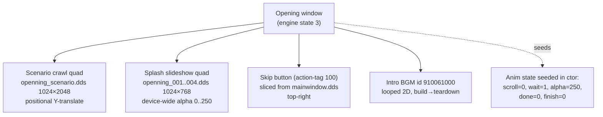
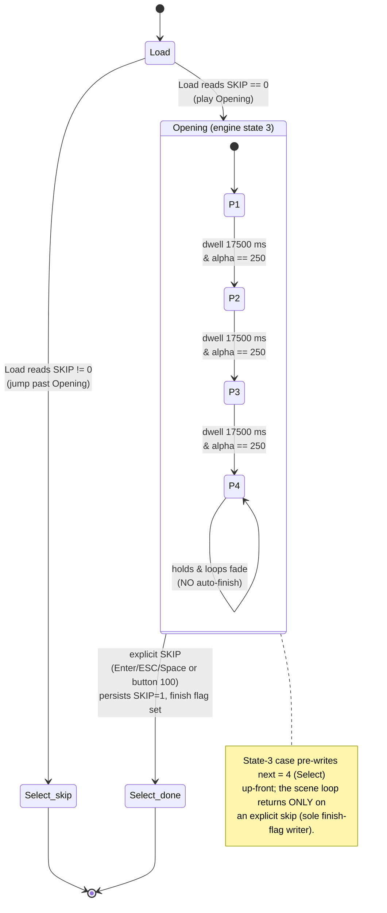
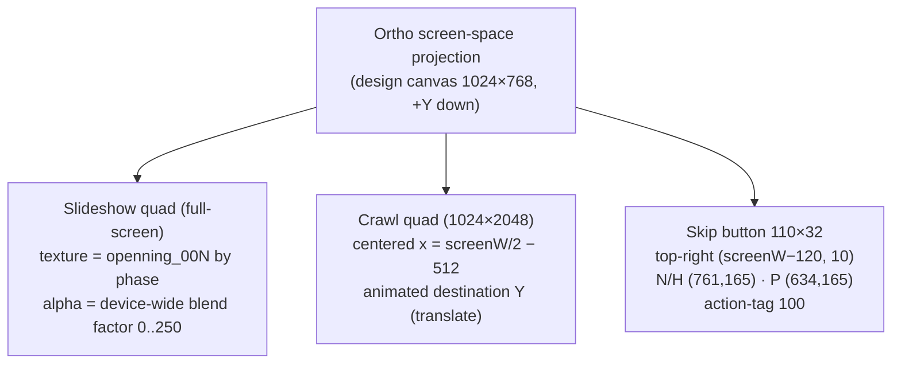

verification: independently re-confirmed 2026-06-19 directly from the doida.exe binary (build 263bd994,
  element-level front-end construction pass, static IDA) — the Opening construct/tick routines were
  re-read at the element/asset/src-rect level: the 4 splash panels (openning_001..004), the
  scenario-crawl quad (openning_scenario.dds 1024×2048, dst x=screenW/2−512 / y=screenH−200), the
  single-texture alpha-over-black crossfade (alpha ceiling 250, +1/tick, ~17500 ms dwell), the crawl
  scroll math (1000 ms gate, +30 u/s, clamp 1843, manual scrub actions 1004/1005 + wheel ±30), and the
  skip button (mainwindow.dds src N/H (761,165) / P (634,165), 110×32, action 100, persists
  [OPENNING] SKIP=1) all CONFIRMED — no corrections. (Prior basis: 2026-06-18 scene reconstruction —
  SKIP routing re-read from the application entry point; crawl never auto-finishes; skip is the sole
  exit. Outcome CONFIRMED.)

# Opening Scene Dossier — engine state 3 (post-login intro)

> **Clean-room deliverable.** Synthesized **only** from committed specs
> (`Docs/RE/specs/intro_sequence.md`, `Docs/RE/specs/frontend_layout_tables.md §6`) plus the
> committed C#/Godot port. No decompiler output, no binary addresses, no pseudo-code; every fact is
> re-expressed in neutral prose. Promoted under EU Software Directive 2009/24/EC Art. 6
> (decompilation solely to achieve interoperability).
>
> **Scope.** This dossier is a per-scene synthesis of the Opening intro (engine state 3). It owns no
> new facts of its own: the *animation behaviour* is owned by `specs/intro_sequence.md`, the *numeric
> layout oracle* by `specs/frontend_layout_tables.md §6`, the *DDS texture format* by the texture
> format spec, and the *sound runtime* by `specs/sound.md`. Where this file and those specs disagree,
> the source specs win.

---

## 1. Overview

The **Opening** scene is the engine's **post-login cinematic intro**. It is reached **after** the
player has logged in, and it plays the game's introductory presentation before the player picks a
character. It is **engine state 3** in the boot scene state machine.

It exists in the flow **only conditionally**. The boot machine reads an Opening-skip flag during the
load phase (state 2). On the **very first** run the flag is unset (`SKIP == 0`) and the machine
advances into state 3 to play the intro; the act of skipping (or, in the port, completing) persists
`SKIP = 1`, so on **every subsequent** run the load phase reads a non-zero flag and jumps **straight
past** the Opening to character-select. The Opening is therefore a once-seen intro, easily and
permanently dismissible.

The intro draws **two independent animated layers**, each driven by its own mechanism:

1. **Scenario crawl ("red ribbon").** One pre-rendered, full-width image
   (`data/ui/openning_scenario.dds`, 1024×2048) whose on-screen **vertical position** is translated
   over time so the tall sheet crawls past the viewport. This is a **baked image**, not typeset text:
   there is **no font slot, no engine glyph layout, and no string-table / `msg.xdb` source** for the
   crawl text — the calligraphy was baked into the DDS at authoring time. The crawl is a **positional
   translate**, not a UV-scroll and not a shader.
2. **Splash slideshow.** Four separate full-screen panels (`openning_001.dds` … `openning_004.dds`,
   each 1024×768) shown in sequence, each dwelling ~17500 ms, blended by a single device-wide alpha
   factor that ramps between 0 and **250** (note: ceiling 250 = `0xFA`, **not** 255). The crossfade is
   a **single-texture alpha-over-(black-cleared)-back-buffer** modulation — **not** a two-texture
   simultaneous blend; the next panel simply fades in from 0 as it replaces the prior.

The two layers are **concurrent**: the crawl scrolls over the crossfading slideshow backdrop, with the
skip button on top throughout (the tick advances the crawl first, then the slideshow FSM each frame).

A single looped 2D background cue (**sound id 910061000**) plays for the whole scene, started at
scene build and stopped on teardown.

The user can **skip** at any time (keyboard Enter / ESC / Space, or a top-right skip button carrying
action-tag 100). Skipping persists the skip flag and tears the scene down; the machine then continues
into character-select (state 4). The slideshow FSM has **no auto-finish of its own** — without a skip
the last panel holds and loops its fade indefinitely; the *only* writer of the "finished" flag is the
skip handler.

> **Filename spelling.** The original spells the stem **`openning`** (double-n) — the legacy typo is
> the literal VFS name and is preserved verbatim.

---

## 2. Object & ownership inventory

The scene is a single Opening window object that, at build time, loads its textures, fires its BGM,
and constructs three visual children (the slideshow quad, the scenario crawl quad, and the skip
button). It seeds its own animation state in its constructor and advances both animation layers from
its per-frame tick. Teardown is a three-part sequence (named-command dispatch → dispose-list push →
slot-0 scalar-deleting destructor) — **not** a plain destructor (see §4).

| Object / element | Role | Source / owner |
|---|---|---|
| **Opening window** | The scene root for engine state 3. Loads textures once, fires the BGM, owns both animation state machines, handles skip, and tears down. | `intro_sequence.md §0/§3.4`, `frontend_layout_tables.md §6` |
| **Scenario crawl quad** | One 1024×2048 image quad (`openning_scenario.dds`), centered horizontally, translated vertically over time (the "red ribbon" band). Single quad — **no sub-rect / frame slicing** of the tall sheet. | `intro_sequence.md §1/§2`, `frontend_layout_tables.md §6` |
| **Slideshow quad** | One full-screen quad whose texture is swapped between the four `openning_00N.dds` panels by the phase index; alpha-modulated by the device-wide blend factor (drawn directly in the 2D pass, not a child widget). | `intro_sequence.md §1/§3`, `frontend_layout_tables.md §6` |
| **Skip button** | A 3-state button sliced from `data/ui/mainwindow.dds`, anchored top-right, carrying action-tag 100; click runs the same teardown as the keyboard skip. | `intro_sequence.md §2.2/§2.5`, `frontend_layout_tables.md §6` |
| **Intro BGM (id 910061000)** | One looped 2D cue created+played once at scene build, stopped on teardown. Distinct from the login curtain stinger (861010105) and the loading BGM (920100100). | `intro_sequence.md §4`, `frontend_layout_tables.md §6/§7`, `specs/sound.md` |
| **Animation state (seeded in ctor)** | done-latch = 0, finish-flag = 0, scroll position = 0, startup wait-flag = 1 (arms the ~1000 ms crawl gate), alpha = **250 (max)**. | `intro_sequence.md §3.4` |



---

## 3. State machine

Two interacting layers of state govern this scene: the **boot scene machine** (how the engine enters
and leaves state 3) and the **slideshow phase FSM** inside the scene.

**Entry / exit.** The engine enters state 3 **only** from the load phase (state 2) when the
Opening-skip flag reads zero; otherwise the load phase jumps directly to character-select (state 4),
bypassing the Opening. The state-3 case writes its next state = 4 **up-front** (so the machine will
fall through to character-select once the scene's blocking loop returns); the intro itself does not
choose the destination, it only governs *when* the scene loop returns. The **only** way the scene
loop returns is an explicit **skip** (the sole writer of the finish flag); the slideshow FSM never
auto-finishes on its own.

**Slideshow phase FSM.** A phase index holds 1, 2, 3, 4 and selects which panel is drawn. Each phase
dwells ~17500 ms; when the dwell expires **and** the panel's alpha has reached its extreme (250), the
phase increments (1→2→3→4). Phase 4 is terminal for the FSM: it does **not** increment further and it
does **not** finish — it holds and loops its alpha fade indefinitely until a skip occurs.



---

## 4. Execution flow

The scene is built once, ticks two animation layers per frame, accepts a skip at any time, and tears
down through a named-command dispatch followed by object destruction.

**Build.** Load the six textures once (the four splash panels into a contiguous 4-entry handle array,
the scenario sheet as one quad, the chrome atlas for the skip button); construct the slideshow quad,
the scenario crawl quad, and the top-right skip button; seed the animation state (scroll = 0, startup
wait = 1, alpha = 250, latches = 0); create and play the BGM (id 910061000) **once** — this is the
last meaningful action of the build, not a per-frame call.

**Per-frame tick — scenario crawl.** For the first ~1000 ms the crawl does nothing (a one-shot
startup gate consumes the first second and resets the time baseline). Thereafter the crawl advances
its scroll position by `dt_s × 30.0` (i.e. **30 design-px/second**, frame-rate independent) and pushes
the new position to the quad's destination Y each frame (X stays 0; only Y animates). When the
position reaches **1843** the crawl latches "done" and stops — there is **no wrap-around**. After the
crawl has latched, the player may scrub it as a "review": a keyboard nudge (actions 1004 up / 1005
down, ±`dt_s × 30`, clamped 0..1843) and an independent mouse-wheel/drag scrub (UI event type 8, ±30
per event, clamped 30..1833 — a slightly different range and a different position field).

**Per-frame tick — slideshow.** A single alpha byte steps +1 per tick toward **250** (the fade-in;
a global direction byte selects fade-in vs fade-out). The byte is **broadcast into all four channels
of one device-wide blend factor** (a Direct3D TEXTUREFACTOR-style render-state) and applied to the
whole panel quad over the black-cleared back-buffer — it is a **single-texture alpha-over-black**
modulation, **not** a two-texture blend and **not** per-vertex colour. The quad is drawn as 4
vertices / 2 triangles under an orthographic screen-space projection sized to the client rect, with a
straight-alpha blend. When a phase's dwell (~17500 ms) expires and its alpha has reached the extreme,
the phase index increments (1→2→3→4); phase 4 holds.

**User skip (any time).** A keyboard event (Enter / ESC / Space) or a click carrying the skip
button's action-tag 100 runs the **same** teardown path: persist the skip flag, set the scene's
"closing" flag (the finish flag — the sole writer), and tear down the children. (The mouse-wheel/drag
scrub, UI event type 8, is a separate non-closing branch of the same handler.)

**Teardown (NOT a plain destructor).** Teardown is a three-part sequence:
1. **Named-command dispatch** — a small helper passes the scene's own name string to a
   "dispatch-by-name" entry point on the engine driver singleton (its sole job; it does **not** free
   the object).
2. **Dispose-list push** — the scene's embedded UI-event sub-object is pushed onto the engine's
   dispose-list (the same sub-object registered at construction).
3. **Slot-0 scalar-deleting destructor** — the scene's vtable slot-0 scalar-deleting destructor then
   runs (with the "also free" argument): it adjusts to the base, restores the base vtable, and
   conditionally frees the object. Textures and child components are released through the dispose-list
   and the window base, not enumerated by the slot-0 destructor itself.

```mermaid
sequenceDiagram
    participant SM as Boot scene machine
    participant OW as Opening window
    participant Drv as Engine driver
    participant Snd as Sound runtime

    SM->>OW: enter state 3 (SKIP==0); build
    Note over SM: state-3 case pre-writes next = 4 (Select)
    OW->>OW: load 6 textures once;<br/>build slideshow + crawl + skip button
    OW->>OW: seed state (scroll=0, wait=1, alpha=250, latches=0)
    OW->>Snd: create + play BGM 910061000 (once, looped)

    loop Per-frame tick
        OW->>OW: crawl — gate ~1000 ms, then pos += dt·30, push to dest-Y, clamp 1843 (no wrap)
        OW->>OW: slideshow — alpha +1/tick to 250 via device-wide blend factor (alpha-over-black)
        OW->>OW: dwell ~17500 ms & alpha==250 → phase++ (1→2→3→4); phase 4 holds
    end

    alt user skip (Enter/ESC/Space OR button action-tag 100)
        OW->>OW: persist SKIP=1; set finish/closing flag
        OW->>Drv: named-command dispatch (pass scene name)
        OW->>Drv: dispose-list push (UI-event sub-object)
        OW->>OW: slot-0 scalar-deleting destructor (also-free)
        OW->>Snd: stop BGM 910061000
        OW-->>SM: scene loop returns → fall through to state 4 (Select)
    end
```

---

## 5. UI architecture

The Opening is an **immediate-mode ortho-quad scene**, not a widget tree. Three drawn elements sit
under an orthographic screen-space projection sized to the client rect:

- **Crawl quad** — the single 1024×2048 scenario sheet, **centered horizontally** at
  `x = screenW/2 − 512`, with a starting Y near the bottom (`screenH − 200`, the destination-Y base
  before the scroll offset is added). The animated quantity is its **destination Y**, advanced each
  frame. There is no frame slicing — the whole texture is one quad.
- **Slideshow quad** — one full-screen quad (`(0, 0, screenW, screenH)` scaled from the 1024×768
  design canvas) whose **texture handle** is swapped between the four `openning_00N` panels by the
  phase index, and whose alpha comes from the single device-wide blend factor (broadcast into all four
  channels), not per-vertex colour.
- **Skip button** — a 3-state button sliced from `data/ui/mainwindow.dds`: source Normal/Hover
  `(761, 165)`, Pressed `(634, 165)`, size **110 × 32**; anchored **top-right** at
  `(x = screenW − 120, y = 10)`; action-tag **100**.

Reference canvas is **1024 × 768** (top-left origin, +Y down); the port scales the canvas to the
window. The original increments the crawl in **+Y (DirectX Y-down)** (raw value increases 0 → 1843),
so a Godot (Y-up) port must **invert the sign** so the crawl reads as scrolling upward — the on-screen
upward read is the component's offset-setter convention plus the bottom-anchored 2048-tall texture, not
a negation in the raw math.



---

## 6. Asset manifest

All textures are concrete VFS paths loaded once at scene build; the BGM is a numeric 2D cue. Note the
**double-n** `openning` spelling throughout.

| Asset (VFS path / id) | Type | Size | Role |
|---|---|---|---|
| `data/ui/openning_scenario.dds` | texture | 1024 × 2048 | Scrolling scenario sheet — the "red ribbon" crawl; one whole-texture quad, no slicing |
| `data/ui/openning_001.dds` | texture | 1024 × 768 | Splash panel — slideshow phase 1 |
| `data/ui/openning_002.dds` | texture | 1024 × 768 | Splash panel — slideshow phase 2 |
| `data/ui/openning_003.dds` | texture | 1024 × 768 | Splash panel — slideshow phase 3 |
| `data/ui/openning_004.dds` | texture | 1024 × 768 | Splash panel — slideshow phase 4 |
| `data/ui/mainwindow.dds` | texture (chrome) | — | Skip-button atlas (src N/H `(761,165)` / P `(634,165)`, 110 × 32) |
| **910061000** | sound (2D, looped) | — | Opening cinematic BGM; created+played once at build, stopped on teardown. Resolves to `data/sound/2d/910061000.ogg` by the category-<5 loader rule (basename/extension capture-pending) |

> Distinct from the **login** curtain stinger **861010105** (login sub-state 1) and the **loading**
> BGM **920100100** (looped, category 0) — three different scenes, three different cues
> (`frontend_layout_tables.md §7`, `specs/sound.md`).

---

## 7. C# + Godot fidelity summary

The committed port already matches the binary's behaviour for this scene; the campaign's Phase-1
"correction" was to the **spec's framing** (the crawl is a baked DDS sprite, not typeset text), **not
to the code** — the Godot `OpeningWindow` was already rendering the baked `openning_scenario.dds`
translated in Y, with the slideshow and the 250 alpha ceiling. Phase-4 **runtime verification**
force-rendered the Opening with `SKIP = 0` to confirm it draws (in dev it had always been skipped with
`SKIP = 1`). The 2026-06-19 element-level construction re-read CONFIRMED every numeric (4 panels,
~17500 ms dwell, alpha 250 / +1 per tick, crawl 1000 ms gate + 30 u/s + 1843 clamp, skip src-rects,
action 100, BGM 910061000) with no corrections.

| Concern | Where | Status |
|---|---|---|
| SKIP-gate routing **into/out of** state 3 | `04.Client.Core/MartialHeroes.Client.Application/Scene/SceneStateMachine.cs` — `AdvanceScene()` routes Load → Opening(3)/Select(4) via the `SkipOpening` flag, and Opening(3) → Select(4) | MATCHES — the state-3 → state-4 advance and the load-phase skip branch are both modelled (`AdvanceLoadScene`, the `Opening => … Select` arm) |
| Opening-skip INI read | `04.Client.Core/MartialHeroes.Client.Application/Assets/OpeningSkipIniReader.cs`; consumed via `SceneStateMachine.SkipOpening` | MATCHES — the `OPENNING/SKIP` decision is consulted once when Load advances |
| Crawl as a **baked sprite** (not typeset text) | `05.Presentation/MartialHeroes.Client.Godot/Ui/Scenes/Opening/OpeningWindow.cs` — loads `data/ui/openning_scenario.dds` into one `TextureRect` and translates its `Position.Y` | MATCHES — uses the baked DDS translated in Y; no font slot / no string-table text. This was already correct before the campaign |
| Crawl mechanics (1000 ms gate, 30 px/s, clamp 1843, Y-up sign inversion) | same file — `UpdateScroll(...)` | MATCHES — startup gate, 30 px/s advance, clamp at 1843, and the Godot Y-up sign inversion are all present |
| Manual crawl scrub (actions 1004 up / 1005 down after "done"; wheel ±30) | same file — review-scrub branch | port should verify both the 1004/1005 keyboard scrub (clamp 0..1843) and the wheel/drag scrub (clamp 30..1833) are modelled |
| Slideshow (4 panels, ~17500 ms dwell, alpha ceiling **250**, alpha-over-black) | same file — `UpdateSlideshow(...)`, `AlphaMax = 250`, `DwellMs = 17500` | MATCHES — the four-panel paging, dwell, and the 250 (not 255) alpha ceiling are present; the single-texture alpha-over-black model is the faithful crossfade (not a two-texture blend) |
| Skip (Enter/ESC/Space + button action 100; persist `OPENNING/SKIP=1`) | same file — `_Input(...)`, `OnSkipPressed()`, `PersistSkip()` | MATCHES — both skip paths persist the flag and advance |
| BGM 910061000 at build, stop on teardown | same file — `Audio?.PlayIntroBgm()` at `_Ready`; `05.Presentation/MartialHeroes.Client.Godot/Scene/Controllers/OpeningScene.cs` owns the audio node lifecycle | MATCHES |
| Scene controller / no auto-finish / skip is sole exit | `05.Presentation/MartialHeroes.Client.Godot/Scene/Controllers/OpeningScene.cs` — builds the window, advances to Select only on `IntroFinished` | MATCHES the CAMPAIGN-16 "skip is the sole exit" reading |

> **Port note (RESOLVED — port matches the binary).** Re-verified this campaign:
> `OpeningWindow.UpdateSlideshow` **holds phase 4 indefinitely and never auto-finishes** — on phase-4
> dwell expiry it only resets the dwell accumulator and re-loops the alpha fade; it does not advance and
> does not emit `IntroFinished`. The sole exit is an explicit skip (keyboard Enter/ESC/Space or the
> action-100 button), which persists `OPENNING/SKIP=1` and emits `IntroFinished`; `OpeningScene`
> advances to Select **only** on that signal (`OnIntroFinished`). This independently matches the binary
> re-read this campaign — the scenario-crawl update advances Y at 30 u/s, clamps at 1843, and reaching
> the clamp only sets a "done" flag; it does **not** end the scene (front-matter; `scene_state_machine.md
> §3`). The earlier "phase-4 auto-exit" divergence has been **REMOVED / RESOLVED** — panel 4 holds and
> loops its alpha fade indefinitely, and the SOLE exit is the explicit skip (matching
> `intro_sequence.md`); this note is retained only to record that the prior divergence is closed.
> **Per-scene audio:** the Opening plays exactly one cue — the looped 2D BGM **910061000** — and starts
> no other sound. *(Dev-only: the headless auto-walk may still advance the scene in layout-dump mode —
> a test affordance, not a behavioural claim.)*

---

## 8. Validation checklist

- [ ] Engine reaches state 3 **only** from the load phase when the Opening-skip flag is zero; a
  non-zero flag jumps straight to character-select (state 4).
- [ ] Both animated layers run **concurrently**: the scenario crawl (positional Y-translate) **and** the
  four-panel slideshow (texture-swap + alpha ramp) are simultaneously active, skip button on top.
- [ ] Crawl is the **baked** `openning_scenario.dds` (1024×2048) translated in Y, dst x=screenW/2−512,
  base y=screenH−200 — **no** typeset text, **no** font slot, **no** string-table source.
- [ ] Crawl honours the ~1000 ms startup gate, advances at 30 design-px/s, clamps at 1843 with **no**
  wrap; the Y-up port inverts the sign so it reads upward; manual scrub actions 1004/1005 (+wheel ±30).
- [ ] Slideshow dwells ~17500 ms/phase, steps alpha +1 per tick toward **250** (not 255), applied as a
  single device-wide blend factor over a black-cleared back-buffer (alpha-over-black, not a two-texture
  blend, not per-vertex colour); phase 4 holds.
- [ ] Skip button = `mainwindow.dds` src N/H `(761,165)` / P `(634,165)`, 110×32, top-right
  `(screenW−120, 10)`, action-tag 100.
- [ ] BGM **910061000** plays once (looped) from scene build and stops on teardown; it is **not** the
  login stinger 861010105 nor the loading BGM 920100100.
- [ ] Skip works via Enter / ESC / Space **and** the top-right button (action-tag 100); both persist
  `OPENNING/SKIP=1` (`WritePrivateProfileStringA`, section `OPENNING`, key `SKIP`, value `1`, file
  `option.ini`) and advance to character-select.
- [ ] Teardown is a **named-command dispatch → dispose-list push → slot-0 scalar-deleting destructor**
  sequence, not a single plain destructor.
- [ ] Runtime render verified with `SKIP = 0` (the scene actually draws when not skipped).

---

## 9. Open items / GAPs

These remain open and are deferred to a live-debugger confirmation pass (none is load-bearing for the
current port, which advances Opening → Select on the explicit skip only — the phase-4 auto-exit
divergence is RESOLVED, §7):

1. **D3D blend-factor enum mapping** — the slideshow panel sets the blend render-states before the
   quad, but the exact source/destination blend-factor enum (the SRCALPHA / INVSRCALPHA reading,
   `intro_sequence.md §3.2/§3.3`) is inferred from the raw render-state arguments and not yet
   confirmed.
2. **Realized on-screen crawl rate** — the crawl advances at **30 design-px/s** in unscaled
   design-pixel space; the realized on-screen pixels-per-second depend on the view-context
   design→screen scale, which has not been isolated. A live read of the quad's Y over a few seconds
   would pin it.
3. **Visible fade duration** — the alpha ramp is **tick-gated** (+1 per tick), so the perceived fade
   time is frame-rate dependent; a live capture would pin the on-screen fade time.
4. **Fullscreen quad UV mapping** — whether the slideshow frame texture maps 0→1 (full-texture) or a
   sub-range over the quad; the quad is full-screen W×H, full-texture mapping assumed; a live vertex
   dump would confirm.
5. **BGM 910061000 basename/extension** — `data/sound/2d/910061000.ogg` is inferred from the
   category-<5 loader prefix rule, not re-derived here.
6. **Final-fade armed-flag producer site** (documentation-only; the §7 strict-fidelity divergence is
   already RESOLVED) — the exact instruction that first **sets** the final-fade-armed flag was not
   isolated (`frontend_layout_tables.md §6`); the consumer side (the armed-flag check, the alpha ramp,
   the run-flag clear) is fully confirmed.

---

## 10. Sources

- **Animation behaviour (authoritative):** `Docs/RE/specs/intro_sequence.md` — scene placement
  (§0.1), scenario crawl math (§2), splash slideshow + alpha crossfade (§3), constructor-seeded state
  (§3.4), intro sound (§4), teardown (§2.6).
- **Numeric layout oracle (authoritative):** `Docs/RE/specs/frontend_layout_tables.md §6` (Opening
  ortho quads), with §0.6 (alpha ceiling 250, +Y crawl), §0.10 (1:1 atlas blit), §5 (the load-phase
  SKIP gate), §7 (front-end audio cues), §7.10 (the `option.ini` SKIP file).
- **Boot scene state machine (entry/exit, GameState enumeration):** `Docs/RE/specs/client_runtime.md`
  / `Docs/RE/specs/game_loop.md`.
- **Front-end scene flow (the character-select scene this intro hands off to):**
  `Docs/RE/specs/frontend_scenes.md`.
- **Sound runtime (id 910061000 here; 861010105 in the login window):** `Docs/RE/specs/sound.md`.
- **DDS texture format:** the texture format spec for `data/ui/openning_*.dds`.
- **C# / Godot port (cited in §7):**
  `04.Client.Core/MartialHeroes.Client.Application/Scene/SceneStateMachine.cs`,
  `04.Client.Core/MartialHeroes.Client.Application/Assets/OpeningSkipIniReader.cs`,
  `05.Presentation/MartialHeroes.Client.Godot/Ui/Scenes/Opening/OpeningWindow.cs`,
  `05.Presentation/MartialHeroes.Client.Godot/Scene/Controllers/OpeningScene.cs`.
- **Glossary / provenance:** `Docs/RE/names.yaml`, `Docs/RE/journal.md`.
