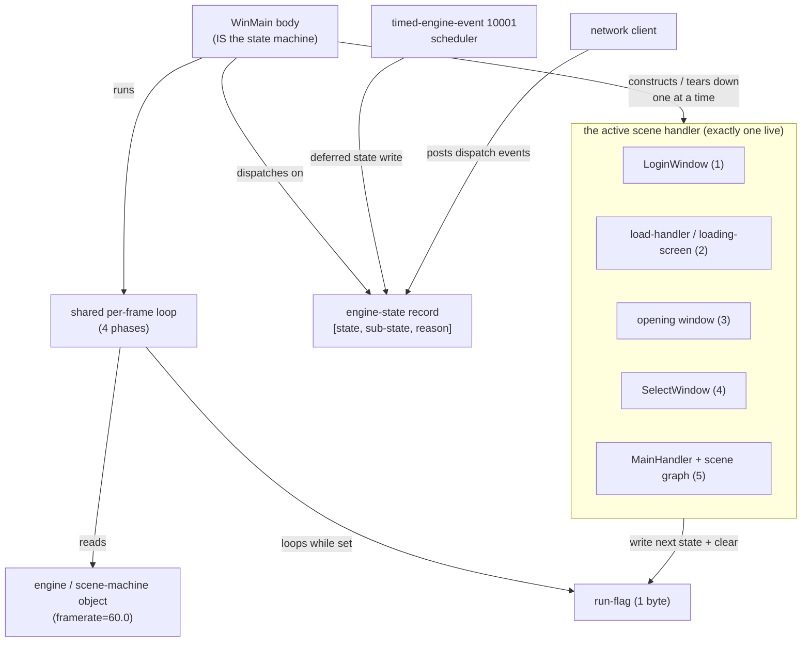

# Scene / Game State Machine — Cross-Cutting Dossier

> **Clean-room neutral synthesis.** Derived by synthesis from the committed `Docs/RE` specs under EU
> Software Directive 2009/24/EC Art. 6 (decompilation permitted solely to achieve interoperability).
> This file contains **no decompiler pseudo-code, no binary virtual addresses, and no decompiler
> identifiers**. `GameState` case numbers, the 3-int record layout, and opcode `(major, minor)` pairs
> are interoperability facts and are stated where load-bearing.
>
> **What this document is.** The single cross-cutting dossier for the engine's **scene / game state
> machine** — the shared spine that sits over *every* interactive scene (Login, Load, Opening,
> Character Select, In-game). It is the dispatcher, not a window: it constructs each scene's handler,
> runs that scene's frame loop, and re-dispatches when the scene signals completion. The per-scene
> dossiers (Login, Select, World, …) describe what each constructed handler *does*; this dossier
> describes the loop that constructs and tears them down.
>
> **Verification basis.** Every fact below was re-confirmed against the live `doida.exe` IDB on build
> SHA `263bd994` during the scene re-confirmation campaign (static IDA + shipped-VFS corroboration; no
> live network capture, no debugger session). The campaign outcome for this spine (U0) was **fully
> CONFIRMED with zero corrections** — see §7 and §8.

---

## 1. Overview

`doida.exe` is a single-process Win32 application built on the in-house "Diamond" engine. Its
application entry point (`WinMain`) **is** the scene state machine. After a one-time bootstrap (Lua
config → launcher gate → **single VFS mount** → message catalogue + device/font bring-up), the entry
point runs an infinite dispatch loop over a single engine-state value and **each case constructs its
own scene-handler object, runs one shared per-frame loop until that handler signals completion, then
tears the handler down and re-dispatches** on whatever state was written last.

The shared spine has these defining properties:

- **One control variable.** The switch dispatches on field 0 of a small **3-int record**
  `[state, sub-state, reason]`. The state field carries the scene value `0..7`.
- **Exactly 8 top-level cases (states 0..7) plus a `default`.** The switch is bounds-checked
  (`state <= 7`) over a jump table of exactly 8 entries. **The value `8` is a terminal exit sub-state,
  not a 9th case** — states 6 (Quit) and 7 (Error) write `8`, so the next loop iteration falls into
  the switch `default` (reverse-singleton teardown + `WinMain` return). Earlier "states 0..8 /
  nine-state" phrasing is wrong.
- **Default scene flow:** `0 Init → 1 Login → 2 Load → 3 Opening → 4 Character Select → 5 In-game`.
- **Login (1) runs BEFORE Load (2).** Login is the first interactive screen; the post-login load is
  visited once per process, immediately after a successful login.
- **Opening (3) is reached only from Load's `SKIP == 0` branch.** When the runtime-built
  `[OPENNING]` / `SKIP` INI key is non-zero, Load advances `2 → 4` directly, skipping the intro.
- **Case 5 pre-arms 4.** Each case writes the *next* state as its pre-loop intent; case 5 (In-game)
  pre-arms state 4 (Select). Consequently **world-exit (logout / disconnect) returns to 4 (Select),
  NOT to 1 (Login)** — a deliberate, non-obvious edge.
- **6 / 7 are inline teardown cases**, not constructed scenes: each writes `8` and drops into the
  `default` branch.

Detail of each constructed scene lives in its own per-scene dossier / spec; the authoritative master
flow that this dossier condenses is `specs/client_workflow.md §4` and `specs/client_runtime.md §7`.

---

## 2. Object & ownership inventory

The spine is intentionally small: a handful of long-lived engine singletons plus exactly one
*currently-constructed* scene handler. The entry point owns the dispatch loop; each case owns the
construction and destruction of its scene handler for the duration of that case body.

| Object | Lifetime | Role on the spine |
|---|---|---|
| Application entry point (`WinMain` body) | process | **Is** the state machine: bootstrap + `while(1) switch(state)` dispatch loop |
| Engine-state record `[state, sub-state, reason]` | process | The single dispatch variable; field 0 selects the case, sub-state/reason carry detail and exit/error keying |
| Engine / scene-machine object | process | Holds the `framerate` field (seeded 60.0) read by the frame throttle; the per-frame loop runs against it |
| Run-flag (one byte) | per scene | Cleared to break the shared per-frame loop and return to the dispatch loop; the commit mechanism (§3) writes the next state then clears this flag |
| The active scene handler (one at a time) | per case body | Constructed on case entry, runs the shared loop, destructed on loop exit. One of: `LoginWindow` (1) · load-handler / loading-screen (2) · opening window (3) · `SelectWindow` (4) · `MainHandler` + scene graph (5). States 0/6/7 are inline (no handler object) |
| Timed-engine-event (`10001`) scheduler | process | The universal "fire after N ms" bridge that converts async network replies / teardown into deterministic state writes (delays 1000 / 1500 / 5000 / 10000 / 30000 ms; e.g. the 30000 ms login watchdog) |
| Network client | process (lazy) | Posts dispatch events that drive network-triggered transitions; closed by the Error (7) case |

**Ownership graph** (who constructs / owns whom on the spine):



States 0 (Init), 6 (Quit), and 7 (Error) construct **no** scene handler — they are inline case bodies
that size the device (0) or tear down (6 / 7).

---

## 3. State machine

The dispatch variable is field 0 of the `[state, sub-state, reason]` record. Triggers are of three
kinds, all funnelling through the same commit mechanism (write next state → clear run-flag →
re-dispatch): **engine-internal** (a case body's post-loop next-state write), **network-driven** (a
received opcode forces a write, often via the `10001` bridge), and **user-driven** (a button / quit
gesture).

```mermaid
stateDiagram-v2
    [*] --> Init

    Init --> Login : always (one-time)

    Login --> Load : case body / EnterGameAck (3/5)
    Login --> Error : window-config fail (sub 1) / device init fail (sub 3)
    Login --> Quit : quit button / version mismatch confirmed (sub 2)

    Load --> Select : OPENNING/SKIP != 0 (skip intro)
    Load --> Opening : OPENNING/SKIP == 0 / absent
    Load --> Quit : quit hotkey (sub 2)
    Load --> Error : connection error during load (sub 2)

    Opening --> Select : intro complete

    Select --> Select : CharacterList (3/1) — forced re-entry, sub 8
    Select --> InGame : case body — enter-game confirmed (pre-arm 5)
    Select --> Quit : quit / action-result code 0 (3/100)
    Select --> Load : action-result 202/203/232 (3/100) — reload
    Select --> Error : action-result 1..4 or 7 (3/100), sub 5

    InGame --> Select : default on loop-exit (pre-armed) / 4/1 spawn-failure fallback
    InGame --> Quit : quit / logout (sub 8)
    InGame --> Error : action-result != 0, local player present (3/100), sub 8

    Quit --> [*] : writes 8 -> switch default (teardown + WinMain return)
    Error --> [*] : reason -> modal; close net client; writes 8 -> default

    note right of InGame
        Case 5 pre-arms state 4, so
        world-exit returns to Select,
        NOT to Login. Login (1) and the
        post-login Load (2) are each
        visited once per process.
    end note

    note right of Quit
        8 is a terminal exit SUB-state,
        not a 9th case: states 6 and 7
        write 8 to fall into the switch
        default branch.
    end note
```

Transition triggers, condensed (authoritative table: `client_workflow.md §4.3`):

| From | Trigger | To | Kind |
|---|---|---|---|
| Init (0) | always, one-time | Login (1) | engine-internal |
| Login (1) | case body / EnterGameAck (3/5) | Load (2) | engine / network |
| Login (1) | window-config fail | Error (7), sub 1 | engine-internal |
| Login (1) | device / secondary init fail | Error (7), sub 3 | engine-internal |
| Login (1) | quit / version mismatch | Quit (6), sub 2 | user |
| Load (2) | `OPENNING/SKIP != 0` | Select (4) | engine-internal |
| Load (2) | `OPENNING/SKIP == 0` / absent | Opening (3) | engine-internal |
| Load (2) | connection error during load | Error (7), sub 2 | network |
| Opening (3) | intro complete | Select (4) | engine-internal |
| Select (4) | CharacterList (3/1) | Select (4), sub 8 (forced re-entry) | network |
| Select (4) | enter-game confirmed (case body) | In-game (5) | engine-internal |
| Select (4) | action-result 0 (3/100) | Quit (6) | network |
| Select (4) | action-result 202/203/232 (3/100) | Load (2) reload | network |
| Select (4) | action-result 1..4 / 7 (3/100) | Error (7), sub 5 | network |
| In-game (5) | loop-exit (pre-armed) / 4/1 spawn-failure | **Select (4)** | engine / network |
| In-game (5) | quit / logout | Quit (6), sub 8 | user |
| In-game (5) | action-result != 0, local player (3/100) | Error (7), sub 8 | network |
| Quit (6) | case body | writes 8 → switch `default` | engine-internal |
| Error (7) | case body (reason → modal, close net) | writes 8 → switch `default` | engine-internal |
| any | `WM_QUIT` | run-flag cleared | OS |

> The result codes `202/203/232` and `1..4/7` are carried by the **generic char/lobby action-result
> S2C `3/100`** (`SmsgCharActionResult`), **not** the char-manage result `3/7` (which handles only
> refresh / rename / delete subtypes and writes no scene state). Wire-byte *value* semantics for these
> opcodes are capture/debugger-pending; the routing/targets above are static CODE-CONFIRMED.

> **2026-06-24 debugger-session — enter-game version mismatch is server-driven (DEBUGGER-CONFIRMED).**
> A live `?ext=dbg` session confirmed the **Select (4) → Error (7)** edge is also reached at the
> **enter-game step** by a **server-side** version rejection (in addition to the documented
> client-local login-gate path that lands at Login (1) → Quit (6) sub 2). When the player commits
> enter-game, the transmitted version token is validated by the **server**; on mismatch an **inbound
> net handler drives the scene machine 5 → 7 (Error)** and the client shows a CP949 "client version
> does not match server" modal before teardown. (The version-token derivation and the dual
> local/server checks are owned by `formats/game_ver.md`.) The same session also debugger-confirmed the
> full live scene sequence **0 → 1 → 2 → 4 (Opening (3) SKIPped, SKIP ≠ 0) → 5** and the teardown
> chain **5 → 7 → 6 → 8** (value 8 = terminal exit sub-state, into the switch default) — every
> transition previously carried as static-only is now debugger-confirmed end-to-end. The 3-int record
> layout `[state, sub-state, reason]` and the ctor-seeded sub-state 8 were likewise confirmed live.

### 3.1 Refinement — the Select (4) → In-game (5) bridge is DUAL (CYCLE 12)

The `Select (4) → In-game (5)` transition is not a simple single write. Two distinct mechanisms both
participate, and **both are required** for the transition to complete:

1. **Case-4 entry pre-arm (standard contract).** As with every case, case 4 writes its post-loop
   intent state — `5` (In-game) — before constructing `SelectWindow` and entering the shared loop.
   This is the ordinary pre-arm described in §4.

2. **`SelectWindow` teardown explicit state-5 write (gated on the "enter committed" latch).** Inside
   the `SelectWindow` teardown path, there is an **additional explicit write of state 5**, gated on
   an "enter committed" latch. This latch records that an enter-game request (`1/9` or the equivalent)
   was actually dispatched and accepted. If the latch is not set (e.g. the player quit or was
   disconnected without committing an enter), the teardown does **not** write state 5, and the
   pre-armed value (from mechanism 1) governs — which may be overwritten by a different exit path
   (Quit, Error, etc.). The "enter committed" latch is what turns a normal teardown into a
   confirmed enter-game transition.

   > **CYCLE 12 precision (IDB SHA 263bd994) — latch ownership and identity.** The "enter
   > committed" latch is a **`SelectWindow` scene member field** — it lives on the `SelectWindow`
   > object itself, NOT on the `NetClient` keepalive-suppress field or any network-layer object.
   > Do not conflate the enter-committed latch with any keepalive suppression or network-state
   > flag. The latch is set when the enter-world send path completes successfully (after `1/9` is
   > dispatched), and the `SelectWindow` teardown checks it before writing state 5.
   > CODE-CONFIRMED, IDB SHA 263bd994.

*([CONFIRMED CYCLE 12]* both the case-4 entry pre-arm and the SelectWindow teardown explicit state-5
write gated on the enter-committed latch; latch is a SelectWindow member field.)*

### 3.2 Refinement — live-player descriptor/stats/level globals copy is POST-`1/9`-send (CYCLE 12)

When the player commits an enter-game request, the copy of the selected character's data into
the global live-player fields occurs **after** the `1/9` enter-world request has been dispatched —
not before. The sequence is: (1) validate and prepare the enter, (2) send `1/9`, (3) copy the
selected character's **descriptor, stats, and level** into the live-player globals. The globals are
not populated until the send is already in flight.

> **CYCLE 12 precision (IDB SHA 263bd994) — copy destinations and the `4/1` spawn seed.**
> The three fields copied are: **descriptor**, **stats**, and **level** — into the corresponding
> live-player global slots. These copied values are **subsequently used as the spawn seed** when
> the `4/1` (`SmsgCharSpawnResponse`) packet arrives: the world-enter handler reads the descriptor
> and stats from these globals to populate the local player's in-world record. **`3/5`
> (`SmsgEnterGameAck` or equivalent) is the server acknowledgment of the enter-world request,
> NOT the spawn trigger** — the actual in-world character appearance is driven by `4/1`, which
> reuses the descriptor/stats already copied into the globals. Do not model `3/5` as the spawn
> initiator. CODE-CONFIRMED, IDB SHA 263bd994.

*([CONFIRMED CYCLE 12]* POST-send ordering of descriptor+stats+level copy; `4/1` reuses the
copied descriptor as the spawn seed; `3/5` is the enter-ack, not the spawn trigger.)*

> **2026-06-24 precision addition.** Beyond the three documented blocks (descriptor/stats/level), the
> enter-game commit writes one additional value: the high byte of a NetHandler roster word and a boolean
> from a second NetHandler field are written to live-player globals at the same time, post-send. The
> semantic of this extra flag byte is capture-pending (likely a PvP/relation or appearance flag). The
> POST-send ordering and the three primary copy destinations are unaffected; this is an additional
> detail. See `scenes/charselect.md §7.4` (the authoritative per-scene record).

---

## 4. Execution flow

Every case follows the identical per-case contract: pre-write the next state (intent), construct the
scene handler, run the shared four-phase per-frame loop until the run-flag is cleared, destruct the
handler, fall through to re-dispatch. A transition is effected by writing the next state and calling
the run-flag-clear ("break") routine — the same mechanism for engine-internal, network-driven, and
user-driven transitions.

```mermaid
sequenceDiagram
    participant WM as WinMain dispatch loop
    participant GS as engine-state record
    participant H as scene handler (this case)
    participant LOOP as shared per-frame loop
    participant SRC as transition source<br/>(case body / network / user / 10001)

    Note over WM,GS: bootstrap done once: VFS mount, msg catalogue, device + fonts

    loop while(1) switch(state)
        WM->>GS: read field 0 (current state)
        WM->>GS: pre-write NEXT state (pre-loop intent)
        WM->>H: construct scene handler for this state
        WM->>LOOP: enter shared loop (set run-flag)

        loop do { 4 phases } while (run-flag)
            LOOP->>LOOP: Phase 1 — pump Win32 msgs + drain deferred input
            LOOP->>H: Phase 2 — scene update + render + present
            LOOP->>LOOP: Phase 3 — round-robin logic tick (~1.1%/frame)
            LOOP->>LOOP: Phase 4 — frame throttle (sleep to fixed 60 FPS)
            SRC-->>GS: write desired next state
            SRC-->>LOOP: clear run-flag (break)
        end

        LOOP-->>WM: loop returns (run-flag cleared)
        WM->>H: destruct scene handler
        Note over WM: fall through → re-dispatch on the state written last
    end

    Note over WM: states 6/7 write 8 → next iteration hits switch default → teardown + return
```

Phase detail is owned by `game_loop.md §7` (the authoritative four-phase order) and summarised in
`client_workflow.md §3`. The spine's only responsibility within the loop is to *host* the active
scene's Phase-2 update/render; the dispatch logic itself runs between loop runs, never inside a frame.

---

## 5. UI architecture

**N/A — this is the dispatcher, not a window.** The scene state machine constructs no widgets of its
own and owns no atlas, font, or layout. Each *constructed scene* is the window-bearing object
(`LoginWindow`, `SelectWindow`, the opening window, the in-game `MainMaster`/HUD); the spine merely
builds, runs, and tears each one down. The Diamond UI / window framework (the `GU*` retained-mode
toolkit, the two-vtable `GUWindow` layout, code-baked geometry on the 1024×768 canvas) is owned by
`specs/ui_system.md`, `structs/guwindow.md`, and `structs/gucomponent.md`, and is summarised per-scene
in the Login / Select / World dossiers. There is nothing scene-machine-specific to document here.

---

## 6. Asset manifest

The spine itself loads exactly **one** asset resource: the **VFS, mounted once before the dispatch
loop begins**. Every later asset is loaded by a *constructed scene* (e.g. `msg.xdb` and the login
atlases during case 1, the ~50-table boot corpus during case 2), and is documented in that scene's
own dossier — not here. The single spine-level asset action:

| Asset | When | Mechanic | Owning spec |
|---|---|---|---|
| `data.inf` (index) + `data/data.vfs` (data archive) | **once**, in the bootstrap immediately before the `while(1)` dispatch loop | `data.inf` opened `FILE_FLAG_RANDOM_ACCESS`; 24-byte header read (entry count = 4th dword, byte +0x0C); 144-byte/entry TOC read into memory; index handle closed; `data/data.vfs` opened and its handle **retained for the process lifetime** (RAW storage, `ReadFile` per open, never memory-mapped) | `formats/pak.md` (container bytes); `specs/resource_pipeline.md §1.5` (mount mechanics) |

The runtime-built `[OPENNING]` / `SKIP` INI key consulted by Load (2) is *read* during case 2, not
mounted by the spine; its literal on-disk filename is debugger-pending (see §9).

---

## 7. C# + Godot fidelity summary

The C#/Godot port models the spine with a **single faithful FSM** (reconstructed this campaign: the
redundant second FSM was **removed** — see the reconstruction note below):

- **`SceneStateMachine`** — the *faithful 8-case engine port*. It owns the live `GameState` record and
  applies the complete transition table (engine-internal `AdvanceScene`, network-driven, and
  user-driven edges), publishing one `SceneStateChangedEvent` per accepted transition.
  `04.Client.Core/MartialHeroes.Client.Application/Scene/SceneStateMachine.cs`
- **`EngineSceneState`** — the faithful scene enum: `Init=0 … Error=7`, with `Exit=8` documented as
  the **terminal loop-exit sentinel, NOT a 9th case** (no `case 8:`).
  `01.Infrastructure.Shared/MartialHeroes.Shared.Kernel/Enums/EngineSceneState.cs`
- **`GameState`** — the faithful `readonly record struct` modelling the 3-int record + the `+0x0C`
  debug byte; constructor default `{ Init, SubState = 8, ErrorDetail = 0 }`; `SubStateNone = 8`
  encodes the "value 8 doing double duty (exit sentinel **and** no-sub-state default)" fact.
  `01.Infrastructure.Shared/MartialHeroes.Shared.Kernel/State/GameState.cs`
- **`SceneHost`** — the Godot dispatch half: keeps exactly one `ISceneController` node in the tree and
  swaps it on each `SceneStateChangedEvent`, mirroring "each case builds + runs one scene". Passive,
  zero game rules.
  `05.Presentation/MartialHeroes.Client.Godot/Scene/SceneHost.cs`

> **Reconstruction note — the second FSM is GONE.** A coarse app-lifecycle convenience FSM
> (`ClientStateMachine` over a `ClientState { Login, CharacterSelection, Loading, World, Disconnected }`
> enum, with its `ClientStateChangedEvent`) formerly ran in parallel to the faithful spine. It and its
> four now-dead methods were **DELETED this campaign**; all consumers were migrated to the faithful
> `SceneStateMachine` / `EngineSceneState` / `SceneStateChangedEvent`. The port no longer carries a
> redundant copy of the engine switch — `SceneStateMachine` is the **sole** scene FSM.

**Verdict: MATCH — zero structural corrections.** Every load-bearing spine fact this dossier encodes is
reflected in the C#/Godot model: 8 cases 0..7, `8` = exit sub-state (not a case), `0 → 1 → 2 → 3/4 →
4 → 5`, Login-before-Load, Opening gated by `SkipOpening`, the `5 → 4` (NOT `5 → 1`) world-exit edge,
the forced Select re-entry on `3/1`, and the `3/100`-vs-`3/7` distinction. The port now keeps a
**single faithful FSM** (the redundant `ClientStateMachine` having been removed). Re-confirmed CYCLE 12
(2026-06-22) against build `263bd994` with no structural corrections; the CYCLE 12 refinements
(dual Select→InGame bridge, §3.1; POST-`1/9` globals copy, §3.2) are fidelity items for the
`SelectWindow` / enter-game path that implementors should verify in the port.

---

## 8. Validation checklist

Use this to verify the machine 1:1 against the binary / port:

- [ ] The dispatch switch is bounds-checked `state <= 7` over a jump table of **exactly 8 entries**
      (states 0..7) plus a `default`.
- [ ] There is **no `case 8:`** — value `8` is written by Quit (6) and Error (7) and lands in the
      switch `default` (teardown + return).
- [ ] The dispatch variable is field 0 of a **3-int record** `[state, sub-state, reason]`; the
      constructor default sub-state is `8`.
- [ ] The VFS is mounted **exactly once**, in the bootstrap *before* the dispatch loop — never inside
      a case body.
- [ ] Default flow is `0 Init → 1 Login → 2 Load → 3 Opening → 4 Select → 5 In-game`.
- [ ] **Login (1) precedes Load (2)**; both are visited **once per process**.
- [ ] **Opening (3) is reached only** from Load when `OPENNING/SKIP == 0` / absent; a non-zero key
      makes Load advance `2 → 4` directly.
- [ ] Each case **pre-writes its next state** as intent before running its loop.
- [ ] Case 5 (In-game) **pre-arms state 4**, so loop-exit returns to **Select (4), not Login (1)**.
- [ ] `CharacterList (3/1)` while on Load/Select forces a **Select re-entry** (state value unchanged,
      handler rebuilt) at sub 8.
- [ ] State-transition result codes route via **`3/100`** (`SmsgCharActionResult`), **not** `3/7`.
- [ ] Quit (6) and Error (7) construct **no scene handler** — inline teardown only; Error reads the
      **reason** field for its modal and closes the net client.
- [ ] A transition is always "write next state → clear run-flag (break) → re-dispatch"; no case jumps
      to another case directly.
- [ ] The port keeps a **single faithful FSM** (`SceneStateMachine`); the redundant `ClientStateMachine`
      has been removed and no second scene FSM remains.
- [ ] The Select (4) → In-game (5) bridge is **DUAL**: case-4 entry pre-arms state 5, AND the
      `SelectWindow` teardown contains an explicit state-5 write gated on the "enter committed" latch
      (§3.1). Both mechanisms must be modelled; a teardown without the latch set must NOT write state 5.
- [ ] The live-player descriptor/stats copy into globals is **POST-`1/9`-send** — the copy happens
      after the enter-world request is dispatched, not before (§3.2).

---

## 9. Open items / GAPs

- **The literal on-disk INI filename behind the `[OPENNING]` / `SKIP` lookup is debugger-pending.**
  The section name `[OPENNING]` (the two-N typo is authentic) and the key `SKIP` are confirmed, and
  the path is built **at runtime** into the settings-object path buffer (offset +1165). Prior
  campaigns identify the file as `option.ini`, but the exact filename *string* at that buffer was not
  statically pinned — it remains capture/debugger-pending. (`client_runtime.md §0.10.1`, §7.10 item 2.)
- **Form-arrival ordering of the world-entry `4/1` handler vs the major-1 billing family** on world
  entry is capture/debugger-pending (does not affect the spine's transition table, only the ordering
  of in-world packets after `5` is entered).
- **Which failure raises which Error sub-state (1 vs 3) — CLOSED (CODE-CONFIRMED, CYCLE 8).** This is
  **not** an Init (0) failure — case 0 (Init) has no Error-raise at all (it unconditionally pre-arms
  state 1). The sub-state 1-vs-3 distinction lives in the **Login (1)** case: a **main-window creation
  failure** raises Error with **sub-state 1**, and a **graphics-device init failure** raises Error with
  **sub-state 3**. (Re-attributed from the earlier "Init failure" framing; the §3 transition rows
  "window-config fail -> Error sub 1" and "device / secondary init fail -> Error sub 3" are now
  CODE-CONFIRMED, not pending.)
- **All packet field VALUE semantics** for the transition-driving opcodes (`3/5`, `3/1`, `3/100`,
  `4/1`) remain capture/debugger-pending — routing, sizes, and offsets are firm; byte meanings are
  not. Do not hard-code wire-byte values from this dossier.

These are non-blocking for the spine: none changes the 8-case structure, the flow order, or any
documented edge.

---

## 10. Sources

Synthesised from the committed specs (read-only; no `_dirty/`, no IDA):

- `Docs/RE/specs/client_architecture.md` — §3 (the GameState scene machine 0..7), §0, §2.
- `Docs/RE/specs/client_workflow.md` — §1.1 (full process flow), §4 (scene state machine, state
  enumeration, transition table, scene-aware disconnect routing, timed-event bridge, error reason
  field).
- `Docs/RE/specs/game_loop.md` — §0 (bootstrap / VFS-mount-once), §7 (authoritative four-phase loop
  the spine hosts).
- `Docs/RE/specs/client_runtime.md` — §0 (boot timeline + VFS mount + `[OPENNING]` buffer), §7
  (master scene lifecycle, per-case contract, transitions).

Port files cited in §7:
`04.Client.Core/MartialHeroes.Client.Application/Scene/SceneStateMachine.cs` ·
`01.Infrastructure.Shared/MartialHeroes.Shared.Kernel/Enums/EngineSceneState.cs` ·
`01.Infrastructure.Shared/MartialHeroes.Shared.Kernel/State/GameState.cs` ·
`05.Presentation/MartialHeroes.Client.Godot/Scene/SceneHost.cs` ·
`04.Client.Core/MartialHeroes.Client.Application/Scene/SceneStateChangedEvent.cs`.
