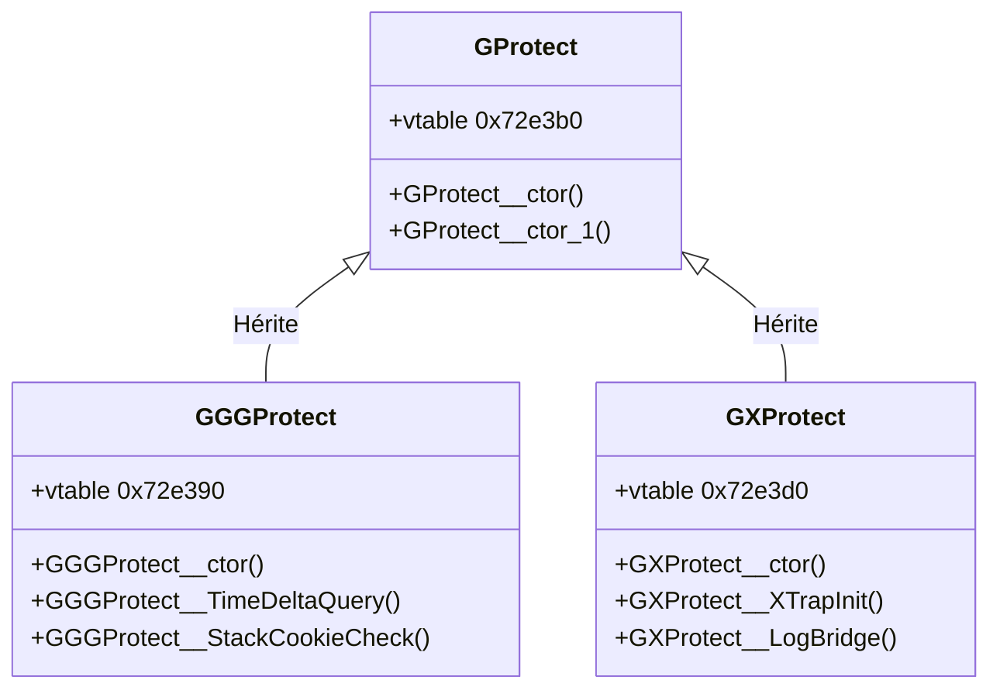

# Noyau du Sous-Système Anti-Cheat — `doida.exe`

> **Version de spécification** : Spécification propre (Clean-Room)  
> **Build cible** : `f61f66a9ae0ec1e946105b2ecff76e8930cb1d1367df64e5688a5266f5ad9963`  
> **Type d'analyse** : Statique (IDA Pro / Décompilation)  
> **Fichiers sources associés** :
> - [anticheat_analysis.md](file:///C:/Users/Arius/RiderProjects/MartialHeroes/Docs/RE/_dirty/anticheat_analysis.md)
> - [gggprotect_real_vfuncs_decomp.md](file:///C:/Users/Arius/RiderProjects/MartialHeroes/Docs/RE/_dirty/gggprotect_real_vfuncs_decomp.md)
> - [gggprotect_vfuncs_decomp.md](file:///C:/Users/Arius/RiderProjects/MartialHeroes/Docs/RE/_dirty/gggprotect_vfuncs_decomp.md)

---

## 1. Hiérarchie des Classes de Protection & Analyse des Vtables

Le sous-système de sécurité utilise une architecture objet en trois classes distinctes. L'analyse des descripteurs RTTI confirme la hiérarchie d'héritage suivante :



### 1.1 Informations RTTI et Adresses de Vtables
* **[GGGProtect](file:///C:/Users/Arius/RiderProjects/MartialHeroes/Docs/RE/_dirty/anticheat_analysis.md#L7)** : Vtable à `0x72e390`. RTTI Descriptor : `??_R0?AVGGGProtect@@@8` à `0x7970f8`.
* **[GProtect](file:///C:/Users/Arius/RiderProjects/MartialHeroes/Docs/RE/_dirty/anticheat_analysis.md#L10)** : Vtable à `0x72e3b0`. RTTI Descriptor : `??_R0?AVGProtect@@@8` à `0x797114`.
* **[GXProtect](file:///C:/Users/Arius/RiderProjects/MartialHeroes/Docs/RE/_dirty/anticheat_analysis.md#L12)** : Vtable à `0x72e3d0`. RTTI Descriptor : `??_R0?AVGXProtect@@@8` à `0x79712c`.

### 1.2 Constructeurs Réels du Framework de Protection
* **[GGGProtect__ctor](file:///C:/Users/Arius/RiderProjects/MartialHeroes/Docs/RE/_dirty/anticheat_analysis.md#L25)** (`0x5f7e81`) : Assigne la vtable `0x72e390` et appelle le constructeur délégué `GProtect__ctor_1`.
* **[GProtect__ctor](file:///C:/Users/Arius/RiderProjects/MartialHeroes/Docs/RE/_dirty/anticheat_analysis.md#L34)** (`0x5f7eff`) : Assigne la vtable `0x72e3b0`.
* **[GProtect__ctor_1](file:///C:/Users/Arius/RiderProjects/MartialHeroes/Docs/RE/_dirty/anticheat_analysis.md#L43)** (`0x5f7f08`) : Version légère (thin constructor), se contentant d'écrire l'adresse de vtable `0x72e3b0`.
* **[GXProtect__ctor](file:///C:/Users/Arius/RiderProjects/MartialHeroes/Docs/RE/_dirty/anticheat_analysis.md#L51)** (`0x5f7fc0`) : Assigne la vtable `0x72e3d0` et appelle `GProtect__ctor_1`.

### 1.3 Résolution du Malentendu sur les fonctions `VFunc_00` à `0x553133` (Scalar Deleting Destructors)

Dans les analyses initiales (voir [anticheat.md](file:///C:/Users/Arius/RiderProjects/MartialHeroes/Docs/RE/specs/anticheat.md#L42)), les slots de fonctions virtuelles `VFunc_00` de `GProtect` / `GXProtect` et les 10 slots lourds `GGGProtect__VFunc_00_0` à `0x00_9` de `GGGProtect` avaient été étiquetés à tort comme :
1. Une structure de "polymorphic UI panel factory" (pour instancier des panels tels que `LoginPanel`, `ServerSelectionPanel`, `GreetPanel`, etc.).
2. Des fonctions d'anti-cheat lourdes (packet integrity, memory scanner, etc.).

L'analyse de décompilation propre démontre qu'il s'agit en réalité de **destructeurs virtuels scalaires** (Scalar Deleting Destructors, désignés sous MSVC par `??_G`) de multiples classes dérivées. 

#### Explication Technique :
1. **Comportement du Destructeur Virtuel sous MSVC** : Dans le compilateur MSVC, le slot 0 d'une vtable de classe polymorphe est traditionnellement réservé au destructeur virtuel. Le compilateur génère une fonction enveloppe (le *scalar deleting destructor*) qui prend un argument booléen (généralement passé dans un registre ou sous forme de paramètre `char a2`). Si cet argument a son bit de poids faible défini (`a2 & 1`), la fonction appelle le désallocateur global de mémoire (ex. `free` ou `delete`) après l'exécution du destructeur.
2. **Mécanisme de Restauration de la Vtable** : Durant la phase de destruction d'un objet en C++, après l'exécution du corps du destructeur de la classe dérivée, le pointeur de vtable de l'objet (`this`) est restauré à la vtable de sa classe parente immédiate. Cette réaffectation s'assure que si des fonctions virtuelles sont appelées indirectement pendant la destruction des classes de base, elles résolvent vers les implémentations de ces classes de base.
3. **Inlining et Confusion** : L'écriture de l'adresse de la vtable parente ressemble exactement à un appel de constructeur léger. Dans le code décompilé de [ItemConfirmPanel__VFunc_00_8](file:///C:/Users/Arius/RiderProjects/MartialHeroes/Docs/RE/_dirty/gggprotect_real_vfuncs_decomp.md#L3), on observe l'appel à `GProtect__ctor_1(Block)`. Il ne s'agit pas d'une instanciation via une factory, mais du rétablissement de la vtable de `GProtect` lors de la destruction de l'objet `ItemConfirmPanel` avant de libérer le bloc de mémoire via `j__free`.
4. **Propagation de Noms** : Faute de métadonnées de types complètes, le décompilateur a propagé le nom du slot parent `GGGProtect__VFunc_00` ou `GXProtect__VFunc_00` à tous les destructeurs virtuels des classes dérivées surchargeant ce slot 0. Les adresses éparpillées dans le binaire (de `0x51edb4` à `0x553133`) correspondent ainsi aux destructeurs réels des classes suivantes :

| Adresse physique | Identifiant temporaire IDA | Classe propriétaire réelle | Rôle réel du symbole |
| :--- | :--- | :--- | :--- |
| `0x51edb4` | `GGGProtect__VFunc_00_0` | `SkillConfirmPanel` | Destructeur virtuel scalaire |
| `0x52456d` | `GGGProtect__VFunc_00_1` | `SkillPanel` | Destructeur virtuel scalaire |
| `0x52c03c` | `GGGProtect__VFunc_00_2` | `WarInfoPanel` | Destructeur virtuel scalaire |
| `0x52d968` | `GGGProtect__VFunc_00_3` | `DXTextureList` | Destructeur virtuel scalaire |
| `0x52dbac` | `GGGProtect__VFunc_00_4` | `Diamond::GUComponent` | Destructeur virtuel scalaire |
| `0x52dfd7` | `GGGProtect__VFunc_00_5` | `Pointer` | Destructeur virtuel scalaire |
| `0x52e4c6` | `GGGProtect__VFunc_00_6` | `AnimationPointer` | Destructeur virtuel scalaire |
| `0x52f663` | `GGGProtect__VFunc_00_7` | `Diamond::GTextureManager` | Destructeur virtuel scalaire (ou destructeur standard) |
| `0x531c23` | `GGGProtect__VFunc_00_8` | `CmdHandler` | Destructeur virtuel scalaire |
| `0x553133` | `GGGProtect__VFunc_00_9` | `BroodWarMapInfoPanel_MapStatePanel` | Destructeur virtuel scalaire |

De même, les fonctions de `0x4fea83` à `0x50bd05` (ex. `LoginPanel`, `ServerSelectionPanel`, `OptionPanel_Character`) sont les destructeurs virtuels de ces panels d'interface graphique héritant de `GProtect` ou `GXProtect`, et non des fonctions d'une usine d'instanciation de l'anti-cheat.

---

### 1.4 Fonctions Virtuelles Réelles et Validées
Une fois les destructeurs nettoyés, les fonctions virtuelles de protection et d'infrastructure réelles sont les suivantes :

#### Fonctions de `GXProtect` (Intégration XTrap) :
* **[GXProtect__XTrapInit](file:///C:/Users/Arius/RiderProjects/MartialHeroes/Docs/RE/_dirty/gggprotect_real_vfuncs_decomp.md#L23)** (Slot 1 @ `0x5f7fcb`) : Initialisation du SDK d'anti-cheat externe (XTrap). Elle charge un jeton d'authentification de licence chiffré sous forme de chaîne hexadécimale de 232 octets et le transmet au point d'entrée d'initialisation de XTrap à l'adresse `0x6CF610`.
* **[GXProtect__LogBridge](file:///C:/Users/Arius/RiderProjects/MartialHeroes/Docs/RE/_dirty/gggprotect_real_vfuncs_decomp.md#L47)** (Slot 6 @ `0x5f8035`) : Pont de journalisation. Redirige les messages système vers l'API de log interne de XTrap (`sub_6CFE40`) et génère un log de débogage préfixé par `[GXProtect]`.

#### Fonctions de `GGGProtect` (Mécanismes internes) :
* **[GGGProtect__StackCookieCheck](file:///C:/Users/Arius/RiderProjects/MartialHeroes/Docs/RE/_dirty/gggprotect_real_vfuncs_decomp.md#L37)** (Slot 1 @ `0x5f7ee6`) : Contrôle de l'intégrité de la pile. Effectue une opération XOR entre l'adresse locale d'une variable de pile et la valeur du cookie de sécurité global situé dans la section `.rdata` (`dword_7A13C0`), puis valide la conformité en appelant l'infrastructure de traitement SEH (`sub_65F22F`).
* **[GGGProtect__TimeDeltaQuery](file:///C:/Users/Arius/RiderProjects/MartialHeroes/Docs/RE/_dirty/gggprotect_real_vfuncs_decomp.md#L71)** (Slot 2 @ `0x5f7e8c`) : Mesure du temps écoulé (rate limiter). Elle vérifie un indicateur d'initialisation dans le BSS (`dword_858BD8`). Si non défini, elle capture le timestamp de référence via `Time_GetMs()` dans `dword_858BD4`. Elle calcule ensuite le delta de temps écoulé. Si ce delta dépasse 10 000 millisecondes (`0x2710`), le timestamp de référence est réinitialisé au temps courant. Cette fonction sert à cadencer l'exécution de certaines vérifications internes sans surcharger le processeur.

---

## 2. Thread de Surveillance Périodique (AntiCheat_MonitorThread)

Le cœur de la protection active s'exécute de façon asynchrone dans un thread de surveillance dédié : **[AntiCheat_MonitorThread](file:///C:/Users/Arius/RiderProjects/MartialHeroes/Docs/RE/_dirty/anticheat_analysis.md#L143)** (situé à l'adresse `0x6276a0`).

### 2.1 Cycle de Cadencement et WaitForSingleObject
Le thread reçoit en paramètre unique un pointeur vers une structure de contrôle de l'anti-cheat (`lpThreadParameter`). La boucle d'intégrité est rythmée par un appel système `WaitForSingleObject` :
* **Intervalle** : **3 555 ms** (valeur brute `0xDE3` passée au timeout).
* **Objet de synchronisation** : Un descripteur d'événement (Event HANDLE) stocké à l'offset `lpThreadParameter + 0x14` (ou le 5ème DWORD). Cet événement permet d'interrompre immédiatement le sommeil du thread lors de l'arrêt du client de jeu.

### 2.2 Algorithme de la Boucle d'Intégrité
À chaque réveil du thread provoqué par l'expiration du délai d'attente (valeur de retour `WAIT_TIMEOUT` ou non nulle), le moniteur exécute de manière séquentielle les routines de vérification d'intégrité :

```
             [Réveil du thread (3555 ms)]
                          │
                          ▼
            Vérification des Hooks API ?
            [sub_628980 (Timers)]
             /                      \
      (Non) /                        \ (Oui)
           ▼                          ▼
     Sortie Fatale              Vérification des Hooks Réseau ?
     Code 1581                  [sub_628BB0 (WinSock)]
                                 /                      \
                          (Non) /                        \ (Oui)
                               ▼                          ▼
                         Sortie Fatale              Détection Débogueur ?
                         Code 2225                  [sub_6279C0 ou Watchdog]
                                                     /                     \
                                              (Oui) /                       \ (Non)
                                                   ▼                         ▼
                                             Écriture Log               Poursuite de la
                                             Obscurci et                Boucle Active
                                             Sortie Fatale
                                             Code 500
```

Si le `WaitForSingleObject` se débloque avec une valeur de retour de `0` (l'événement a été signalé pour demander l'arrêt du thread) :
1. Le thread vérifie l'état du drapeau d'exécution à l'offset `lpThreadParameter[28]`.
2. Si le drapeau est à `0` (arrêt normal programmé), le thread sort proprement de sa boucle et se termine.
3. Si le drapeau est toujours à `1` (signalisation anormale sans intention d'arrêt de la boucle), le client considère cela comme une tentative de contournement par injection de signal et déclenche une **sortie fatale immédiate avec le code 1581**.

---

## 3. Algorithmes de Détection de Hooks API (Snapshots IAT)

Pour empêcher le détournement de fonctions critiques (nécessaires au calcul des timings réseau, de l'anticheat, ou à la falsification des paquets de données), le noyau anti-cheat utilise une vérification par instantané d'adresses (IAT snapshots) pour deux familles d'API.

### 3.1 Détection sur les APIs Temporelles / Haute Résolution
La fonction **[AntiCheat_CheckApiHooks](file:///C:/Users/Arius/RiderProjects/MartialHeroes/Docs/RE/_dirty/anticheat_analysis.md#L195)** (`0x628980`) vérifie que les adresses mémoire des pointeurs système n'ont pas été modifiées par une DLL ou un injecteur externe (hooks en table d'importation).

* **Drapeaux de contrôle** :
  - `byte_9FB748` : Drapeau de contournement (bypass). Si défini à `1`, la fonction renvoie immédiatement `1` (succès).
  - `byte_9FB780` : Indicateur d'initialisation. Si défini à `0`, la détection est considérée comme non active et renvoie `2`.
* **Méthodologie** :
  Au démarrage du client de jeu, les adresses d'importation légitimes des APIs sont sauvegardées dans des variables globales du BSS. Lors de la boucle d'intégrité, les adresses d'importation actives sont lues et comparées à ces valeurs de référence.

| Fonction Cible | Adresse Snapshot BSS | Comportement en cas d'écart | String Pool Associée |
| :--- | :--- | :--- | :--- |
| `QueryPerformanceCounter` | `dword_9FB770` | Incrémentation du compteur d'erreurs | [unk_79B188](file:///C:/Users/Arius/RiderProjects/MartialHeroes/Docs/RE/_dirty/anticheat_analysis.md#L206) (Chaîne chiffrée) |
| `GetTickCount` | `dword_9FB76C` | Incrémentation du compteur d'erreurs | [unk_79B174](file:///C:/Users/Arius/RiderProjects/MartialHeroes/Docs/RE/_dirty/anticheat_analysis.md#L211) (Chaîne chiffrée) |
| `timeGetTime` | `dword_9FB774` | Incrémentation du compteur d'erreurs | [unk_79B160](file:///C:/Users/Arius/RiderProjects/MartialHeroes/Docs/RE/_dirty/anticheat_analysis.md#L216) (Chaîne chiffrée) |

Si le compteur final d'erreurs cumulées est supérieur à `0`, la fonction retourne `0` (échec), provoquant la sortie fatale du client.

### 3.2 Détection sur les APIs WinSock
La fonction **[AntiCheat_CheckNetworkHooks](file:///C:/Users/Arius/RiderProjects/MartialHeroes/Docs/RE/_dirty/anticheat_analysis.md#L230)** (`0x628BB0`) applique le même traitement aux primitives d'envoi réseau standard pour interdire le sniffing local ou la falsification de paquets sortants (ex. proxys ou utilitaires de triche orientés paquets).

* **Drapeaux de contrôle** :
  - `byte_9FB781` : Indicateur d'initialisation réseau. Si non défini (`0`), la fonction retourne `2` (abandon de la vérification).
* **Méthodologie** :
  Comparaison des adresses mémoire actives des fonctions de la DLL `WS2_32.dll` avec les instantanés de démarrage :

| Fonction WinSock Cible | Adresse Snapshot BSS | String Pool Associée |
| :--- | :--- | :--- |
| `WSASend` | `dword_9FB778` | [unk_79B240](file:///C:/Users/Arius/RiderProjects/MartialHeroes/Docs/RE/_dirty/anticheat_analysis.md#L240) (Chiffrée) |
| `send` | `dword_9FB77C` | [unk_79B22C](file:///C:/Users/Arius/RiderProjects/MartialHeroes/Docs/RE/_dirty/anticheat_analysis.md#L245) (Chiffrée) |

Si l'une des adresses ne correspond pas à sa valeur d'origine, le système journalise l'anomalie en chargeant la chaîne d'erreur correspondante et retourne `0` (détection positive de détournement).

---

## 4. Détection de Débogueurs (PEB et Fuite de PID)

La fonction de détection active des débogueurs ou des environnements d'analyse dynamique est implémentée dans **[AntiCheat_CheckDebuggerPresence](file:///C:/Users/Arius/RiderProjects/MartialHeroes/Docs/RE/_dirty/anticheat_analysis.md#L254)** (`0x6279C0`). Elle s'appuie sur le bloc d'informations de thread (TEB) pour accéder à des structures bas niveau du système Windows de deux manières distinctes, régies par le flag de configuration situé à l'offset `this + 4713` (où `this` représente le pointeur de structure anti-cheat) :

* **Flag de Bypass Global** : Si la variable globale `byte_9FB749` est activée (`1`), la routine court-circuite toutes les détections et renvoie `0`.

### 4.1 Mode Standard : Lecture du PEB (Process Environment Block)
Si le flag `*(this + 4713)` est non nul, la fonction interroge directement le drapeau standard de débogage maintenu par le noyau Windows dans la structure PEB :
```c
// Représentation conceptuelle de la lecture PEB
BeingDebugged = NtCurrentTeb()->ProcessEnvironmentBlock->BeingDebugged;
return BeingDebugged;
```
Le noyau Windows met à jour ce champ `BeingDebugged` (situé à l'offset `0x02` du PEB) lors de la fixation d'un débogueur standard via l'API `DebugActiveProcess`.

### 4.2 Mode Furtif : Fuite de PID (Process Identifier Leak)
Si le flag `*(this + 4713)` est nul, la fonction bascule sur un mécanisme alternatif non conventionnel. Elle récupère et retourne le premier octet (le LSB) de l'identifiant du processus courant à partir du TEB :
```c
// Représentation de l'accès direct à l'identifiant de processus
UniqueProcessIdByte = LOBYTE(NtCurrentTeb()->ClientId.UniqueProcess);
return UniqueProcessIdByte;
```

#### Rationale et Fonctionnement :
* Sous Windows, le PID d'un processus actif est un identifiant système unique non nul généré par le noyau.
* Étant donné qu'un PID valide n'est jamais égal à zéro et que sa distribution d'octets bas de gamme (`LOBYTE`) a une probabilité extrêmement élevée d'être non nulle (255 chances sur 256), la fonction retournera presque systématiquement une valeur positive (valeur évaluée comme vraie / `true` en C++).
* Ce comportement simule intentionnellement la présence d'un débogueur en forçant une détection positive, à moins que le PID attribué par le système d'exploitation ne se termine spécifiquement par `0x00` (ou si l'anti-cheat a été neutralisé par une modification de la variable d'embranchement).
* Ce mécanisme fait office de piège ou de "tamper-flag" silencieux pour bloquer l'exécution à moins que le code sous-jacent ou l'état de l'anti-cheat n'ait été minutieusement analysé et configuré par un watchdog externe.

---

## 5. Codes de Sortie Fatals du Client

Lorsqu'une violation de sécurité est confirmée par le thread d'intégrité, le client de jeu n'affiche pas de message d'erreur standard (afin de compliquer l'analyse par ingénierie inverse). Il invoque `AppEvent_ProcessCodeOrFatalExit` (ou `sub_6421D0`) pour mettre fin brusquement au processus de manière contrôlée avec un code d'arrêt fatidique.

| Code de Sortie | Catégorie de Violation | Source / Trigger | Comportement de Clôture |
| :--- | :--- | :--- | :--- |
| **`500`** | Détection de Débogueur | - `BeingDebugged` détecté dans le PEB<br>- Fuite de PID active et évaluée à vrai<br>- Signal de falsification watchdog reçu dans `lpThreadParameter[29]` | 1. Récupération et déchiffrement de la chaîne de log associée via `AntiCheat_ObfuscateThreadMessage(&unk_79AB70)`.<br>2. Écriture immédiate de l'entrée journalisée chiffrée via `DebugLog_WriteObfuscatedLine` (si le pointeur de fichier `dword_9FB74C` est valide).<br>3. Appel à `AppEvent_ProcessCodeOrFatalExit(lpThreadParameter+4188, 500, 0)`. |
| **`1581`** | Falsification d'APIs de Temps / Signal Anormal | - Divergence détectée sur l'adresse de `QueryPerformanceCounter`, `GetTickCount` ou `timeGetTime`.<br>- Signal d'arrêt détecté sur l'Event HANDLE alors que le drapeau d'exécution globale du thread (`lpThreadParameter[28]`) est toujours actif. | 1. Journalisation cryptée de l'erreur.<br>2. Clôture brutale de l'application via `AppEvent_ProcessCodeOrFatalExit` avec le code `1581` et le code de statut d'erreur associé (`0xA` ou `0`). |
| **`2225`** | Falsification d'APIs Réseau (WinSock) | - Divergence détectée sur l'adresse de `WSASend` ou `send`. | 1. Interruption silencieuse immédiate des connexions socket en cours.<br>2. Clôture forcée par l'appel à `sub_6421D0(lpThreadParameter+4188, 2225, 1584, 0xC)`, transmettant le code principal `2225`, le code d'erreur réseau `1584` et l'indicateur d'état `0xC`. |
