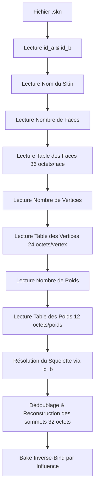

# Runtime Cal3D — Index des Symboles et Cartographie du Pipeline

> **Statut :** Spécification propre issue du reverse-engineering statique (IDA Pro / MCP). Les équations physiques et mathématiques de Linear-Blend Skinning (LBS) sont conformes aux analyses détaillées dans [skinning.md](file:///C:/Users/Arius/RiderProjects/MartialHeroes/Docs/RE/specs/skinning.md).
> **Adresse IDB de référence :** `doida.exe` (SHA256 : `f61f66a9ae0ec1e946105b2ecff76e8930cb1d1367df64e5688a5266f5ad9963`)

---

## 0. Introduction & Architecture Générale

Le moteur de `doida.exe` intègre un runtime d'animation squelettique basé sur le framework open-source **Cal3D**, lourdement modifié, optimisé et intégré directement dans le moteur. Le runtime n'expose pas directement les noms de classes Cal3D standard (`CalModel`, `CalSkeleton`, `CalCoreSkin`, etc.) mais utilise des classes d'enveloppement (wrappers) de l'architecture du jeu : `CoreActor`, `CorePose`, `CoreSkin` et `CoreTrack`.

Le pipeline complet de traitement comporte 5 étapes clés documentées et validées statiquement :

| Étape | Rôle principal | Fonction clé | Adresse | Fichier source |
|---|---|---|---|---|
| **1. Chargement Squelette** | Lecture de la hiérarchie et pose de référence | `BindPose_ParseBndFile` | `0x43009c` | [skinning.md](file:///C:/Users/Arius/RiderProjects/MartialHeroes/Docs/RE/specs/skinning.md#L3-L3.4) |
| **2. Calcul Inverse-Bind** | Pré-calcul de la pose de repos locale par influence | `CoreSkin_LoadFromFile` | `0x43472a` | [cycle17_cal3d_decomp.md](file:///C:/Users/Arius/RiderProjects/MartialHeroes/Docs/RE/_dirty/cycle17_cal3d_decomp.md#L90) |
| **3. Évaluation Keyframes** | Interpolation temporelle (LERP/SLERP) à 10 FPS | `Track_SampleAtTime` | `0x4029a5` | [scan_cal3d.py](file:///C:/Users/Arius/RiderProjects/MartialHeroes/Docs/RE/_dirty/scan_cal3d.py#L362) |
| **4. Parcours Hiérarchique** | Propagation des matrices locales en coordonnées monde | `Pose_WorldWalk` | `0x437fb6` | [scan_cal3d.py](file:///C:/Users/Arius/RiderProjects/MartialHeroes/Docs/RE/_dirty/scan_cal3d.py#L763) |
| **5. Déformation CPU** | Linear-Blend Skinning avec séparation Major/Minor | `Skin_DeformLBS` | `0x4387fb` | [skinning.md](file:///C:/Users/Arius/RiderProjects/MartialHeroes/Docs/RE/specs/skinning.md#L5) |

---

## 1. Description des Classes du Runtime

Le système d'animation squelettique repose sur les classes clés suivantes :

1. **`CoreActor`** (`vftable` @ `0x720b4c`, `typeinfo` @ `0x78e408`) :
   Classe principale d'enveloppement représentant une entité 3D animée. Elle gère l'état logique de l'acteur, son apparence et fait le pont avec le mixer d'animations.
2. **`CoreAnimation`** (`vftable` @ `0x720bd0`, `typeinfo` @ `0x78e850`) :
   Représente un clip d'animation squelettique complet chargé à partir d'un fichier de mouvement `.mot`. Il contient l'ensemble des pistes d'animation (`CoreTrack`).
3. **`CorePose`** (`vftable` @ `0x720bf0`, `typeinfo` @ `0x78e8d0`) :
   Représente une instance vivante du squelette (équivalent de `CalSkeleton`). Elle détient le tableau de structures de bones animés et gère la hiérarchie.
4. **`CoreSkin`** (`vftable` @ `0x720c10`, `typeinfo` @ `0x78ece0`) :
   Représente un maillage déformable (mesh) chargé depuis un fichier `.skn`. Elle stocke les tables de faces, de sommets de référence (rest vertices) et d'influences.
5. **`CoreTrack`** (`vftable` @ `0x720bb4`, `typeinfo` @ `0x78e480`) :
   Contient la suite ordonnée de keyframes (translation et quaternion) associée à un bone spécifique pour un clip d'animation donné.
6. **`CoreSkinManager`** (`vftable` @ `0x720c90`, `typeinfo` @ `0x78ea38`) :
   Gestionnaire et cache global pour les objets de type `CoreSkin`. Évite de recharger plusieurs fois un même maillage (ex: pièces d'armures communes).
7. **`CorePoseManager`** (`vftable` @ `0x720bf8`, `typeinfo` @ `0x78e8e8`) :
   Gestionnaire global stockant les squelettes de référence préchargés au démarrage (fichiers `.bnd`).
8. **`SkinWeight`** (ou `CoreSkin::SkinWeight`, `vftable` @ `0x720c34`, `typeinfo` @ `0x78e964`) :
   Structure de données en mémoire représentant un enregistrement individuel de poids de sommets (influence), étendu à 36 octets pour optimiser la boucle CPU.
9. **`CalSkeleton`** (équivalent conceptuel en jeu : squelette de référence `CorePose` / `.bnd`) :
   Contient la définition de la structure squelettique : le nombre total de bones (limité à 255) et la hiérarchie parente brute.
10. **`CalModel`** (équivalent conceptuel en jeu : `Actor` @ `0x78db84` et `ActorAnimationMixer` @ `0x78da6c`) :
    Gère la combinaison dynamique du squelette d'instance (`CorePose`), des meshes déformables (`CoreSkin`), et l'accumulation des poids de blending des animations.

---

## 2. Structures de Données et Offsets Mémoire

Cette section décrit les layouts binaires exacts des structures de données allouées en mémoire par le compilateur MSVC de `doida.exe`.

### A. CoreSkin (Descripteur de Mesh)
Objet instancié via `CoreSkin__ctor` (0x4325ba).
- **Taille globale approximative :** ~76 octets
- **Offsets importants :**
  - **`+0x00`** (4 octets) : Pointeur vers la `vftable` (`0x720c10`).
  - **`+0x04`** (4 octets) : `id_a` (Identifiant secondaire de mesh).
  - **`+0x08`** (4 octets) : `id_b` (Identifiant du squelette associé / `actor_id`).
  - **`+0x0C`** (28 octets) : `std::string` représentant le nom du skin (ex: "body").
  - **`+0x28`** (4 octets) : Pointeur vers le squelette de référence résolu (`Pose*`).
  - **`+0x2C`** (4 octets) : Nombre d'enregistrements d'influences (`influence_count`).
  - **`+0x30`** (4 octets) : Nombre total de sommets uniques (`vertex_count`).
  - **`+0x34`** (4 octets) : Pointeur vers le tableau des influences brutes.
  - **`+0x38`** (4 octets) : Pointeur vers le tableau d'indices de poids.
  - **`+0x3C`** (4 octets) : Pointeur vers la table d'indexation.
  - **`+0x40`** (4 octets) : Pointeur vers le tableau de structures `SkinWeight36` (influences Major).
  - **`+0x44`** (4 octets) : Pointeur vers le tableau de structures `SkinWeight36` (influences Minor).
  - **`+0x48`** (4 octets) : Nombre de poids Major (`major_count`, float stocké).
  - **`+0x4C`** (4 octets) : Nombre de poids Minor (`minor_count`, entier).

### B. Pose Bone (Joint Squelettique)
Instance de bone animée (`Pose::Joint`), représentant l'équivalent de `CalBone`. Allouée sous forme de tableau contigu.
- **Taille de l'enregistrement :** 88 octets (stride `0x58`)
- **Structure détaillée des offsets :**
  - **`+0x00`** (4 octets) : `vftable` ou padding structurel.
  - **`+0x04`** (4 octets) : Pointeur vers le bone parent (`Pose::Joint*`).
  - **`+0x08`** (4 octets) : Pointeur vers le premier bone enfant (`Pose::Joint*`).
  - **`+0x0C`** (4 octets) : Pointeur vers le bone frère suivant (`Pose::Joint*`).
  - **`+0x10`** (4 octets) : Pointeur vers le bone de base d'origine ([bind bone](file:///C:/Users/Arius/RiderProjects/MartialHeroes/Docs/RE/specs/skinning.md#L438-L443)).
  - **`+0x14`** (4 octets) : `accumWeight` (float) - Poids d'accumulation temporaire.
  - **`+0x18`** (4 octets) : `layerWeight` (float) - Poids de la couche active.
  - **`+0x1C`** (12 octets) : Vecteur translation locale animée (`localAnimTrans` : 3 × f32).
  - **`+0x28`** (16 octets) : Quaternion rotation locale animée (`localAnimQuat` : 4 × f32, format XYZW).
  - **`+0x38`** (12 octets) : Vecteur translation monde (`boneWorldTrans` : 3 × f32).
  - **`+0x44`** (16 octets) : Quaternion rotation monde (`boneWorldQuat` : 4 × f32, format XYZW).
  - **`+0x54`** (4 octets) : Facteur d'échelle locale du bone (`nodeScale` : f32).

> [!NOTE]
> Les offsets de translation et rotation monde (`+0x38` et `+0x44`) servent d'accumulateurs temporaires (`accumTrans` / `accumQuat`) lors du sampling et du blending des pistes d'animation, avant d'être écrasés par la matrice monde finale calculée lors du parcours hiérarchique (`Pose_WorldWalk`).

### C. In-Memory Bind Bone (Bone de Référence Statique)
Représente le squelette au repos (bind pose) chargé depuis un fichier `.bnd`.
- **Taille de l'enregistrement :** 72 octets (stride `0x48`)
- **Structure détaillée des offsets :**
  - Contient les pointeurs de hiérarchie parente et enfant.
  - Stocke la translation locale (3 × f32) et la rotation locale (quaternion 4 × f32, XYZW).
  - Stocke la translation monde (3 × f32) et la rotation monde (4 × f32, XYZW) pré-calculées lors de la première phase de chargement du squelette.

### D. SkinWeight / Runtime Influence (Enregistrement d'Influence)
Objet instancié via `SkinWeight36_DefaultInit` (0x430e8c) représentant l'influence d'un bone sur un vertex.
- **Taille de l'enregistrement :** 36 octets (stride `0x24` = 9 × f32)
- **Structure détaillée :**
  - **`+0x00`** (4 octets) : `vertex_index` (u32, index du vertex de rendu affecté).
  - **`+0x04`** (4 octets) : `bone_id` (u32, identifiant du bone influençant).
  - **`+0x08`** (4 octets) : `weight` (f32, coefficient d'influence normalisé).
  - **`+0x0C`** (12 octets) : `localPos` (3 × f32, position du vertex projetée dans le repère local du bone).
  - **`+0x18`** (12 octets) : `localNormal` (3 × f32, normale du vertex projetée dans le repère local du bone).

---

## 3. Format Binaire des Fichiers de Skin (`.skn`)

La fonction `CoreSkin_LoadFromFile` (@ `0x43472a`) assure la lecture séquentielle du format binaire propriétaire `.skn` depuis le système de fichier virtuel (VFS).



### A. Structure des Enregistrements Séquentiels
Le fichier est lu sans aucun alignement mémoire (padding) entre les sections :

1. **Header (12 octets + N octets) :**
   - `id_a` (4 octets, u32 LE)
   - `id_b` (4 octets, u32 LE) : Clé de résolution du squelette. Si `id_b == 0`, le mesh est considéré comme rigide (sans squelette). S'il est non-nul, il s'agit d'un identifiant squelettique sparse (`actor_id` de 1 à 8892).
   - `name_length` (4 octets, u32 LE) : Taille de la chaîne du nom.
   - `name` (N octets) : Chaîne de caractères sans caractère nul terminal.

2. **Table des Faces (4 octets + `face_count` × 36 octets) :**
   - `face_count` (4 octets, u32 LE).
   - Chaque enregistrement de face (36 octets) contient 3 sommets de coin (corner records, 12 octets chacun) :
     - `vertex_index` (4 octets, u32 LE) : Index du sommet dans la table.
     - `uv_u` (4 octets, f32 LE) : Coordonnée de texture horizontale.
     - `uv_v` (4 octets, f32 LE) : Coordonnée de texture verticale.

3. **Table des Sommets de base (4 octets + `vertex_count` × 24 octets) :**
   - `vertex_count` (4 octets, u32 LE).
   - Chaque enregistrement de sommet (24 octets, 6 × f32) possède un ordre de stockage inversé par rapport aux conventions D3D :
     - `normal` (12 octets, 3 × f32 LE : X, Y, Z).
     - `position` (12 octets, 3 × f32 LE : X, Y, Z).

4. **Table des Poids / Skinning (4 octets + `weight_count` × 12 octets) :**
   - `weight_count` (4 octets, u32 LE).
   - Chaque enregistrement d'influence (12 octets) contient :
     - `vertex_index` (4 octets, u32 LE) : Sommet ciblé.
     - `bone_index` (4 octets, u32 LE) : Identifiant du bone.
     - `weight` (4 octets, f32 LE) : Force de l'influence. Si `weight < 0.01`, la structure est immédiatement jetée lors du chargement.

### B. Résolution du Squelette et Reconstruction
Lors du chargement, la fonction résout la hiérarchie squelettique :
```cpp
v37 = CharPosePool_LookupById(dword_7B1728, *(_DWORD *)(this + 8)); // +8 correspond à id_b
if (v37)
    *(_DWORD *)(this + 40) = v37; // Stockage du pointeur squelette resolved
```
Le moteur procède ensuite au **dédoublage** des sommets et à leur copie dans un tampon unifié de sommets de rendu (stride de **32 octets**) :
- position (12 octets, 3 × f32)
- normale (12 octets, 3 × f32)
- texture U (4 octets, f32)
- texture V (4 octets, f32, calculé via `1.0 - uv_v` pour s'adapter au repère D3D).

---

## 4. Algorithmes d'Évaluation Squelettique et de Skinning

### A. Interpolation des Keyframes (`.mot`)
Le fichier d'animation `.mot` est échantillonné à une fréquence fixe de **10 FPS**. Pour un instant d'animation $t$ en secondes, l'interpolation d'une piste (track) s'effectue ainsi :

$$\text{index} = \lfloor t \cdot 10.0 \rfloor$$
$$\alpha = t - \frac{\text{index}}{10.0}$$

1. **Translation :** Interpolation linéaire simple (LERP) entre la clé $\text{index}$ et la clé $\text{index} + 1$ avec le facteur $\alpha$.
2. **Rotation :** Interpolation sphérique (SLERP) sur le plus court chemin (shortest-arc) :
   - Si le produit scalaire $\mathbf{q}_a \cdot \mathbf{q}_b < 0$, le quaternion de destination est nié : $\mathbf{q}_b \leftarrow -\mathbf{q}_b$.
   - Si les quaternions sont extrêmement proches, repli sur un LERP normalisé.

> [!WARNING]
> Le facteur $\alpha$ utilisé dans la formule est le temps brut restant en secondes (compris dans l'intervalle $[0.0, 0.1]$) et n'est **pas** normalisé dans $[0.0, 1.0]$. Cela provoque un micro-saccadement (snapping) fidèle aux animations d'époque.

### B. Accumulation et Arbre de Mélange (Blend Tree)
Chaque frame, le mélangeur d'animation (`ActorAnimationMixer`) réinitialise les accumulateurs squelettiques et résout les couches d'animation :

1. **Action-Layer Pass** (Clips uniques) : échantillonnage et écriture des translations et quaternions avec un poids relatif.
2. **Commit Pass** : Les valeurs temporaires de translation et quaternion accumulées sont normalisées par la somme des poids.
   - **Garde de division par zéro** : Si le poids total est presque nul, le dénominateur est bloqué à `0.001` par un test de logarithme natif (`logf(accumulated_weight) < 0.001`).
3. **Verrouillage des Translations Intérieures (Interior-bone translation lock) :**
   Afin d'éviter toute déformation ou étirement anormal des membres du personnage, le runtime applique une restriction stricte sur les translations animées :
   - Si un bone possède un parent, un grand-parent, **et** au moins un enfant (bone considéré comme *intérieur*), sa translation locale animée est **systématiquement écrasée** par sa translation locale statique de bind pose (`bindLocalTrans`).
   - Seuls le bone root, ses enfants directs, et les bones feuilles (leaf) sont autorisés à appliquer la translation interpolée de l'animation.

### C. Parcours de la Hiérarchie (World Walk)
Une fois les transformations locales consolidées, le moteur calcule les coordonnées monde de chaque bone par un parcours récursif de la hiérarchie du root vers les feuilles :

$$\mathbf{t}_{\text{world}} = (\mathbf{q}_{\text{parent\_world}} \otimes \mathbf{t}_{\text{anim\_local}}) \cdot s_{\text{node}} + \mathbf{t}_{\text{parent\_world}}$$
$$\mathbf{q}_{\text{world}} = (\mathbf{q}_{\text{parent\_world}} \otimes \mathbf{q}_{\text{bind\_local}}) \otimes \mathbf{q}_{\text{anim\_local}}$$

Où $\otimes$ désigne le produit de quaternion (Hamilton) et $s_{\text{node}}$ l'échelle uniforme locale du bone.

---

## 5. Pré-calcul de l'Inverse Bind et Skinning CPU

### A. Bake de la Pose Inverse à l'Attachement
Le fichier `.skn` ne stocke aucun pré-calcul de pose de repos inverse. Lors de la liaison du maillage au squelette, la fonction `CoreSkin_LoadFromFile` calcule et stocke la projection locale de chaque influence :

$$\mathbf{p}_{\text{local\_rest}} = \mathbf{q}_{\text{bind\_world}}^{-1} \otimes (\mathbf{p}_{\text{rest}} - \mathbf{t}_{\text{bind\_world}})$$
$$\mathbf{n}_{\text{local\_rest}} = \mathbf{q}_{\text{bind\_world}}^{-1} \otimes \mathbf{n}_{\text{rest}}$$

Le quaternion conjugué $\mathbf{q}^{-1} = (-x, -y, -z, w)$ est utilisé pour inverser l'orientation monde de référence. Ces valeurs locales cuites sont sauvées directement dans les champs `localPos` et `localNormal` de la structure `SkinWeight36` de l'influence.

### B. Algorithme de Linear-Blend Skinning (LBS)
Lors de la mise à jour de la frame, le pipeline CPU effectue la déformation des sommets en exploitant la séparation Major/Minor pour optimiser les accès cache :

1. **Pass Major (Écriture) :**
   Pour chaque sommet, la première influence (celle ayant le plus grand poids, appelée Major) est évaluée et remplace la valeur du sommet de destination $\mathbf{v}_{\text{dest}}$ :

   $$\mathbf{p}_{\text{placed}} = \mathbf{q}_{\text{world}} \otimes (\mathbf{p}_{\text{local\_rest}} \cdot s_{\text{mesh}}) + \mathbf{t}_{\text{world}}$$
   $$\mathbf{n}_{\text{placed}} = \mathbf{q}_{\text{world}} \otimes \mathbf{n}_{\text{local\_rest}}$$
   $$\mathbf{v}_{\text{dest}}.\text{position} = \mathbf{p}_{\text{placed}} \cdot w_{\text{major}}$$
   $$\mathbf{v}_{\text{dest}}.\text{normal} = \mathbf{n}_{\text{placed}} \cdot w_{\text{major}}$$

2. **Pass Minor (Accumulation) :**
   Les influences secondaires restantes (Minor) calculent la même transformation et l'ajoutent au sommet de destination par accumulation additive :

   $$\mathbf{v}_{\text{dest}}.\text{position} \leftarrow \mathbf{v}_{\text{dest}}.\text{position} + \mathbf{p}_{\text{placed}} \cdot w_{\text{minor}}$$
   $$\mathbf{v}_{\text{dest}}.\text{normal} \leftarrow \mathbf{v}_{\text{dest}}.\text{normal} + \mathbf{n}_{\text{placed}} \cdot w_{\text{minor}}$$

Où $s_{\text{mesh}}$ représente le facteur d'échelle globale du mesh, calculé à l'attachement comme le produit `nodeScale * meshScale`.

### C. Modes d'Optimisation du Skinning
Le moteur dispatche la déformation selon trois modes (défini au niveau de l'acteur `actor + 1768`) :
- **Mode 0 (LBS Complet) :** Exécution complète de l'algorithme Major/Minor décrit ci-dessus.
- **Mode 1 (Rigide Major) :** Les sommets suivent uniquement le bone Major dominant. La multiplication par le poids $w$ est ignorée (considérée égale à $1.0$), économisant de nombreuses opérations flottantes.
- **Mode 2 (Rigide Optimisé) :** Utilise une table de proximité de couture. Seuls les sommets principaux "propriétaires" sont déformés géométriquement, les sommets doublons présents aux coutures du maillage se contentent de copier les valeurs calculées de leurs homologues.

---

## 6. Références Croisées
- [skinning.md](file:///C:/Users/Arius/RiderProjects/MartialHeroes/Docs/RE/specs/skinning.md) : Modélisation mathématique du LBS et conventions d'axe.
- [mesh.md](file:///C:/Users/Arius/RiderProjects/MartialHeroes/Docs/RE/formats/mesh.md) : Format binaire d'échange des fichiers squelettiques `.bnd` et `.skn` sur disque.
