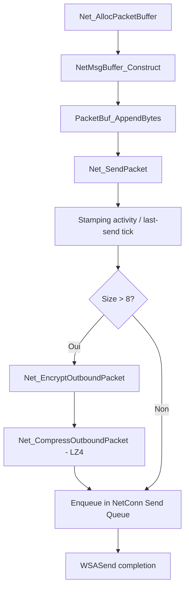

# Spécification Technique — Protocole Réseau et Cycle des Messages

Ce document décrit en détail les spécifications physiques et comportementales du protocole réseau client-serveur de Martial Heroes. Il repose sur les analyses et décompilations des Cycles 17 et 18.

## 1. Structure Physique des Paquets et du Tampon Dynamique

Le protocole réseau utilise des paquets structurés avec un en-tête de taille fixe suivi d'un corps (payload) de taille variable.

### 1.1 Structure Physique de l'En-tête (NetPacketHeader)

L'en-tête [NetPacketHeader](file:///C:/Users/Arius/RiderProjects/MartialHeroes/Docs/RE/specs/network_dispatch.md#L92) mesure exactement **8 octets**. Il est structuré comme suit :

| Offset | Taille (octets) | Type | Champ | Description |
|---|---|---|---|---|
| `+0` | 4 | `u32` | `size` | Taille totale du paquet (en-tête + payload). Minimum = `8`. |
| `+4` | 2 | `u16` | `major` | Opcode majeur (famille du message). |
| `+6` | 2 | `u16` | `minor` | Opcode mineur (action/type spécifique dans la famille). |

Les paquets ne contenant pas de données (payload vide, tel que les pings/heartbeats basiques de taille 8) contournent les étapes de chiffrement et de compression.

### 1.2 Gestion du Tampon Dynamique (NetMsgBuffer)

Lorsqu'un paquet est instancié en mémoire client, un tampon dynamique représenté par la structure `NetMsgBuffer` gère l'allocation de la mémoire réseau.
- Il encapsule le pointeur de mémoire brute obtenu lors de l'allocation.
- Il écrit automatiquement l'en-tête [NetPacketHeader](file:///C:/Users/Arius/RiderProjects/MartialHeroes/Docs/RE/specs/network_dispatch.md#L92).
- Il fournit une interface de croissance dynamique au fur et à mesure que des octets de données lui sont ajoutés, recalculant et mettant à jour le champ `size` au début du tampon.

---

## 2. Cycle d'Allocation et d'Envoi Client-vers-Serveur

Le processus d'envoi d'un message depuis le client vers le serveur suit un cycle strict d'allocation, de construction, d'écriture et de transmission physique.



### 2.1 Les étapes détaillées du cycle

1. **Allocation :**  
   La fonction [Net_AllocPacketBuffer](file:///C:/Users/Arius/RiderProjects/MartialHeroes/Docs/RE/names.yaml#L3393) alloue un bloc de mémoire brute destiné à héberger le paquet.
2. **Construction :**  
   Le pointeur alloué est passé à [NetMsgBuffer_Construct](file:///C:/Users/Arius/RiderProjects/MartialHeroes/Docs/RE/names.yaml#L3396) pour initialiser l'en-tête de base (les champs de taille et opcodes).
3. **Ajout de données (Append) :**  
   La fonction [PacketBuf_AppendBytes](file:///C:/Users/Arius/RiderProjects/MartialHeroes/Docs/RE/names.yaml#L3385) copie les octets de données utilisateur (les structures de données ou DTOs) à la suite de l'en-tête et met à jour dynamiquement la taille globale dans `size`.
4. **Envoi Physique :**  
   La fonction [Net_SendPacket](file:///C:/Users/Arius/RiderProjects/MartialHeroes/Docs/RE/names.yaml#L3406) est invoquée avec l'instance de [NetClient](file:///C:/Users/Arius/RiderProjects/MartialHeroes/Docs/RE/structs/net_client.md) et le paquet construit. Elle réalise les opérations de pipeline suivantes :
   - Mise à jour de l'horodatage d'activité réseau `send_timestamp` (tick-count local à l'offset `+0x141B0`).
   - Chiffrement du payload via `Net_EncryptOutboundPacket` (qui redirige vers la fonction XOR/ROL à 3 passes stateless `Net_Cipher_OutboundXorRol3Round`).
   - Compression du payload via la routine LZ4 `Net_CompressOutboundPacket`.
   - Ajout à la file d'attente d'envoi (`send queue`) de la connexion réseau sous-jacente.
   - Signalement et traitement asynchrone par `WSASend` dans le thread I/O.
5. **Verrouillage de requête (In-Flight Latch) :**  
   Pour les messages transactionnels de gestion de personnage (ex: sélection, entrée en jeu, déplacement), le wrapper d'envoi positionne le verrou d'attente réseau `request_in_flight_latch` (un octet situé à l'offset `+0x141BC` du [NetClient](file:///C:/Users/Arius/RiderProjects/MartialHeroes/Docs/RE/structs/net_client.md)) à `1`. Cela suspend l'envoi périodique du heartbeat `(2, 10000)` jusqu'à réception de la réponse du serveur (ou acquittement forcé).

---

## 3. Index de Messages Protocolaires Identifiés

Les opcodes sont codés sous la forme d'un couple `(major, minor)` où `major` représente la famille générale et `minor` le type de message spécifique.

### 3.1 Messages Client-vers-Serveur (C2S) Clés

Basés sur les décompilations de [cycle18_final_sweep_decomp.md](file:///C:/Users/Arius/RiderProjects/MartialHeroes/Docs/RE/_dirty/cycle18_final_sweep_decomp.md) :

- **`Cmsg_EnterGame_Send` (Opcode 1/9) :**
  - Adresse de décompilation : `0x5e2947`
  - Taille fixe du payload : `40 octets (0x28)`
  - Rôle : Demande d'entrée en jeu avec les informations d'authentification du personnage.
- **`Cmsg_MoveCharacter_Send` (Opcode 1/14) :**
  - Adresse de décompilation : `0x5e2a1d`
  - Taille du payload : `1 octet`
  - Rôle : Notification de déplacement du personnage.

### 3.2 Autres Messages Protocolaires Courants

- **Opcode `0/0` (S2C - KeyExchange) :** Envoi par le serveur de la clé publique RSA de 54 octets et de 2 scalaires u32, provoquant la réponse client **Opcode `1/4`** contenant les informations d'identification chiffrées.
- **Opcode `1/2` (C2S - Keepalive / LobbyPing) :** Envoi d'un en-tête vide (8 octets) par le thread d'inactivité du client pour maintenir la liaison.
- **Opcode `2/13` (C2S - Move Anti-Idle / Heartbeat) :** Packet de mouvement généré automatiquement en cas d'inactivité (payload de 16 octets).
- **Opcode `2/10000` (C2S - Keepalive Principal) :** Heartbeat de 12 octets contenant un u32 nul (`0`), compressé à l'initialisation et envoyé toutes les 20 secondes en cas de canal inactif.
- **Opcode `2/112` (C2S - Keepalive Toggle) :** Activation ou désactivation événementielle du heartbeat.
- **Opcode `5/146` (S2C) / `2/146` (C2S) :** Handshake de vérification d'intégrité de la liaison et acquittement de livraison.

---

## 4. Flux d'Entrée, Réception Smsg et Boucle d'Événements

La réception des paquets s'appuie sur une séparation claire entre les threads système de bas niveau et la boucle d'événements principale du moteur du jeu.

```
[Moteur Windows Socket]
         │ (WSARecv overlapped)
         ▼
[Thread I/O #3 (Socket worker)]
         │ (Extraction et réassemblage des trames par taille u32)
         ▼
[File d'attente de réception] (Lock critical section)
         │
         ▼ (Spins & Pops)
[Thread de Consommation #1 (Network worker)]
         │ (Poste un événement de type 15, sous-code 100)
         ▼
[Moteur d'Événements (NetHandler_OnNetworkEvent)]
         │
         ├──► Sous-code 102 ──► Machine à États de Connexion (GameState)
         │
         └──► Sous-code 100 ──► Net_DispatchInboundByMajorMinor
                                         │
                                         ▼ (Décompression LZ4 vers buffer 11680B)
                               [Dispatch par Opcode Majeur]
                                 ├── Famille 0: Hardwired KeyExchange
                                 ├── Famille 1: Switch billing / S2C
                                 ├── Famille 3: Cascade Character / S2C
                                 ├── Famille 4: Table-driven (table_idx - 1246)
                                 └── Famille 5: Table-driven (table_idx - 1400)
```

### 4.1 Réassemblage et Files d'Attente (Threads #3 et #1)

Le flux entrant est géré par deux threads coopérant au travers d'une file d'attente verrouillée :
- **Thread I/O (#3) :** Exécute la boucle de lecture réseau via `WSARecv`. Il maintient un tampon de réassemblage (commençant à `connection_object + 100`). Il lit la taille globale du paquet et attend qu'assez d'octets soient accumulés pour détacher un paquet entier, le copier dans un tampon propre et le pousser dans la file d'attente réseau.
- **Thread de Consommation (#1) :** Récupère les trames de la file d'attente de façon séquentielle et appelle le gestionnaire d'événements du client en postant un événement de type **`15`** avec le sous-code **`100`**. Une fois posté, le tampon de la trame est immédiatement libéré.

### 4.2 Le Point d'Entrée des Événements Réseau

La boucle d'événements principale reçoit l'événement de type `15` et redirige le traitement selon le sous-code lu à l'offset `+4` de la structure d'événement :
- **Sous-code `100` (Packet reçu) :** Déclenche la fonction de dispatching principale [Net_DispatchInboundByMajorMinor](file:///C:/Users/Arius/RiderProjects/MartialHeroes/Docs/RE/names.yaml#L2906).
- **Sous-code `102` (État de connexion) :** Redirige vers la machine à états de connexion pour gérer les transitions de scène et de socket (ex : déconnexions, tentatives de reconnexions chronométrées).

### 4.3 Traitement et Dispatch (NetHandler)

La fonction [Net_DispatchInboundByMajorMinor](file:///C:/Users/Arius/RiderProjects/MartialHeroes/Docs/RE/names.yaml#L2906) décompresse d'abord le paquet si sa taille est supérieure à 8 octets (dans un tampon statique de réception de **11 680 octets** ou `0x2DA0`). Puis, elle aiguille le traitement :

- **Opcodes switchés en dur :**
  - **Majeur 0 :** Aiguillé directement vers la logique d'échange de clés (KeyExchange) pour le couple `(0, 0)`.
  - **Majeur 1 et 3 :** Routés par un switch ou une cascade d'instructions conditionnelles sur le mineur (ex : affichage de notices de facturation pour le majeur 1, ou mise à jour de liste de personnages et apparition d'entités pour le majeur 3).
- **Opcodes gérés par tables (Response & Push) :**
  - Les familles majeures `4` (Response) et `5` (Push) sont traitées via deux tables de fonctions de **154 entrées** situées dans l'instance [NetHandler](file:///C:/Users/Arius/RiderProjects/MartialHeroes/Docs/RE/structs/net_handler.md) (obtenue via `NetHandler_GetSingleton()`).
  - **Table de Réponses (Majeur 4) :** Indexée à l'adresse de base du tableau par la formule `index = minor` (décalage interne `table_index - 1246`). Elle contient 100 slots configurés par l'installateur, 2 slots explicitement nuls (0 et 27) et le reste pointe sur un gestionnaire par défaut inerte (NoOp).
  - **Table de Push (Majeur 5) :** Indexée par la formule `index = minor` (décalage interne `table_index - 1400`). Elle contient 65 slots valides configurés par l'installateur.
- **Rôles Guest vs Member :**  
  Le singleton [NetHandler](file:///C:/Users/Arius/RiderProjects/MartialHeroes/Docs/RE/structs/net_handler.md) encapsule deux sous-objets distincts : `Guest` (actif lors de l'authentification et du choix des canaux en lobby) et `Member` (chargé en jeu actif, qui met à disposition des handlers les références globales aux gestionnaires d'acteurs et de ressources visuelles).
