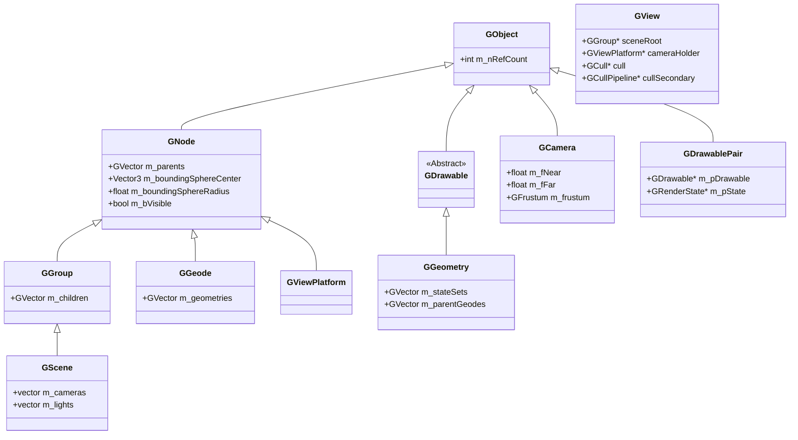

# Spécification Technique du Scene Graph 3D Diamond

Ce document décrit en détail la structure, l'organisation en mémoire et les mécanismes de fonctionnement (traversée, culling, rendu) du Scene Graph 3D du moteur **Diamond** utilisé par *Martial Heroes*. Il est basé sur l'analyse de l'exécutable `doida.exe` (SHA256 : `f61f66a9ae0ec1e946105b2ecff76e8930cb1d1367df64e5688a5266f5ad9963`) et les fichiers d'analyses brutes :
*   [_dirty/scene_graph_analysis.md](file:///C:/Users/Arius/RiderProjects/MartialHeroes/Docs/RE/_dirty/scene_graph_analysis.md)
*   [_dirty/cycle17_scene_graph_ctors.md](file:///C:/Users/Arius/RiderProjects/MartialHeroes/Docs/RE/_dirty/cycle17_scene_graph_ctors.md)

> **Note de réconciliation (CYCLE 14, 2026-06-28) :** Quatre interprétations de champs de la section
> `GView` ci-dessous ont été corrigées d'après le spec de struct de référence
> `Docs/RE/structs/gview.md` (§3 et §6.1), qui fait désormais autorité pour la disposition complète
> de `Diamond::GView`. La taille de l'objet a également été mise à jour (~308 octets, non 296+).

> **AUTHORITATIVE STRUCT REFERENCE — node layouts and vtable slot roles (CYCLE 14, 2026-06-28):**
> [`Docs/RE/structs/scene_graph_nodes.md`](../structs/scene_graph_nodes.md) is now the
> firewall-clean, authoritative record for all Diamond scene-graph node class layouts
> (`GObject` / `GNode` / `GGroup` / `GScene` / `GTransform` / `GSwitch` / `GGeode` /
> `GViewPlatform` / `GLight`) and for the `GNode` vtable slot-role map (slots 0–9) and
> `GGroup` extension slots (10–15). That spec was derived from RTTI-walk, constructor/destructor
> control-flow analysis, and vtable-content reading (IDB SHA `f61f66a9`). **It corrects several
> slot labels carried in the vtable tables below** — in particular the roles assigned to
> slots 1, 2, 4–9 of `GNode`/`GGroup`/`GGeode` differ materially from the content-derived reading
> in `scene_graph_nodes.md §4`. On any conflict between this document and
> `Docs/RE/structs/scene_graph_nodes.md`, the struct spec is authoritative.
> Engineers citing node layouts: `// spec: Docs/RE/structs/scene_graph_nodes.md`.

---

## 1. Hiérarchie globale des classes du Scene Graph

Le Scene Graph de Diamond s'inspire fortement des concepts d'**OpenSceneGraph (OSG)**. Il organise les objets 3D sous forme de graphe acyclique dirigé (DAG) composé de nœuds de différents types.



---

## 2. Disposition en mémoire (Memory Layout) et Vtables

### 2.1 Structure générique `GVector`
De nombreuses classes utilisent la structure de données interne `GVector` de Diamond pour stocker des listes dynamiques de pointeurs (parents, enfants, géométries, états). Sa taille en mémoire est de **16 octets** (4 DWORDs) :

| Offset | Type | Nom du membre | Description |
| :--- | :--- | :--- | :--- |
| `+0x00` | `int` | `m_nSize` | Nombre actuel d'éléments dans le vecteur |
| `+0x04` | `int` | `m_nCapacity` | Capacité actuelle allouée |
| `+0x08` | `int` | `m_nStride` | Pas mémoire entre les éléments (généralement `4` pour des pointeurs) |
| `+0x0C` | `void*` | `m_pData` | Pointeur vers le tableau d'éléments en mémoire tas (heap) |

---

### GNode
*   **Taille en mémoire** : `76` octets (Offsets `0x00` à `0x4B`)
*   **Vtable** : `0x72EF8C` (héritée de `GObject`)
*   **Description** : Classe de base de tous les nœuds du Scene Graph. Gère la sphère englobante (bounding sphere) et la liste des parents.

| Offset | Type | Description |
| :--- | :--- | :--- |
| `+0x00` | `void*` | Pointeur de la vtable (`0x72EF8C`) |
| `+0x04` | `int` | Compteur de références de l'objet (`GObject::m_nRefCount`) |
| `+0x24` | `Vector3` | Centre de la sphère englobante (`m_boundingSphereCenter` : 3x `float` : X, Y, Z) |
| `+0x30` | `float` | Rayon de la sphère englobante (`m_boundingSphereRadius`) |
| `+0x38` | `bool` | Indicateur de visibilité ou d'activation du culling (`m_bVisible` / `m_bActive`) |
| `+0x3C` | `GVector` | Vecteur contenant des pointeurs vers les nœuds parents (`GVector m_parents`) |

---

### GGroup
*   **Taille en mémoire** : `92` octets (hérite de `GNode`)
*   **Vtable** : `0x72EF14`
*   **Description** : Nœud de regroupement logique pouvant posséder plusieurs nœuds enfants.

| Offset | Type | Description |
| :--- | :--- | :--- |
| `+0x00` | `GNode` | Sous-objet `GNode` (taille `76` octets) |
| `+0x4C` | `GVector` | Vecteur de pointeurs vers les nœuds enfants (`GVector m_children`) |

#### Vtable de GGroup (`0x72ef14`) :
| Index | Offset | Fonction d'implémentation | Signification de la fonction (Slot) |
| :--- | :--- | :--- | :--- |
| `[0]` | `+0` | `0x60240d` | Destructeur virtuel |
| `[1]` | `+4` | `0x602633` | `accept(Traverser&)` - Traversée de l'arbre |
| `[2]` | `+8` | `0x6023d0` | `cull(Traverser&)` - Phase de culling frustum |
| `[3]` | `+12` | `0x4171a8` | `draw()` - Rendu (généralement NOP `nullsub_160` pour GGroup) |
| `[4]` | `+16` | `0x602429` | `cullTraverse()` / `computeBound()` - Teste la visibilité et descend vers les enfants |
| `[5]` | `+20` | `0x6024b8` | `dirtyBound()` - Invalide la sphère englobante |
| `[6]` | `+24` | `0x601ee7` | `update()` - Mise à jour logique |
| `[7]` | `+28` | `0x60231f` | `setName(const char*)` |
| `[8]` | `+32` | `0x602390` | `getName()` |
| `[9]` | `+36` | `0x602ac4` | `addChild(GNode*)` |
| `[10]` | `+40` | `0x60210d` | `removeAllChildren()` |
| `[11]` | `+44` | `0x60214a` | `insertChild(int, GNode*)` |
| `[12]` | `+48` | `0x6022bb` | `getChild(int)` |
| `[13]` | `+52` | `0x602182` | `removeChild(GNode*)` |
| `[14]` | `+56` | `0x6021f1` | `getMatrix()` |
| `[15]` | `+60` | `0x60225f` | `getWorldMatrix()` |

---

### GScene
*   **Taille en mémoire** : `120` octets (hérite de `GGroup`)
*   **Vtable** : `0x73109c`
*   **Description** : Le nœud racine d'une scène 3D. Gère des listes spécifiques pour les caméras actives et les lumières.

| Offset | Type | Description |
| :--- | :--- | :--- |
| `+0x00` | `GGroup` | Sous-objet `GGroup` (taille `92` octets) |
| `+0x5C` | `std::vector` | Liste interne de caméras actives (gérée via pointeurs begin/end/capacity) |
| `+0x6C` | `std::vector` | Liste interne de sources lumineuses `GLight` actives |

---

### GGeode
*   **Taille en mémoire** : `92` octets (hérite de `GNode`)
*   **Vtable** : `0x72FD84`
*   **Description** : *Geometry Node*. Nœud feuille du graphe contenant la géométrie réelle (`GGeometry` / `GDrawable`).

| Offset | Type | Description |
| :--- | :--- | :--- |
| `+0x00` | `GNode` | Sous-objet `GNode` (taille `76` octets) |
| `+0x4C` | `GVector` | Vecteur contenant des pointeurs vers les objets `GGeometry` / `GDrawable` |

#### Vtable de GGeode (`0x72fd84`) :
| Index | Offset | Fonction d'implémentation | Signification de la fonction (Slot) |
| :--- | :--- | :--- | :--- |
| `[0]` | `+0` | `0x6082ae` | Destructeur virtuel |
| `[1]` | `+4` | `0x6085a5` | `accept(Traverser&)` |
| `[2]` | `+8` | `0x608263` | `cull(Traverser&)` |
| `[3]` | `+12` | `0x4171a8` | `draw()` (NOP) |
| `[4]` | `+16` | `0x608320` | `cullTraverse()` - Évalue la visibilité des géométries enfants |
| `[5]` | `+20` | `0x608471` | `dirtyBound()` |
| `[6]` | `+24` | `0x60852e` | `update()` |
| `[7]` | `+28` | `0x60818e` | `setName(const char*)` |
| `[8]` | `+32` | `0x602390` | `getName()` |
| `[9]` | `+36` | `0x602ac4` | `addDrawable(GDrawable*)` |

---

### GGeometry
*   **Taille en mémoire** : `84`+ octets
*   **Vtable** : `0x72FD04` (hérite de `GDrawable`)
*   **Description** : Représente la géométrie primitive et ses liaisons avec les états de rendu (textures, matériaux).

| Offset | Type | Description |
| :--- | :--- | :--- |
| `+0x00` | `GDrawable` | Sous-objet de base `GDrawable` |
| `+0x24` | `Vector3` | Centre de la sphère englobante |
| `+0x30` | `float` | Rayon de la sphère englobante |
| `+0x3C` | `GVector` | Vecteur d'états de rendu associés (`GVector m_stateSets`) |
| `+0x54` | `GVector` | Références vers les nœuds `GGeode` parents (`GVector m_parentGeodes`) |

---

### GView
*   **Taille en mémoire** : ~`308` octets (le dernier champ couvre les octets +304..+307). ~~`296`+ octets~~ — **corrigé** ; voir `Docs/RE/structs/gview.md §3`.
*   **Vtable** : `0x7301F4`
*   **Description** : Objet de vue par caméra (`Diamond::GView`) que le frame driver parcourt chaque frame pour exécuter la configuration de la caméra, le frustum culling et la séquence de passes de rendu ordonnées. Pour la table de champs complète et vérifiée, voir `Docs/RE/structs/gview.md`.

| Offset | Type | Description |
| :--- | :--- | :--- |
| `+0x00` | `void*` | Pointeur de la vtable (`0x7301F4`) |
| `+0x24` | `GGroup*` (refcounted) | **Racine de la scène** (`GGroup*`/`GScene*` en jeu). Défini via un setter avec refcount ; libéré par `GObject::unref` à la destruction. ~~`GCamera*` Caméra active liée à la vue~~ — **corrigé** (voir `Docs/RE/structs/gview.md §3 et §6.1`). La caméra est accessible indirectement via le champ `cameraHolder` (+0x28). |
| `+0x70` | `Diamond::GCull*` (owned) | **Pipeline de culling primaire** (736 octets, alloué sur le tas, propriété exclusive). Fournit la liste des éléments visibles à dessiner via son slot virtuel. ~~`void*` structure de plateforme interne (736 octets)~~ — **corrigé** (voir `Docs/RE/structs/gview.md §3 et §6.1`). |
| `+0x74` | `GCullPipeline*` (owned, null par défaut) | **Pipeline de culling secondaire** (null par défaut, construit à la demande). ~~`GPipeline* m_pPipeline` Pipeline de rendu lié à cette vue~~ — **corrigé** (voir `Docs/RE/structs/gview.md §3 et §6.1`). |
| `+0x130` | `IDirect3DTexture9*` (COM, owned) | **Texture de chiffres du compteur FPS**, chargée depuis `data/ui/counter.dds`. ~~`COM IUnknown*` périphérique Direct3D (Direct3D Device)~~ — **corrigé** ; le périphérique D3D est sur l'objet post global, accessible via GView +0x120 (voir `Docs/RE/structs/gview.md §3 et §6.1`). |

> **Référence de l'autorité :** la table de champs complète de `Diamond::GView` (tous les offsets, types et notes de confiance) se trouve dans `Docs/RE/structs/gview.md §3`. Les quatre corrections de cette section sont documentées dans `gview.md §6.1`.

---

### GCamera
*   **Taille en mémoire** : `140` octets
*   **Vtable** : `0x731CC4`
*   **Description** : Gère la projection, la matrice de vue et encapsule le Frustum (les plans de culling).

| Offset | Type | Description |
| :--- | :--- | :--- |
| `+0x00` | `void*` | Pointeur de la vtable de GCamera (`0x731CC4`) |
| `+0x04` | `int` | `m_nRefCount` (`GObject`) |
| `+0x24` | `float` | Distance du plan de coupe proche (`m_fNear`, défaut : `0.01745f`) |
| `+0x28` | `float` | Distance du plan de coupe lointain (`m_fFar`, défaut : `1000.0f`) |
| `+0x2C` | `GFrustum` | Objet Frustum englobant (hérite de `GPolytope`, vtable `0x731CE0`) |

*Note: La classe `GFrustum` intégrée à partir du décalage `+0x2C` contient les 6 équations cartésiennes des plans du tronc de cône de vision (Frustum).*

---

### GPipeline
*   **Vtable** : `0x73017C`
*   **Description** : Interface abstraite décrivant le pipeline d'exécution graphique.
*   **Slots importants** :
    *   `[0]` : Destructeur virtuel.
    *   `[1]` à `[5]` : Fonctions `__purecall` destinées à être implémentées par des pipelines réels comme `GCullPipeline`.

---

### GParticleBuffer
*   **Taille en mémoire** : `248`+ octets
*   **Vtable** : `0x7300A8`
*   **Description** : Gère le tampon de données pour les systèmes de particules.
*   **Champs internes notables** :
    *   `+0x10` : Taille des blocs.
    *   `+0x20` : Tableau d'éléments de structures de particules.
    *   `+0x50` : Deuxième tableau dynamique de particules.
    *   `+0x80` : Troisième tableau (tailles et échelles).

---

### GDrawablePair
*   **Taille en mémoire** : `12` octets (0x0C)
*   **Vtable** : `0x720118`
*   **Description** : Structure ultra-légère servant de commande élémentaire de dessin (Leaf Draw Call) dans la file d'attente graphique.

| Offset | Type | Description |
| :--- | :--- | :--- |
| `+0x00` | `void*` | Pointeur de la vtable (`0x720118`) |
| `+0x04` | `GDrawable*` | Pointeur vers l'objet géométrique à dessiner (`m_pDrawable`) |
| `+0x08` | `GRenderState*` | Pointeur vers le state set D3D à appliquer (`m_pRenderState`) |

#### Vtable de GDrawablePair :
*   `[1] 0x607160` : `traverse()` / `accept()`
*   `[2] 0x60717f` : `cull()` - Applique les transformations et passe le drawable à la file de rendu.
*   `[3] 0x6071c3` : `draw()` - Retourne le pointeur de l'état de rendu.

---

## 3. Mécanismes de Traversal et Culling

### 3.1 La phase de Traversée (`accept`)
La traversée s'appuie sur le patron de conception **Visitor**.
1. La traversée commence en appelant `accept(Traverser&)` (Slot 1) sur le nœud racine.
2. Un nœud de type `GGroup` (ou `GScene`) exécute sa méthode `accept` (`0x602633`) :
    *   Il traite d'abord ses propres données.
    *   Il boucle sur tous ses enfants répertoriés dans son `GVector` à l'offset `+0x4C` et propage récursivement l'appel `accept()`.
3. Un nœud feuille de type `GGeode` (`0x6085a5`) relaie l'appel `accept()` sur toutes les géométries `GGeometry` / `GDrawable` sous-jacentes.

---

### 3.2 La phase de Culling hiérarchique (`cull` / `cullTraverse`)
Le moteur Diamond économise les ressources du GPU en éliminant les branches du graphe hors champ via un **Frustum Culling** basé sur les sphères englobantes.

#### Algorithme du test de Frustum (`sub_41703B`)
Pour chaque nœud évalué :
1. Le traverser de culling (`GCullTraverser`) récupère les 6 équations de plans du Frustum de la caméra courante (`GCamera::m_frustum` à l'offset `+0x2C`).
2. Le moteur extrait le centre ($C$) et le rayon ($R$) de la sphère englobante du nœud courant à l'offset `+0x24` du `GNode`.
3. Pour chacun des 6 plans définis par leur normale $N$ et leur distance à l'origine $d$ :
    $$dist = (N \cdot C) + d$$
    *   Si $dist < -R$ : La sphère est **complètement en dehors** du Frustum. Le nœud est marqué comme culled. Le test renvoie `0` immédiatement.
    *   Si $dist > R$ pour tous les plans : La sphère est **complètement à l'intérieur** du Frustum. Le test renvoie `1`.
    *   Si $-R \le dist \le R$ : La sphère **intersecte** le plan. Elle est partiellement visible. Le test renvoie `1`.

#### Propagation récursive (Slot 4 - `computeBound` / `cullTraverse`)
L'implémentation de la méthode du **Slot 4** (ex: `0x602429` pour `GGroup`) illustre cette logique :

```c
int __thiscall GGroup_cullTraverse(GGroup* this, GCullTraverser* traverser)
{
    if (this->m_children.m_nSize == 0)
        return 0;

    // 1. Récupération des plans du frustum de la caméra
    FrustumPlanes frustum;
    traverser_getFrustum(traverser, &frustum);

    // 2. Test d'intersection de la sphère englobante du groupe (+0x24)
    if (!frustum_testSphere(&this->m_boundingSphereCenter, &frustum))
    {
        return 0; // Totalement hors frustum -> culled!
    }

    int anyChildVisible = 0;
    // 3. Si visible, on propage le test récursivement aux enfants
    for (int i = 0; i < this->m_children.m_nSize; ++i)
    {
        GNode* child = (GNode*)GVector_at(&this->m_children, i);
        
        // Appel virtuel au Slot 4 (cullTraverse) du fils
        if (child->vtable->cullTraverse(child, traverser) == 1)
        {
            anyChildVisible = 1;
        }
    }

    // 4. Si au moins un enfant est visible, on ajoute ce groupe à la file de rendu
    if (anyChildVisible == 1 && traverser->m_pass < 0)
    {
        renderQueue_add(&traverser->m_drawQueue, this);
    }

    return anyChildVisible;
}
```

---

### 3.3 Phase de Rendu (`draw`)
Une fois le culling achevé, les objets visibles restants dans la file d'attente (`renderQueue`) sont triés et dessinés :
1. Le moteur regroupe les géométries visibles et leurs états de rendu respectifs (matériau, texture D3D) sous forme d'instances légères de `GDrawablePair` (12 octets).
2. Pour chaque `GDrawablePair` :
    *   L'état de rendu `GRenderState` est appliqué au périphérique Direct3D (via `IDirect3DDevice9::SetTexture`, `SetRenderState`, etc.).
    *   La méthode `draw()` (Slot 3) de la géométrie concrète (`GGeometry`) est appelée.
    *   Cette dernière soumet les tampons de sommets et d'indices (Vertex Buffer / Index Buffer) via les appels API D3D appropriés (`DrawIndexedPrimitive`).
