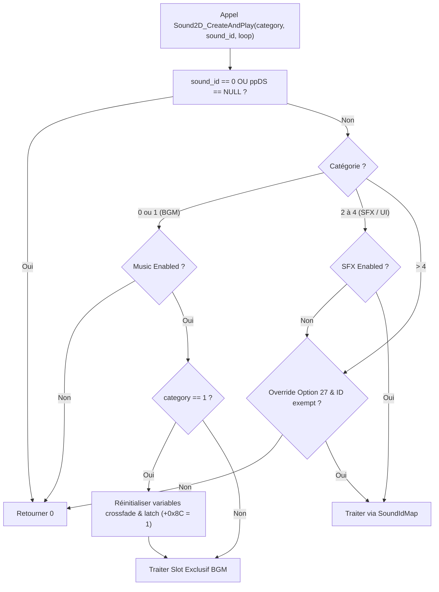
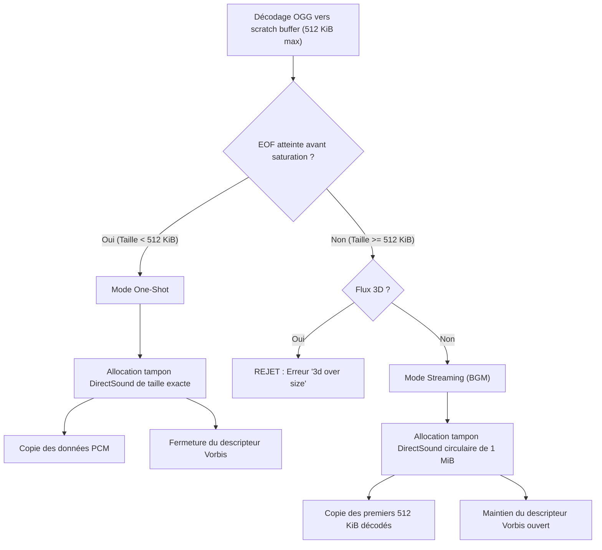

# Spécification Technique du Système Audio (Sound System)

Ce document décrit l'architecture et les détails d'implémentation de bas niveau du système audio du client Martial Heroes, basé sur les analyses de reverse engineering des fonctions de gestion du son, de décodage Ogg Vorbis et de l'interface Microsoft DirectSound.

---

## 1. Architecture Globale et Structures Mémoire

Le système audio repose sur une classe principale, `CSoundManager` (souvent appelée `SoundManager` ou `AmbientSoundManager` selon les contextes de reverse engineering). Le manager est exposé au reste du moteur sous la forme d'un singleton global accessible via `AmbientSoundManager_GetSingleton` (@ `0x452506`). Ce pointeur est stocké dans le slot 14 du tableau des sous-systèmes globaux du client (voir [runtime_singletons.md](file:///C:/Users/Arius/RiderProjects/MartialHeroes/Docs/RE/structs/runtime_singletons.md)).

### 1.1 Structure Mémoire de `CSoundManager`

L'objet `CSoundManager` occupe environ 640 octets en mémoire. Voici la carte des offsets confirmée par l'analyse statique :

| Offset (Hex) | Offset (Dec) | Type | Rôle / Nom du Champ | Description |
|---|---|---|---|---|
| `+0x00` | 0 | `float[3]` | Player XYZ Cache | Position XYZ du joueur local, mise à jour à chaque cycle d'évaluation ambiante. |
| `+0x0C` | 12 | — | Voice Array State Block | Début du bloc d'état des voix géré par `SoundManager_InitVoiceArrays`. |
| `+0x0E` | 14 | `uint8` | Last BGM MUD Index | Cache de l'index de BGM issu de la dernière tuile `.mud` lue. |
| `+0x0F` | 15 | `uint8[2]` | Last BGE Indices | Cache des index d'ambiance 2D de la dernière tuile `.mud`. |
| `+0x11` | 17 | `uint8[3]` | Last EFF Indices | Cache des index d'effets 3D de la dernière tuile `.mud`. |
| `+0x14` | 20 | `uint8` | Last Played BGM Zone | Permet d'éviter de relancer une BGM identique déjà active. |
| `+0x18` | 24 | `uint32` | SFX Slot Count | Nombre maximal de canaux d'effets sonores, initialisé à `12`. |
| `+0x1C` | 28 | `float` | Master Multiplier | Multiplicateur global de volume BGM (généralement `1.0f`), servant au crossfade. |
| `+0x20` | 32 | `uint8` | Crossfade In-Progress | Booléen indiquant si une transition de fondu croisé est en cours. |
| `+0x24` | 36 | `uint32` | Pending BGM ID | ID de la BGM en cours de chargement ou de fondu entrant. |
| `+0x28` | 40 | `uint32` | Hour-of-day Cache | Cache de l'heure du monde de jeu (`game_seconds / 3600`). |
| `+0x34` | 52 | `GSound*` | Active BGM Voice | Pointeur vers l'objet vocal BGM actuellement actif (Slot Catégorie 0/1). |
| `+0x38` | 56 | `GSound*[3]`| Ambient Voices Array | Tableau contenant les 3 voix d'ambiance active (issues des tuiles `.bge`/`.eff`). |
| `+0x44` | 68 | `SoundIdMap` | Sound ID Map (Cat 2..4) | Arbre binaire trié stockant les voix 2D associées aux catégories d'effets 2 à 4. |
| `+0x68` | 104 | `SoundIdMap` | Actor-Event Map Root | Arbre de gestion des voix 3D pour les sons liés aux entités/acteurs. |
| `+0x74` | 116 | `float` | Music Gain | Volume de la musique, calculé par `OPTION_SOUNDBOL_MUSIC / 100.0`. |
| `+0x78` | 120 | `float` | Terrain/Ambient Gain | Volume des sons d'ambiance et du terrain, calculé par `OPTION_SOUNDVOL_BACK / 100.0`. |
| `+0x7C` | 124 | `float` | Char SFX Gain | Volume des SFX du personnage local, calculé par `OPTION_SOUNDVOL_CHAR / 100.0`. |
| `+0x80` | 128 | `float` | Mob SFX Gain | Volume des SFX des monstres (mobs), calculé par `OPTION_SOUNDVOL_MOB / 100.0`. |
| `+0x84` | 132 | `uint8` | Music Enabled | Flag d'activation globale de la musique (`OPTION_SOUND_MUSIC`). |
| `+0x85` | 133 | `uint8` | Terrain/SFX Enabled | Flag d'activation globale des effets et sons d'ambiance (`OPTION_SOUND_TERRAIN`). |
| `+0x86` | 134 | `uint8` | Char/Mob Enabled | Flag d'activation globale des voix de combat (`OPTION_SOUND_CHAR \| OPTION_SOUND_MOB`). |
| `+0x8C` | 140 | `uint8` | BGM Toggle Latch | Registre interne de transition BGM lors des changements de zone. |
| `+0x90` | 144 | `uint32` | Last Eval Time (ms) | Timestamp (`GetTickCount`) de la dernière évaluation globale de l'ambiance. |

### 1.2 Allocation et Initialisation via `SoundManager_InitVoiceArrays`

Le constructeur de `CSoundManager` (`SoundManager_ctor` @ `0x4524ab`, voir [cycle18_final_sweep_decomp.md](file:///C:/Users/Arius/RiderProjects/MartialHeroes/Docs/RE/_dirty/cycle18_final_sweep_decomp.md)) initialise les 12 premiers octets de l'objet à zéro (Player XYZ Cache), puis délègue la configuration du reste de l'objet à la fonction interne `SoundManager_InitVoiceArrays` (@ `0x4526a7`) en lui passant l'adresse décalée de `this + 12` :
1. **Initialisation des listes et structures d'arbres :** Les racines des structures `SoundIdMap` aux offsets `+0x44` et `+0x68` sont configurées (pointeurs internes mis à zéro, taille définie à 0).
2. **Configuration des slots de lecture :** Le pointeur BGM actif (`+0x34`) et le tableau des voix d'ambiance (`+0x38`) sont mis à `NULL`.
3. **Chargement des options de volume :** Les valeurs initiales des gains de volume (`+0x74` à `+0x80`) sont lues depuis la structure d'options globale du client (`DoOption` à l'adresse `0x854C10` via `Singleton_GetOrInit_854C10` @ `0x5e26be`).

La désallocation et le nettoyage de ces structures sont pris en charge lors de la destruction du manager par la fonction `SoundManager_DestructVoiceArrays` (@ `0x452872`).

---

## 2. Algorithme de Lecture 2D : `Sound2D_CreateAndPlay`

La fonction `Sound2D_CreateAndPlay` (@ `0x455505`) gère la création dynamique et l'exécution des pistes audio 2D à partir de leur identifiant numérique unique (`sound_id`).

### 2.1 Routage et Gestion des Catégories de Lecture

Le comportement de mixage est déterminé par le paramètre de catégorie de l'appel.

### 2.2 Gestion Exclusive du Slot BGM (Catégories 0 et 1)

Les catégories **0** et **1** partagent un unique slot audio exclusif situé à l'offset `+0x34` (`Active BGM Voice`).
1. **Libération automatique sur mismatch (ID différent) :** 
   Si une BGM est déjà active, l'algorithme appelle la méthode virtuelle `vtable[3]` du son existant pour valider si le fichier correspond à l'ID demandé. Si les fichiers diffèrent (mismatch) :
   - La voix précédente est immédiatement stoppée et libérée via son destructeur virtuel.
   - Le slot à l'offset `+0x34` est défini à `0` (pour forcer une nouvelle allocation).
2. **Création et instanciation :** 
   Si le slot est vide, la fonction appelle `Sound_CreateOggVoice(sound_id, 1, "data/sound/2d/")`. L'argument `1` correspond au flag d'instanciation OGG 2D.
3. **Application du gain et lecture :**
   Le volume est configuré d'après la variable de gain de musique `Music Gain` (`+0x74`). Les propriétés de crossfade sont réinitialisées (flag en cours à 0, rampe à 1.0f). Le son est démarré via `GSound_Play`.

### 2.3 Parallélisme des SFX et UI (Catégories 2 à 4) via `SoundIdMap`

Pour les bruitages (SFX) et les sons d'interface, le moteur utilise la structure `SoundIdMap` (offset `+0x44`) pour permettre la lecture simultanée de plusieurs sons.

1. **Recherche de slot existant (`SoundIdMap_LowerBound`) :**
   L'arbre ordonné est interrogé avec la clé composite `(category, sound_id)`.
2. **Cas "Déjà existant" :**
   Si la voix est déjà répertoriée dans la structure :
   - Le moteur rembobine le tampon DirectSound sous-jacent au début en appelant sa méthode d'interface `SetCurrentPosition(0)`.
   - Il met à jour le volume de la voix (volume forcé à `1.0f` si l'option de débordement 27 est active et que l'ID fait partie des identifiants exemptés `861010109`/`861010110`, sinon volume standard `Terrain/Ambient Gain` à `+0x78`).
   - Le son est rejoué via `GSound_Play`.
3. **Cas "Nouveau son" (Non trouvé dans l'arbre) :**
   - Une nouvelle voix est créée via `Sound_CreateOggVoice(sound_id, 1, "data/sound/2d/")`.
   - Si l'allocation réussit, le son est configuré avec le volume approprié et joué.
   - S'il démarre correctement, le couple `(sound_id, GSound*)` est inséré dans l'arbre à l'aide de `SoundIdMap_FindInsertSlot`. En cas d'erreur de lecture, l'objet vocal nouvellement alloué est immédiatement détruit.

---

## 3. Décodage et Streaming des fichiers OGG

Le client Martial Heroes n'utilise pas de middleware tiers (comme FMOD ou Miles). Il intègre statiquement la bibliothèque **Xiph.Org libVorbis 1.3.2** (build *Schaufenugget*).

### 3.1 Chargement depuis le VFS

La fonction `Sound_CreateOggVoice` effectue les opérations suivantes :
1. **Résolution du chemin :** Le nom du fichier est construit à la volée sous la forme `<dir_prefix><sound_id>.ogg` (les identifiants numériques sont traduits en chaînes décimales brutes, sans remplissage de zéros).
2. **Ouverture de flux :** Si le gestionnaire de fichiers virtuels (VFS) est monté, le fichier est ouvert en mémoire via `ov_open_callbacks` depuis l'archive `data.vfs` (voir [vfs_overview.md](file:///C:/Users/Arius/RiderProjects/MartialHeroes/Docs/RE/specs/vfs_overview.md)). En cas d'échec ou en mode éditeur, un flux classique `fopen` / `ov_open` est tenté sur le disque.

### 3.2 Règle Stricte des Canaux (Hard Codec Rule)

Le format du fichier Vorbis est validé dès l'ouverture :
- **Clips 3D (positionnels) :** Doivent impérativement être **Mono (1 canal)**.
- **Clips 2D (non positionnels) :** Doivent impérativement être **Stéréo (2 canaux)**.

Tout fichier ne respectant pas cette contrainte est immédiatement rejeté, loggé comme invalide et ignoré par le moteur de rendu audio.

### 3.3 Seuil de Streaming et Tampon de Décodage

Le client possède un tampon de décodage partagé unique de **512 KiB** (`0x80000` octets) nommé `DecodeScratchBytes`.
Lors du chargement, le moteur décode l'intégralité du fichier Ogg Vorbis dans ce scratch buffer à l'aide d'appels répétés à `ov_read`. Une fois le décodage terminé, la taille du flux extrait détermine le mode de lecture :

### 3.4 Processus Asynchrone de Streaming (`GSoundThread`)

Le thread asynchrone d'arrière-plan `GSoundThread` est responsable de maintenir les tampons circulaires de streaming remplis sans bloquer la boucle principale du jeu.
- **Cadence de rafraîchissement :** Le thread boucle en permanence avec un appel à `Sleep(100)` (pause de 100 ms).
- **Mise à jour des tampons :** Si plus de **200 ms** se sont écoulées depuis la dernière mise à jour, le thread parcourt la liste des voix actives de type streaming et invoque leur méthode virtuelle `updateStream()`.
- **Remplissage :** Cette méthode effectue de nouveaux appels à `ov_read` pour décoder les blocs PCM suivants et les injecter dans la partie libre du tampon circulaire DirectSound de 1 MiB.

---

## 4. Propriétés Audio et API DirectSound

### 4.1 Contrôle de Volume Logarithmique : `GSound_SetVolumeFromAmplitude`

L'amplitude linéaire du son $X \in [0, 1]$ (obtenue par la formule `option_volume / 100.0` et modulée par les facteurs d'atténuation du terrain ou de distance) est convertie en centièmes de décibel (millibels DirectSound, de $-10000$ mB à $0$ mB) avant d'être passée à `IDirectSoundBuffer::SetVolume`.

La conversion est implémentée de manière uniforme par la fonction `GSound_SetVolumeFromAmplitude` (@ `0x452be8`) selon la formule mathématique suivante :

* Si $X = 0.0$ :
$$\text{Volume (mB)} = -10000 \quad (\text{silence total})$$

* Si $X > 0.0$ :
$$\text{Volume (mB)} = \lfloor \ln(\ln(X) \times 3000.0 + 0.5) \rfloor$$

Cette courbe logarithmique imbriquée assure une atténuation très rapide de la perception sonore dès que l'amplitude descend en dessous de 1.0, simulant une décroissance naturelle.

### 4.2 Algorithme de Fondu Croisé (Cross-fading) de BGM

Lorsqu'un changement de zone ou de contexte survient (par exemple, le joueur passe sur une nouvelle tuile `.mud` ayant un identifiant de BGM différent), le manager n'effectue pas de coupure abrupte. Il utilise les champs de crossfade pour gérer la transition :

1. **Calcul de la transition :** Le manager stocke l'ID de la BGM actuelle dans `Pending BGM ID` (`+0x24`) et initie la rampe de gain `Master Multiplier` (`+0x1C`) à `1.0f`. Le flag de crossfade `+0x20` est levé.
2. **Ramp-down / Ramp-up :** À chaque mise à jour de trame, le manager diminue progressivement la valeur de `Master Multiplier` (`+0x1C`) pour atténuer le volume de la piste en cours de fermeture.
3. **Optimisation "Identique" :** Si le nouvel ID demandé correspond à la BGM déjà en cours d'exécution, l'algorithme **n'interrompt pas** la lecture. Il remonte simplement la rampe du multiplicateur global à sa valeur maximale, évitant ainsi un redémarrage audio inutile.
4. **Cas Spécifique de l'Échange (Trade-Busy BGM Override) :**
   Lors du déclenchement d'un échange entre joueurs (paquet réseau opcode `5/106`, voir [sound.md](file:///C:/Users/Arius/RiderProjects/MartialHeroes/Docs/RE/specs/sound.md#L482-L505)), le manager force l'ID de BGM à la valeur fixe **863500002** (musique d'échange) et désactive temporairement le traitement des pistes d'ambiance 2D (`.bge`). Les sons 3D positionnels (`.eff`) continuent cependant d'être joués.

### 4.3 Intégration DirectSound (`ppDS`)

Le moteur s'interface directement avec l'API DirectSound de Windows via le pointeur global de périphérique DirectSound `ppDS` :
- **Initialisation du périphérique :** Réalisée par `DirectSoundCreate(NULL, &ppDS, NULL)`.
- **Niveau de coopération :** Configuré obligatoirement à `DSSCL_NORMAL` (valeur `1`). Le client n'a pas besoin de droits prioritaires ou exclusifs sur le matériel audio.
- **Tampon Primaire :** Créé avec les flags de description `DSBCAPS_PRIMARYBUFFER | DSBCAPS_CTRL3D` (`0x11`). Ce tampon **ne possède pas** le flag `DSBCAPS_CTRLVOLUME`. Par conséquent, tous les appels de réglage de volume doivent cibler les tampons secondaires DirectSound.
- **Tampons Secondaires :** Créés avec les formats PCM décrits par les structures `WAVEFORMATEX` (stéréo 44.1 kHz 16 bits par défaut pour la 2D, mono 22.05 kHz 16 bits par défaut pour la 3D). Ils incluent le flag `DSBCAPS_CTRLVOLUME` (`0x80`) pour autoriser le contrôle d'amplitude individuel.
- **Listener 3D :** L'interface de l'auditeur `IDirectSound3DListener` est acquise immédiatement à l'initialisation du tampon primaire par un appel à `QueryInterface`.
