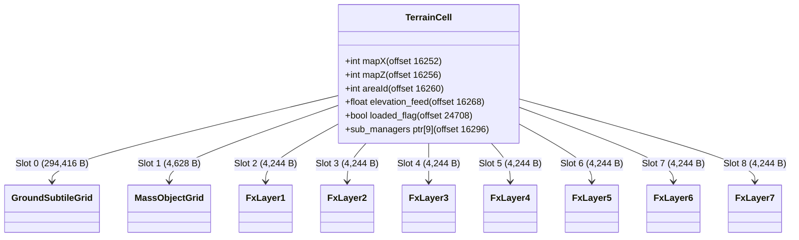

# Spécification Technique : Système de Terrain (Terrain System)

Ce document décrit en détail le fonctionnement et l'intégration du système de terrain (moteur de rendu, gestion de la mémoire, échantillonnage de hauteur et fichiers VFS). Il s'appuie sur le travail de reverse engineering documenté dans la cartographie du terrain :
- [cycle18_final_sweep_decomp.md](file:///C:/Users/Arius/RiderProjects/MartialHeroes/Docs/RE/_dirty/cycle18_final_sweep_decomp.md)
- [terrain-streaming.md](file:///C:/Users/Arius/RiderProjects/MartialHeroes/Docs/RE/specs/terrain-streaming.md)
- [terrain-manager.md](file:///C:/Users/Arius/RiderProjects/MartialHeroes/Docs/RE/structs/terrain-manager.md)

---

## 1. Structure de la mémoire et cycle de vie de `TerrainCell`

Chaque cellule active du terrain est gérée par un objet de la classe `TerrainCell` d'une taille fixe en mémoire de **24 712 octets**. L'allocation de ces objets est centralisée dans un pool fixe de 34 cellules pré-allouées au démarrage par le gestionnaire de streaming (`TerrainLoader`). Il n'y a donc pas d'allocation/désallocation dynamique de l'objet `TerrainCell` à chaque chargement de secteur.

### 1.1 Constructeur `TerrainCell_ctor` (0x43c327)
Lors de l'initialisation d'une cellule par [TerrainCell_ctor](file:///C:/Users/Arius/RiderProjects/MartialHeroes/Docs/RE/_dirty/cycle18_final_sweep_decomp.md#L1), l'objet de base est structuré en plusieurs grilles internes. Il réalise l'allocation dynamique de ses gestionnaires de sous-couches (les *sub-managers*).

Le tableau des sous-gestionnaires (`sub_managers`) est situé à l'offset **`+16296`** (jusqu'à `+16328`), contenant **9 pointeurs** de 4 octets (slots 0 à 8). Ces sous-gestionnaires gèrent les textures de sol, les bâtiments, et les couches d'effets visuels.



### 1.2 Grilles et allocations des sous-gestionnaires

Voici les allocations dynamiques réalisées au sein du constructeur de `TerrainCell` :

| Slot | Offset (Byte) | Sous-gestionnaire | Taille (Bytes) | Fonction d'initialisation | Description |
|:---:|:---:|---|---|---|---|
| **0** | `+16296` | **Ground Subtile Grid** | `294 416` (`0x47E10`) | `TerrainCell_InitGroundSubtileGrid` | Grille de textures de sol de base (16×16 dalles). Gère l'indexation locale des textures mappées sur le pool global. |
| **1** | `+16300` | **Mass Object Grid** | `4 628` (`0x1214`) | `TerrainCell_InitMassObjectGrid` | Gestionnaire d'objets de masse statiques (arbres, rochers, éléments de décor). |
| **2** | `+16304` | **FxLayer 1** | `4 244` (`0x1094`) | `sub_45D9F8` | Couche d'effet visuel/eau 1 (`fx1`). |
| **3** | `+16308` | **FxLayer 2** | `4 244` (`0x1094`) | `sub_45F734` | Couche d'effet visuel/eau 2 (`fx2`). |
| **4** | `+16312` | **FxLayer 3** | `4 244` (`0x1094`) | `sub_461548` | Couche d'effet visuel/eau 3 (`fx3`). |
| **5** | `+16316` | **FxLayer 4** | `4 244` (`0x1094`) | `Fx4Layer_ctor` | Couche d'effet visuel/eau 4 (`fx4`). |
| **6** | `+16320` | **FxLayer 5** | `4 244` (`0x1094`) | `Fx5Layer_ctor` | Couche d'effet visuel/eau 5 (`fx5`). |
| **7** | `+16324` | **FxLayer 6** | `4 244` (`0x1094`) | `sub_4671F8` | Couche d'effet visuel/eau 6 (`fx6`). |
| **8** | `+16328` | **FxLayer 7** | `4 244` (`0x1094`) | `sub_469178` | Couche d'effet visuel/eau 7 (`fx7`). |

> [!NOTE]
> La somme des allocations pour une seule cellule de terrain active est d'environ **331 432 octets** (24 712 de base + 294 416 pour le sol + 4 628 pour la masse + 7 × 4 244 pour les effets visuels).

### 1.3 Recyclage et cycle de vie (`loaded_flag`)
- L'indicateur booléen `loaded_flag` situé à l'offset **`+24708`** (1 octet) est initialisé à `0` par le constructeur.
- Il passe à `1` lors d'un chargement réussi du secteur (lorsque le fichier `.map` et ses dépendances sont lus).
- Lorsque le joueur se déplace, les cellules sortant du rayon actif voient leur `loaded_flag` réinitialisé à `0` (phase de culling).
- Lors de l'allocation d'un nouveau secteur, l'allocateur de slots parcourt séquentiellement les 34 cellules du pool et sélectionne la première cellule inactive (`loaded_flag == 0`) pour y charger les nouvelles données géométriques, évitant ainsi des réallocations coûteuses.

---

## 2. Échantillonnage de la hauteur au sol (Ground Height Sampling)

Le moteur client utilise les coordonnées absolues mondiales X/Z pour retrouver la hauteur Y correspondante. Ce mécanisme s'appuie sur la résolution de la cellule active dans la grille chargée, suivie d'une interpolation précise sur le triangle contenant le point requis.

### 2.1 Résolution de la cellule 3×3 via `Terrain_ResolveLoadedCell3x3` (0x401df0)

Le client accède aux cellules actives via la fonction [Terrain_ResolveLoadedCell3x3](file:///C:/Users/Arius/RiderProjects/MartialHeroes/Docs/RE/_dirty/cycle18_final_sweep_decomp.md#L244) exposée sur l'objet `TerrainManager`. 

```cpp
int __thiscall Terrain_ResolveLoadedCell3x3(_DWORD *this, int targetX, int targetZ)
{
  int centerCell; // esi

  if ( !*(this + 23) ) // center_cell (offset +92) est-il nul ?
    return 0;
  centerCell = *(this + 23);
  
  // Vérification de la portée : le secteur recherché doit être dans une grille 3x3 autour du centre
  if ( (unsigned int)(targetX - centerCell->mapX + 1) > 2 || 
       (unsigned int)(targetZ - centerCell->mapZ + 1) > 2 )
  {
    return 0; // En dehors de la fenêtre 3x3 active
  }
  else
  {
    // Calcul de l'index dans le tableau ring_slots (5x5, offset +44)
    // Offset calculé : 12 + 5 * dx + dz
    // Adresse mémoire correspondante : this + 23 + 5 * dx + dz (en DWORDs, donc +92 + 20 * dx + 4 * dz octets)
    int dx = targetX - centerCell->mapX;
    int dz = targetZ - centerCell->mapZ;
    return *(this + 5 * dx + dz + 23);
  }
}
```

- L'objet `TerrainManager` dispose de son anneau de pointeurs spatiaux `ring_slots` à l'offset **`+44`** (25 pointeurs, grille 5×5 indexée en row-major : `5 * row + col`).
- La cellule centrale sur laquelle se trouve le joueur est à l'index spatial **12** (ce qui correspond à l'offset **`+92`** de `TerrainManager`, aussi appelé `center_cell`).
- La recherche s'assure que la différence de coordonnées de cellule `dx` et `dz` est comprise dans l'intervalle `[-1, 1]`. Si c'est le cas, elle retourne le pointeur de cellule à l'index `12 + 5 * dx + dz` de l'anneau.

### 2.2 Interpolation de hauteur via `Terrain_SampleGroundHeightSteppedXZ`

Pour calculer la hauteur Y exacte d'un point à des coordonnées mondiales `(worldX, worldZ)` :
1. Les coordonnées mondiales sont converties en coordonnées de cellule et de quad (chaque cellule de 1024×1024 unités contient une grille géométrique de 64×64 quads, avec un espacement entre sommets de 16 unités).
2. Le moteur détermine le quad contenant le point requis.
3. **Triangulation et Résolution Diagonal / Direction :**
   - Chaque quad est divisé en **deux triangles** (split diagonal).
   - Cette division dépend du fichier `.ted` (bloc 4 de la géométrie, contenant les drapeaux de direction et d'orientation UV). Durant la phase de chargement de la cellule, ces drapeaux sont lus pour construire les faces géométriques (triangles) de la cellule.
4. **Test de Containment 2D :**
   - Au runtime, la fonction applique un test de boîte englobante AABB (XZ) sur les triangles locaux, suivi d'un test d'inclusion de point en 2D (test de signe sur les 3 arêtes dans le plan XZ) pour identifier le triangle exact qui contient `(worldX, worldZ)`.
5. **Calcul Barycentrique / Résolution de Plan :**
   - Le moteur résout l'équation du plan formé par les trois sommets $P_1, P_2, P_3$ du triangle pour trouver Y :
     $$Ax + By + Cz + D = 0 \implies y = -\frac{Ax + Cz + D}{B}$$
   - En cas d'ambiguïté ou de superposition, la hauteur maximale (Maximum Y) parmi les triangles valides est conservée.

> [!IMPORTANT]
> Le client n'effectue **pas** d'interpolation bilinéaire simple à 4 coins pour la hauteur finale du sol. Une implémentation fidèle doit impérativement utiliser l'interpolation par plan de triangle pour éviter des divergences de collision ou de caméra près des diagonales des quads.

---

## 3. Intégration de la carte dans le VFS (Virtual File System)

Le monde de Martial Heroes est segmenté en zones (areas/maps). Toutes les données afférentes sont stockées sous forme d'archives compressées `.vfs` et structurées sous des répertoires logiques normalisés.

### 3.1 Structure du répertoire de carte `data/map<NNN>/`
Chaque zone est représentée par un numéro à 3 chiffres complété par des zéros (`<NNN>`, par exemple `000` pour la zone globale/de départ, `001` pour la première zone standard, `201` pour un donjon).

```
data/map<NNN>/
├── map<NNN>.bin                  # Fichier de métadonnées de zone (taille fixe 520 octets)
├── region<NNN>.bin               # Grille de régions (liaison avec les zones sûres/PvP)
├── regiontable<NNN>.bin          # Table des attributs de région (nom de zone, bounds, etc.)
├── npc<NNN>.arr                  # Configuration des spawns des PNJs / monstres de la zone
├── <NNN>.tol                     # Fichier d'authoring d'origine (optionnel, non lu au runtime)
├── soundtable<NNN>.bgm           # Table des musiques de fond (BGM)
├── soundtable<NNN>.bge           # Table des sons d'ambiance
├── soundtable<NNN>.eff           # Table des effets sonores
├── soundtable<NNN>.wlk           # Table des bruits de pas (marche)
├── soundtable<NNN>.run           # Table des bruits de pas (course)
└── dat/                          # Sous-répertoire contenant les données géométriques des cellules
    ├── d<NNN>.lst                # Manifeste binaire des cellules présentes dans la carte
    ├── d<NNN>x<mapX>z<mapZ>.map  # Descripteur textuel CP949 de la cellule (Fichier pivot)
    ├── d<NNN>x<mapX>z<mapZ>.ted  # Données géométriques et élévation de la cellule
    ├── d<NNN>x<mapX>z<mapZ>.bud  # Modèles 3D et placement des bâtiments (optionnel)
    ├── d<NNN>x<mapX>z<mapZ>.sod  # Géométrie de collision 2D-XZ (murs invisibles)
    └── d<NNN>x<mapX>z<mapZ>.exd  # Données géométriques de terrain additionnel (extra-terrain)
```

### 3.2 Fichiers de géométrie géoréférencée `.ted` vs `.hmp`
Dans d'autres moteurs de jeux de la même famille (comme *KalOnline*), les géométries de hauteur de terrain sont contenues dans des fichiers portant l'extension **`.hmp`**.
Pour *Martial Heroes*, ce rôle est entièrement assuré par les fichiers **`.ted`** (Terrain Elevation Data). 

Un fichier `.ted` mesure exactement **46 987 octets** et ne comporte aucun en-tête. Il se divise en 5 blocs de données brutes lus séquentiellement :

1. **Hauteurs (Block 1 - `height_map`)** : `16 900` octets ($65 \times 65 \times 4$ octets en `float` IEEE 754). Contient les altitudes absolues du maillage du sol.
2. **Normales (Block 2 - `normal_map`)** : `12 675` octets ($65 \times 65 \times 3$ octets signés `int8`). Les composantes normales sont décodées en les divisant par `127.0`. Le vecteur Y représente l'axe vertical (Y-up).
3. **Index de texture (Block 3 - `texture map`)** : `256` octets ($16 \times 16$ octets `uint8`). Ces indices locaux font référence à la liste des textures définie dans la section `TERRAIN` du descripteur `.map`.
4. **Directions et Flags UV (Block 4 - `direction map`)** : `256` octets ($16 \times 16$ octets `uint8`). Gère les rotations de textures (bit `0x01` = miroir S/U, bit `0x02` = miroir T/V) ainsi que la direction du split diagonal pour la triangulation.
5. **Couleurs Diffuses (Block 5 - `diffuse map`)** : `16 900` octets ($65 \times 65 \times 4$ octets `RGBA`). Les canaux de couleur subissent une multiplication par `0.5` lors de la lecture en mémoire (le canal Alpha de rembourrage vaut `0`).

### 3.3 Fichiers de scripts de zone (`data/script/`)
En marge des répertoires de carte locaux, les configurations globales de routage et de météo sont écrites sous forme de tables binaires à enregistrements fixes dans le répertoire `data/script/` :

- **`data/script/mapsetting.scr`** : Table binaire globale contenant la liste des zones de jeu (~52 enregistrements). Chaque enregistrement mesure **84 octets** et contient l'identifiant de la zone, son nom encodé en CP949, les boîtes englobantes mondiales (XZ bounds) et les paramètres de brouillard initiaux de la zone.
- **Sound Tables (`soundtable*.ext`)** : Chacun des cinq fichiers de sons régionaux (`.bgm`, `.bge`, `.eff`, `.wlk`, `.run`) contient **256 enregistrements de 48 octets** (soit `12 288` octets utiles, suivis d'une table d'activation de 1024 octets inutilisée par le client au runtime, pour une taille totale sur disque de `13 312` octets). Ils associent l'index issu des grilles de terrain aux chemins d'accès des fichiers audio dans le VFS.
- **`data/map000/texture/bgtexture.lst`** : Contient l'index global unique des textures de terrain et de bâtiments utilisé par toutes les zones du monde (les enregistrements font **48 octets** sur disque et référencent les textures relatives `.dds` situées sous `data/map000/texture/`).
