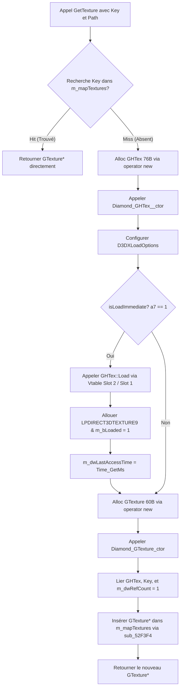

# Chargement d'assets 2D et Cache de Texture (Spécification Technique)

Ce document décrit le pipeline d'intégration, de chargement, de mise en cache et de dessin des textures et assets 2D au sein du client Martial Heroes (`doida.exe`, build `f61f66a9`). Il s'appuie sur la rétro-ingénierie des routines d'allocation, de gestion de mémoire cache et de soumission de géométrie au périphérique de rendu sprite 2D.

---

## 1. Chargement d'assets 2D depuis le Système de Fichiers Virtuel (VFS)

Le client utilise un système de fichiers virtuel unifié pour encapsuler ses ressources. La structure et les règles régissant le chargement des images 2D (.dds, .tga, .bmp, .png) sont définies comme suit :

### 1.1 Architecture d'accès VFS
* Lorsque le VFS est actif (`g_VfsMounted == 1` à l'adresse `0x8C4EC9`), tout chargement d'image passe par la fonction globale `Vfs_FindAndReadEntry` (@ `0x60AC70`).
* Cette fonction recherche le fichier demandé dans la table des matières (`data.inf`) par recherche dichotomique sur le tableau `g_VfsToc`.
* Une fois le fichier localisé dans `data/data.vfs` à l'aide de son décalage (`dataOffset`) et de sa taille (`dataSize`), la routine acquiert la section critique `g_VfsReadLock` (`0x797890`) pour verrouiller l'accès au descripteur global `g_VfsDataHandle`.
* Elle effectue ensuite une lecture directe via `ReadFile` dans un tampon mémoire alloué dynamiquement sur le tas avec `malloc` ("Branch 2 : In-Memory Slurp", documentée dans [vfs_master_manual.md](file:///C:/Users/Arius/RiderProjects/MartialHeroes/Docs/RE/vfs/vfs_master_manual.md)).
* En mode développeur non monté (`g_VfsMounted == 0`), le pipeline bascule automatiquement vers la lecture de fichiers locaux ordinaires ("Branch 1 : Loose-File Fallback") via des requêtes standard Windows.

### 1.2 Détection automatique de format via D3DX9
* Le moteur du client ne contient aucun vérificateur d'extension de nom de fichier (ex: `.dds`, `.tga`) ni aucun parseur d'en-tête de bas niveau propriétaire avant la phase de décodage.
* Le tampon mémoire brut de l'image slurped est directement transmis à la fonction de l'API Direct3DX9 :
  * `D3DXCreateTextureFromFileInMemoryEx` (@ `0x65e004` / `0x65e00a`) pour le chargement principal VFS.
  * `D3DXCreateTextureFromFileExA` en cas de repli sur disque.
* La bibliothèque D3DX9 décode l'en-tête et identifie le format à l'aide des signatures binaires :
  * **DDS :** En-tête débutant par la signature magique `DDS ` (`44 44 53 20`).
  * **TGA :** Identifié par les heuristiques D3DX9 (pas de signature fixe de début, le premier octet spécifiant la longueur `idLength`).
  * **BMP :** Débutant par `BM` (`42 4D`).
  * **PNG :** Débutant par la signature standard ISO `89 50 4E 47 0D 0A 1A 0A`.

### 1.3 Caractéristiques techniques des formats ciblés
* **Format DDS (DirectDraw Surface) :**
  * Principalement exploité pour les décors, objets tridimensionnels et les grands atlas de l'interface utilisateur.
  * Variantes supportées : DXT1 (BC1), DXT2/DXT3 (BC2), DXT5 (BC3), et formats bruts RAW non compressés (24bpp BGR et 32bpp BGRA).
  * Différence DXT2 vs DXT3 : Les deux partagent une structure BC2 de 16 octets/bloc, mais DXT2 utilise une couleur pré-multipliée par l'alpha (premultiplied alpha), alors que DXT3 s'attend à une couleur brute (straight alpha). Le moteur doit utiliser le mode de mélange (blend mode) approprié pour éviter des artefacts de bordures noires sur l'interface.
  * Les textures RAW uncompress 32bpp (A8R8G8B8) nécessitent une inversion de canaux BGRA vers RGBA lors de l'intégration dans des moteurs modernes.
* **Format TGA (Targa Image File) :**
  * Utilisé spécifiquement pour les animations d'effets de particules et d'anciennes portions de l'interface.
  * Format type constaté : Type 2 (True-color non compressé), 32 bits par pixel (canaux BGRA).
  * Sens de lecture des lignes : Le bit 5 de l'octet `imageDescriptor` (offset `0x11`) est typiquement à `0`, ce qui indique que l'image est codée de bas en haut (bottom-up). Un flip vertical est indispensable lors du chargement.
  * Clôture du fichier par le pied de page normalisé TGA 2.0 contenant la signature `TRUEVISION-XFILE` sur les 26 derniers octets.

---

## 2. Gestionnaire de Cache GTextureManager et cycle de vie de la Texture

Afin d'éviter le décodage et l'allocation continue en mémoire vidéo, le client maintient un registre des ressources chargées via le gestionnaire de textures.

### 2.1 Structures mémoire et alignements
Les structures impliquées sont les suivantes (voir détails complets dans [ghtex.md](file:///C:/Users/Arius/RiderProjects/MartialHeroes/Docs/RE/structs/ghtex.md)) :

#### Diamond::GTextureManager (Taille : 16 octets / `0x10`)
* **`+0x00` :** Pointeur vers la table virtuelle `GTextureManager::vftable` (adresse : `0x72990c`).
* **`+0x04` :** `m_mapTextures` (`std::map<void*, GTexture*>`, taille 12 octets sous l'architecture x86 d'origine). Cette table stocke les pointeurs d'objets wrappers sous forme d'arbre rouge-noir indexé par une clé d'identification.

#### Diamond::GTexture (Taille : 60 octets / `0x3C`)
Wrapper de référence-comptage dérivant de `Diamond::GRenderState`.
* **`+0x00` :** Pointeur vers la table virtuelle `GTexture::vftable` (adresse : `0x730f8c`).
* **`+0x04` :** `m_dwRefCount` (compteur de références, incrémenté lors des requêtes).
* **`+0x34` (52) :** `m_pGHTex` (pointeur vers l'instance de ressource physique [GHTex](file:///C:/Users/Arius/RiderProjects/MartialHeroes/Docs/RE/structs/ghtex.md)*).
* **`+0x38` (56) :** `m_pKey` (clé de recherche unique dans la map, généralement le pointeur d'identifiant de l'asset ou sa clé d'origine).

#### Diamond::GHTex (Taille : 76 octets / `0x4C`)
Ressource texture physique contenant le pointeur Direct3D sous-jacent. Elle dérive de [GHandle](file:///C:/Users/Arius/RiderProjects/MartialHeroes/Docs/RE/structs/ghtex.md#L14) (48 octets).
* **`+0x04` :** `m_strPath` (`std::string`, stocke le chemin virtuel dans le VFS).
* **`+0x20` :** `m_bActive` (drapeau d'activation, initialisé à `1`).
* **`+0x21` :** `m_bLoaded` (booléen indiquant si la texture est allouée dans la VRAM).
* **`+0x24` :** `m_dwTimeout` (seuil d'inactivité avant libération, initialisé à `180000` ms = 3 minutes).
* **`+0x28` :** `m_dwLastAccessTime` (timestamp CPU de la dernière utilisation, mis à jour via `Time_GetMs()`).
* **`+0x3C` (60) :** `m_dwFormat` (D3DFORMAT Direct3D).
* **`+0x40` (64) :** `m_pD3DTexture` (pointeur brut d'interface de ressource `LPDIRECT3DTEXTURE9`).
* **`+0x44` (68) :** `m_dwTextureVramSize` (empreinte en mémoire vidéo VRAM).
* **`+0x48` (72) :** `m_pD3DXOptions` (pointeur vers les options de configuration D3DX9).

---

### 2.2 Séquence d'exécution de GTextureManager_GetTexture (@ 0x52f4d8)
La routine de récupération de texture s'exécute selon l'enchaînement décrit ci-dessous (analyse brute tirée de [cycle17_texture_decomp.md](file:///C:/Users/Arius/RiderProjects/MartialHeroes/Docs/RE/_dirty/cycle17_texture_decomp.md)) :



1. **Recherche en Cache (Lookup) :**
   La méthode interroge l'arbre `m_mapTextures` en recherchant la clé `Block`.
   * **Cache Hit :** Si une correspondance est trouvée, le pointeur du wrapper référencé `GTexture*` est immédiatement renvoyé. Le compteur de références n'est pas modifié lors de cet accès en lecture.
   * **Cache Miss :** Si la clé est absente, la procédure de création est entamée.

2. **Allocation et initialisation de [GHTex](file:///C:/Users/Arius/RiderProjects/MartialHeroes/Docs/RE/structs/ghtex.md) :**
   * Elle alloue `76` octets sur le tas via `operator new`.
   * Elle appelle le constructeur `Diamond_GHTex__ctor` pour allouer et copier la chaîne de chemin d'accès `Str` dans la structure `std::string` `m_strPath` et initialiser les constantes de base (`m_bActive = 1`, `m_bLoaded = 0`, `m_dwTimeout = 180000`).
   * Elle définit les options de chargement en appelant la méthode `Diamond_GHTex_SetD3DXLoadOptions`.
   * Si l'argument booléen de chargement immédiat (`a7`) est vrai :
     * La fonction appelle la vtable slot 2 de `GHTex` (`LoadWrapper`), qui redirige vers le slot 1 (`GHTex_Load` à l'adresse `0x60b1bb`).
     * `GHTex_Load` interroge le montage VFS, lit les données sous forme de flux mémoire brute et appelle `D3DXCreateTextureFromFileInMemoryEx` (ou bascule sur le disque physique).
     * En cas de succès, elle assigne la ressource de texture créée à `m_pD3DTexture`, bascule le statut `m_bLoaded = 1` et enregistre le temps système courant dans `m_dwLastAccessTime` via `Time_GetMs()`.

3. **Allocation et initialisation de [GTexture](file:///C:/Users/Arius/RiderProjects/MartialHeroes/Docs/RE/structs/ghtex.md#L43) :**
   * Elle alloue `60` octets sur le tas via `operator new`.
   * Elle appelle le constructeur `Diamond_GTexture_ctor` pour configurer le filtre d'état de rendu `GRenderState` (ID d'état = 7), affecter le pointeur `GHTex*` à l'offset `52` (`+0x34`), et copier la clé d'identification `Block` à l'offset `56` (`+0x38`).
   * Le compteur de références de l'objet wrapper `m_dwRefCount` (offset `+0x04`) est incrémenté pour être fixé à `1` (`++v11[1]`).

4. **Insertion dans l'arbre :**
   * Le nouveau wrapper `GTexture*` est associé à sa clé `Block` et enregistré dans la structure de cache `m_mapTextures` via l'appel `sub_52F3F4`.
   * Le pointeur `GTexture*` est enfin retourné à l'appelant.

---

## 3. Pipeline de Dessin 2D Bas-Niveau : Diamond_GU2D_SubmitTexturedQuad (@ 0x52dbc8)

La soumission de géométrie 2D à l'écran (widgets de l'interface graphique et pointeur de la souris) s'effectue via un pipeline de dessin centralisé. 

### 3.1 Rôle de Diamond_GU2D_SubmitTexturedQuad
La fonction de bas niveau `Diamond_GU2D_SubmitTexturedQuad` (@ `0x52dbc8`) permet de soumettre un quad texturé au périphérique sprite 2D global de l'application. Elle prend en charge la transformation des coordonnées UV de la texture source, les coordonnées cibles de destination à l'écran, ainsi que la couleur de teinte.

### 3.2 Analyse de la routine (Pseudocode résumé)
La fonction possède la signature suivante (détails issus de [textured_quad_decomp.md](file:///C:/Users/Arius/RiderProjects/MartialHeroes/Docs/RE/_dirty/textured_quad_decomp.md)) :
```cpp
int __thiscall Diamond_GU2D_SubmitTexturedQuad(
    void** this, 
    const RECT* pSrcRect, 
    const RECT* pDstRect, 
    LPDIRECT3DTEXTURE9 pD3DTexture, 
    D3DCOLOR colorARGB
);
```

#### Déroulement logique de la fonction :
1. **Accès au Sprite Device :**
   * Le paramètre implicite `this` représente le contexte moteur de rendu.
   * À l'offset d'index `44495` (soit `44495 * 4 = 177980` octets), la routine lit le pointeur vers l'interface du périphérique d'affichage sprite D3D9 global, désigné sous le nom de `GSpriteDevice` (qui encapsule ou implémente l'interface `ID3DXSprite` de Direct3D 9).
2. **Séquence d'appels virtuels sur GSpriteDevice :**
   Si le pointeur `GSpriteDevice` récupéré est valide, la routine enchaîne les quatre méthodes virtuelles suivantes :

   * **SetState (Vtable Slot 8 / Offset +32) :**
     `GSpriteDevice->SetState(48);`
     Configure l'état de rendu du périphérique en lui transmettant la valeur `48` (`0x30`). Ce paramètre active le mode de blending alpha du pipeline Direct3D (`D3DXSPRITE_ALPHABLEND`).
     
   * **SetTexture (Vtable Slot 5 / Offset +20) :**
     `GSpriteDevice->SetTexture(pD3DTexture);`
     Lie la ressource texture Direct3D (`LPDIRECT3DTEXTURE9`) transmise via l'argument `pD3DTexture` (extrait depuis le champ `m_pD3DTexture` du [GHTex](file:///C:/Users/Arius/RiderProjects/MartialHeroes/Docs/RE/structs/ghtex.md) actif).
     
   * **SetRectAndColor (Vtable Slot 9 / Offset +36) :**
     `GSpriteDevice->SetRectAndColor(pSrcRect, pDstRect, 0, 0, colorARGB);`
     Soumet la géométrie du quad et ses informations colorimétriques :
     * `pSrcRect` : Pointeur sur le rectangle source d'atlas UV (pixels).
     * `pDstRect` : Pointeur sur le rectangle cible de destination à l'écran (pixels).
     * `0, 0` : Valeurs flottantes de rotation et d'échelle, fixées à zéro sur cette soumission de quad direct.
     * `colorARGB` : Valeur hexadécimale de couleur au format ARGB, codée sur 32 bits, servant à la fois à l'opacité et à la teinte globale de rendu.
     
   * **Flush (Vtable Slot 11 / Offset +44) :**
     `GSpriteDevice->Flush();`
     Force la soumission immédiate de l'instruction de dessin au GPU, vidant le tampon d'affichage sprite pour garantir le z-order correct de l'interface utilisateur.
