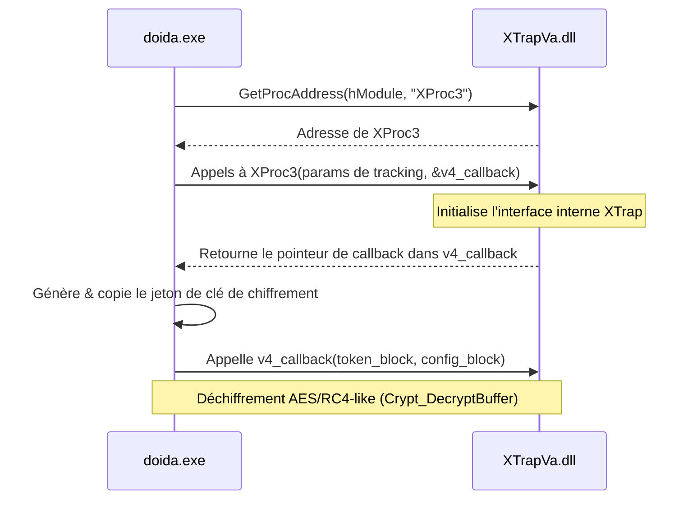

# Spécification Technique : Intégration de l'Anti-Cheat XTrap

> **Fichier cible :** `doida.exe` (SHA256: `f61f66a9ae0ec1e946105b2ecff76e8930cb1d1367df64e5688a5266f5ad9963`)  
> **Analyse :** Statique (IDA Pro) & Décompilation — CYCLE 17  
> **Statut :** Spécification de Référence  
> **Fichiers sources bruts :**
> - Analyses globales : [xtrap_analysis.md](file:///C:/Users/Arius/RiderProjects/MartialHeroes/Docs/RE/_dirty/xtrap_analysis.md)
> - Décompilations du chargeur : [cycle17_xtrap_decomp.md](file:///C:/Users/Arius/RiderProjects/MartialHeroes/Docs/RE/_dirty/cycle17_xtrap_decomp.md)
> - Décompilations de la télémétrie & selfcheck : [gggprotect_network_and_selfcheck.md](file:///C:/Users/Arius/RiderProjects/MartialHeroes/Docs/RE/_dirty/gggprotect_network_and_selfcheck.md)

---

## 1. Vue d'Ensemble de l'Intégration XTrap

L'anti-cheat XTrap est interfacé dans le client Martial Heroes via la couche polymorphique `GXProtect` (décrite dans [anticheat.md](file:///C:/Users/Arius/RiderProjects/MartialHeroes/Docs/RE/specs/anticheat.md)). Il repose sur une DLL chargée dynamiquement, `XTrapVa.dll`, qui exporte la fonction principale de couplage `XProc3`. 

L'architecture d'intégration comprend trois composants clés :
1. **Chargement dynamique et initialisation** du module `XTrapVa.dll` avec déchiffrement des jetons d'enregistrement et de configuration.
2. **Télémétrie réseau** périodique et événementielle via un socket TCP dédié pour envoyer l'état d'intégrité de la machine et du client à un serveur de relais XTrap.
3. **Autocontrôle d'intégrité de l'image PE (Selfcheck)** qui compare l'image mémoire active du client avec sa copie sur disque, en utilisant un décodeur de longueur d'instruction (LDE) pour ignorer les relocalisations et détecter d'éventuels hooks ou breakpoints.

---

## 2. Chargement Dynamique et Initialisation de XTrapVa.dll

### 2.1 Résolution des Chemins de Chargement (XTrap_LoadLibraryVa @ 0x6d0250)

Le chargement du module s'effectue dans [XTrap_LoadLibraryVa](file:///C:/Users/Arius/RiderProjects/MartialHeroes/Docs/RE/_dirty/cycle17_xtrap_decomp.md#L169). La routine tente de charger `XTrapVa.dll` à partir de plusieurs chemins de recherche :

```
[Chemin d'initialisation explicite (a1)]\XTrap\XTrapVa.dll
                     │ (Échec / Non fourni)
                     ▼
[Dossier Parent de doida.exe]\XTrap\XTrapVa.dll
                     │ (Échec : Erreur 126 / ERROR_MOD_NOT_FOUND)
                     ▼
.\XTrap\XTrapVa.dll
```

1. **Vérification d'existence :** Si le handle de module global `hModule` (`0xA40C94`) est déjà initialisé, la routine définit l'erreur globale `dword_A40C80 = 8195` (indiquant que le module est déjà chargé) et retourne `0`.
2. **Chargement initial :** La fonction exécute un `LoadLibraryA` sur le premier chemin construit.
3. **Chemin de repli (Fallback) :** Si `LoadLibraryA` échoue avec le code d'erreur `126` (`ERROR_MOD_NOT_FOUND`), elle tente de charger le module depuis le répertoire relatif `.\XTrap\XTrapVa.dll`.
4. **Finalisation :**
   - En cas de succès, elle valide le module via [XTrap_VerifyXProc3Module](file:///C:/Users/Arius/RiderProjects/MartialHeroes/Docs/RE/names.yaml#L4385) (`0x6d4410`), stocke le handle dans `hModule` (`0xA40C94`) et retourne `1`.
   - En cas d'échec complet, elle capture le dernier code d'erreur via `GetLastError()`, l'enregistre dans `dword_A40C7C`, définit le code d'erreur global `dword_A40C80 = 8196` et retourne `0`.

---

### 2.2 Résolution et Appel de l'Export XProc3 (XTrap_ResolveXProc3 @ 0x6cffd0)

Une fois la DLL chargée, le client résout l'export système unique **`XProc3`** par le biais de `GetProcAddress`.



1. **Enregistrement des Paramètres de Tracking :**
   Le client appelle l'export `XProc3` (résolu à [XTrap_ResolveXProc3](file:///C:/Users/Arius/RiderProjects/MartialHeroes/Docs/RE/names.yaml#L4341)) en lui passant les adresses de cinq variables globales de suivi d'état :
   - `dword_A40C84`
   - `dword_A40C88`
   - `dword_A40C8C`
   - `dword_A40C90`
   - Un pointeur de callback local `v4`.
2. **Exécution du Callback `v4` :**
   `XProc3` remplit la variable `v4` avec l'adresse d'un callback interne de la DLL. Le client invoque ce callback en lui transmettant un bloc de jeton (Token Block) et un bloc de configuration (Config Block).
3. **Déchiffrement des Blocs de Configuration :**
   Le callback déchiffre ces structures de données en mémoire à l'aide de la routine `Crypt_DecryptBuffer` :
   
   | Bloc | Taille | Clé de Déchiffrement (Hex) | Rôle |
   |------|--------|----------------------------|------|
   | **Token Block** | 1596 octets | `69CB2FD62997E31B` (128-bit) | Contient les jetons de sécurité de session et d'intégrité matérielle |
   | **Config Block** | 300 octets | `39345AEA0DEF4D79` (128-bit) | Paramètres de comportement de l'anti-cheat (fréquences de scan, etc.) |

Si la résolution d'export ou l'initialisation échoue, le code d'erreur `675854` est écrit dans le statut de suivi global, provoquant l'interruption immédiate de l'initialisation du client.

---

## 3. Télémétrie Réseau XTrap

La télémétrie réseau assure la communication bidirectionnelle entre le client de jeu et les serveurs d'autorisation XTrap.

### 3.1 Initialisation et Cycle de Connexion Sockets

- **Winsock Startup (XTrap_Socket_ctor @ 0x6d15b0) :**
  Initialise la bibliothèque réseau Windows Sockets (Winsock) en appelant `WSAStartup` avec la version `2.2` (`0x0202`).
- **Configuration Réseau (XTrap_SocketSetup @ 0x6d16b0) :**
  Configure la structure de socket TCP avec les valeurs par défaut suivantes :
  - **Adresse IP (Cible) :** `211.115.86.66` (résolue via `inet_addr`)
  - **Port TCP :** `2424`
- **Mécanisme de Connexion et Retentatives (XTrap_ConnectWithRetry @ 0x6d1710) :**
  La fonction [XTrap_ConnectWithRetry](file:///C:/Users/Arius/RiderProjects/MartialHeroes/Docs/RE/_dirty/cycle17_xtrap_decomp.md#L208) implémente une connexion TCP robuste et bloquante :
  1. Tente un premier `connect` sur le socket.
  2. Si la connexion échoue avec l'erreur `10060` (`WSAETIMEDOUT`), la fonction s'interrompt immédiatement (retourne `0`).
  3. Pour toute autre erreur réseau, elle alloue un événement Win32 via `CreateEventA` et entame une boucle de **10 tentatives** de reconnexion.
  4. Chaque tentative est espacée de **200 ms** (`WaitForSingleObject(EventA, 200)`).
  5. Si la boucle se termine sans succès, elle ferme l'événement et renvoie `0`.
  6. En cas de succès, elle exécute `getsockname` pour interroger l'interface réseau locale associée à la socket établie, extrait le numéro de port local et l'enregistre à l'offset `+4` de sa structure de contrôle.

---

### 3.2 Structure et Construction du Paquet V1 (XTrap_BuildXlXfV1Packet @ 0x6d1f20)

Le paquet est construit via [XTrap_BuildXlXfV1Packet](file:///C:/Users/Arius/RiderProjects/MartialHeroes/Docs/RE/_dirty/cycle17_xtrap_decomp.md#L249). Il se compose d'un en-tête standardisé et d'un payload chiffré.

#### 3.2.1 En-tête de Paquet (`XL_XF_V1`)
L'en-tête mesure 12 octets et possède la structure suivante :
- **Magic Signature (8 octets) :** `"XL_XF_V1"` (représentant la version 1 du protocole de transmission XTrap).
- **Taille Globale (4 octets) :** Longueur du payload de télémétrie (`lstrlenA(TelemetryPayload)`) additionnée de `32` octets.

#### 3.2.2 Extraction du Jeton d'Intégrité
Le paquet intègre des données cryptographiques stockées dynamiquement en mémoire :
1. Extrait une série de mots depuis la zone mémoire `0xA408F2` jusqu'à `0xA40972` (soit 64 octets), convertis en chaîne hexadécimale via un formateur de type `sprintf` avec le filtre `%02X`.
2. Déscramble cette chaîne à l'aide de la fonction `sub_6D43B0` avec la clé interne `"5FE02A7A34BCF7"`.
3. Valide le jeton en calculant un checksum XOR sur ses 6 premiers DWORDs :
   $$\text{Checksum} = \text{Token}[0] \oplus \text{Token}[4] \oplus \text{Token}[8] \oplus \text{Token}[12] \oplus \text{Token}[16] \oplus \text{Token}[20]$$
4. Si le checksum correspond à la valeur attendue stockée à `Token[24]`, le jeton est validé ; sinon, la valeur d'erreur `4095` est insérée comme code d'échec matériel.

#### 3.2.3 Disposition de la Structure du Payload (`v15`)
Le payload est modélisé sous la forme d'un tableau de 133 DWORDs (532 octets) :

| Offset (Index DWORD) | Type / Taille | Description |
|----------------------|---------------|-------------|
| `v15[0]` | `DWORD` | Valeur du jeton déchiffré (`Token[4]`) ou code d'erreur `4095` |
| `v15[1]` à `v15[16]` | `CHAR[62]` | Chaîne d'identification système issue de `byte_A404A8` |
| `v15[17]` à `v15[32]`| `CHAR[62]` | Chaîne d'identification système issue de `byte_A404EC` |
| `v15[33]` à `v15[48]`| `CHAR[62]` | Chaîne d'identification système issue de `byte_A4052C` |
| `v15[49]` à `v15[64]`| `CHAR[62]` | Chaîne d'identification système issue de `byte_A4056C` |
| `v15[65]` | `DWORD` | Identifiant global `dword_A404E8` |
| `v15[66]` | `DWORD` | Résultat d'état système (`sub_6D18F0()`) |
| `v15[67]` | `DWORD` | Résultat d'état système (`sub_6D1860()`) |
| `v15[68]` | `DWORD` | **Port réseau local** retourné par `getsockname` lors du connect |
| `v15[69]` | `DWORD` | Résultat d'état système (`sub_6D1850()`) |
| `v15[70]` | `DWORD` | Type de paquet réseau (fixé à `3`) |
| `v15[71]` | `DWORD` | Paramètre `a2` (Code d'événement de télémétrie) |
| `v15[72]` | `DWORD` | Toujours `0` |
| `v15[73]` | `DWORD` | Paramètre `a3` (Code d'erreur système ou d'API) |
| `v15[74]` | `DWORD` | Paramètre `a4` (Indice de source réseau) |
| `v15[75]` | `DWORD` | Jeton d'intégrité mémoire (`Token[8]`) |
| `v15[76]` | `DWORD` | Toujours `0` |
| `v15[77]` | `DWORD` | Jeton magique constant (valeur `-721420223` / `0xD5000041`) |
| `v15[78]` | `DWORD` | Jeton constant de configuration (valeur `-452984832` / `0xE5000000`) |
| `v15[79]` | `DWORD` | Toujours `0` |
| `v15[80]` | `DWORD` | Jeton d'intégrité mémoire (`Token[16]`) |
| `v15[81]` | `DWORD` | Jeton d'intégrité mémoire (`Token[20]`) |
| `v15[82]` | `DWORD` | Jeton d'intégrité mémoire (`Token[12]`) |
| `v15[83]` à `v15[132]`| `CHAR[198]` | Source ou contexte d'erreur d'appel (argument `Source` limité à `0xC6` octets) |

#### 3.2.4 Chiffrement Réseau final
Après assemblage de la structure `v15`, elle est encodée via la routine `sub_6D1AF0`. L'en-tête `"XL_XF_V1"` et la taille calculée sont copiés en début de structure. Le paquet complet subit ensuite une opération de chiffrement par flux XOR à l'aide de `sub_6D1E20` avant d'être expédié via `sub_6D1670` sur le port `2424` de la cible `211.115.86.66`.

---

## 4. Vérification de l'Intégrité de l'Image PE (Selfcheck)

Le processus de Selfcheck est la contre-mesure d'intégrité logicielle de premier niveau exécutée par la fonction [Selfcheck_MapModuleAndVerify](file:///C:/Users/Arius/RiderProjects/MartialHeroes/Docs/RE/_dirty/gggprotect_network_and_selfcheck.md#L133) @ `0x6d4710`.

### 4.1 Mécanisme de Mappage Physique

Pour éviter de lire une image PE déjà modifiée en mémoire virtuelle par d'éventuels outils de triche (injecteurs, hookers dynamiques), le client mappe directement le fichier binaire physique du disque :

1. **Création du handle de fichier :** Appelle `CreateFileA` sur le chemin de l'exécutable (`lpFileName`) avec un accès en lecture seule (`GENERIC_READ`), un partage autorisé en lecture (`FILE_SHARE_READ`) et l'instruction d'ouverture de fichier existant (`OPEN_EXISTING`).
2. **Vérification de taille :** Interroge `GetFileSize` sur le handle obtenu.
3. **Mappage en mémoire :** Alloue un objet de mappage en lecture seule via `CreateFileMappingA` (avec les droits `PAGE_READONLY`) puis mappe le fichier dans l'espace d'adressage virtuel du processus à l'aide de `MapViewOfFile` (droits `FILE_MAP_READ`).
4. **Vérification de signature PE :** Lit les premiers DWORDs du mappage pour s'assurer de la présence des signatures `"MZ"` (DOS) et `"PE"` (NT headers) aux adresses de base physiques.

---

### 4.2 Analyse des Opcodes et Moteur LDE (LDE_DecodeInstruction @ 0x6dc8c0)

Le Selfcheck parcourt les sections de code de l'image disque virtuelle et de l'image mémoire chargée pour valider leur conformité byte-à-byte. Cependant, pour éviter d'invalider le processus à cause des modifications légitimes apportées par l'OS, il embarque un décodeur d'instructions x86 :

- **Rôle du LDE (LDE_DecodeInstruction @ 0x6dc8c0) :**
  Il s'agit d'un *Length Disassembler Engine* (voir [LDE_DecodeInstruction](file:///C:/Users/Arius/RiderProjects/MartialHeroes/Docs/RE/names.yaml#L4398)). La fonction décode les préfixes, les codes opératoires (opcodes), les octets ModR/M et SIB d'une instruction x86 pour en déduire sa taille exacte (de 1 à 15 octets).
- **Détection active de Hooks :**
  Lors du parcours par la routine [Selfcheck_DecodeInstructionsAndHash](file:///C:/Users/Arius/RiderProjects/MartialHeroes/Docs/RE/names.yaml#L4389) (`0x6d4d30`), le moteur recherche activement les instructions typiques d'injection de code et de hooks :
  - `0xCC` : Instruction `INT 3` (Breakpoint logiciel).
  - `0xE9` : Instruction `JMP` relative (Redirection de fonction / Detour Hook).
  - `0xE8` : Instruction `CALL` relative (Hook de surveillance / Detour Call).
- **Mécanisme de Masquage (Masking) :**
  Afin de ne pas générer de faux positifs sur les adresses absolues ajustées par le chargeur Windows lors du chargement (relocalisations du binaire / Base Relocation Table) ou lors de la liaison dynamique des imports (IAT), la routine calcule la position de ces offsets variables grâce à la table des relocalisations du PE.
  Les octets correspondant à des cibles relocalisées ou à des pointeurs d'importation sont **ignorés (masqués)** lors du calcul du hash de bloc en mémoire virtuelle et sur disque.

---

### 4.3 Validation et Traitement des Signatures de Fin de Fichier

La validation de l'intégrité repose sur deux blocs de données cryptographiques (Signature Blobs) situés tout à la fin du fichier exécutable physique :

```
[Fin du fichier doida.exe]
┌───────────────────────────────────────┬─────────────────────────────────┐
│              Blob Primaire            │          Blob Secondaire        │
│              (608 octets)             │            (32 octets)          │
└───────────────────────────────────────┴─────────────────────────────────┘
▲                                       ▲                                 ▲
FileSize - 992                          FileSize - 384                    FileSize
```

#### 4.3.1 Le Blob Primaire (Taille : 608 octets)
- **Position :** Situé à `FileSize - 992` octets de la fin du fichier.
- **Processus de Vérification :**
  1. Le client calcule le hash cryptographique des sections de code et d'exports après masquage des relocalisations via [Selfcheck_HashSectionsAndExports](file:///C:/Users/Arius/RiderProjects/MartialHeroes/Docs/RE/_dirty/gggprotect_network_and_selfcheck.md#L160) (`0x6d4af0`).
  2. Le bloc de hash calculé en mémoire (`v15`) est de-scramblé via `sub_6D4350` avec la clé **`EB023C05F5E8CA6D`** (128-bit) pour générer le bloc témoin `v16`.
  3. Une comparaison binaire `memcmp` est effectuée entre ce bloc témoin déchiffré `v16` et les 608 octets (`0x260` octets) présents dans le fichier physique mappé à l'adresse `FileSize - 992`.
  4. En cas de différence (tampering détecté sur le code ou les exports), la variable globale de statut `dword_A41208` est définie à **`6`**, et la fonction échoue.

#### 4.3.2 Le Blob Secondaire (Taille : 32 octets)
- **Position :** Situé à `FileSize - 384` octets de la fin du fichier.
- **Processus de Vérification :**
  1. Le client prend le bloc témoin de 608 octets déchiffré `v16` et calcule sa somme de contrôle à l'aide de la fonction de hash globale `Crypt_HashBuffer` (@ `0x6d54e0`). Ce hash produit un résultat de 32 octets.
  2. Le client effectue un `memcmp` de 32 octets (`0x20` octets) entre ce hash calculé et les octets physiques situés à `FileSize - 384`.
  3. En cas de non-concordance, le statut `dword_A41208` est défini à **`7`**, et la fonction retourne `0`.
  4. Si les deux vérifications sont concluantes, le client démonte la vue physique du fichier, ferme tous les handles de fichiers et renvoie `1` (succès), autorisant le jeu à poursuivre son exécution.

---

## 5. Matrice de Référence des Statuts et Erreurs

Les codes d'erreur retournés par le système d'initialisation de XTrap et son Selfcheck interne permettent d'identifier précisément les causes de fermeture du client :

| Variable de Statut | Valeur d'Erreur | Cause Technique |
|--------------------|-----------------|-----------------|
| `dword_A40C80` | `8195` | `XTrapVa.dll` déjà chargée (Tentative de double initialisation) |
| `dword_A40C80` | `8196` | Échec de chargement de `XTrapVa.dll` (DLL absente ou corrompue) |
| `dword_A1A_Offset36` (ou `dword_A40C80`) | `675851` | Échec de validation des fichiers d'anti-cheat annexes (`xtrap.xt`, `xtrapva.dll`, etc.) |
| `dword_A1A_Offset36` (ou `dword_A40C80`) | `675854` | Échec de résolution dynamique de l'export `XProc3` via `GetProcAddress` |
| `dword_A41208` | `2` | Échec d'ouverture du fichier exécutable (`CreateFileA` a renvoyé `INVALID_HANDLE_VALUE`) |
| `dword_A41208` | `3` | Impossible de récupérer la taille du fichier physique (`GetFileSize` a échoué) |
| `dword_A41208` | `4` | Échec de création de l'objet de mappage fichier (`CreateFileMappingA` a échoué) |
| `dword_A41208` | `5` | Échec d'obtention de la vue mémoire virtuelle du fichier (`MapViewOfFile` a échoué) |
| `dword_A41208` | `6` | Violation d'intégrité : Signature du code corrompue (Mismatch du Blob Primaire à `FileSize - 992`) |
| `dword_A41208` | `7` | Violation d'intégrité : Empreinte de signature altérée (Mismatch du Blob Secondaire à `FileSize - 384`) |
